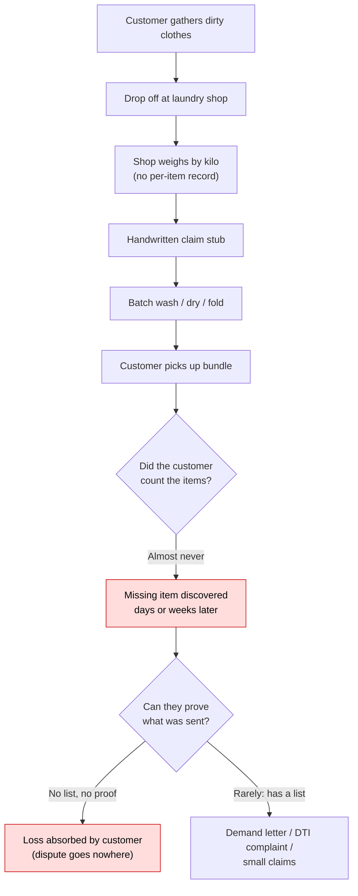
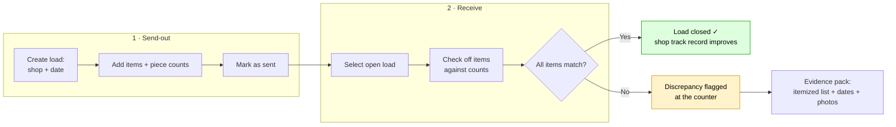

# Problem Statement — Personal Laundry Send-Out Tracking

> **Working name:** Clothesline — a personal laundry send/receive tracker
> **Document date:** 3 July 2026 · **Market context:** Metro Manila, Philippines

---

## 1. The problem

Busy professionals in Metro Manila routinely outsource their laundry to neighborhood laundry shops and pickup/delivery services. The standard process is informal: clothes are weighed by the kilo, the customer receives a handwritten claim stub (at best), and days later a plastic-wrapped bundle comes back.

**There is no reliable, customer-owned record of exactly what was sent out — so when an item goes missing, the customer often cannot prove it, sometimes cannot even be sure of it, and usually discovers the loss days or weeks too late.**

This is not a hypothetical worry:

- Philippine legal commentators describe lost, damaged, or partially returned laundry as **"not uncommon"**, to the point that law firms publish step-by-step guides for demand letters, DTI complaints, and small-claims filings over lost laundry ([Respicio & Co.](https://www.respicio.ph/commentaries/laundry-shop-lost-or-damaged-clothes-liability-and-small-claims-in-the-philippines)).
- The recommended first step in every one of those remedies is the same thing customers almost never have: **a documented list of the missing items** — brand, size, count, and value ([Respicio & Co.](https://www.respicio.ph/commentaries/compensation-claim-for-laundry-service-lost-clothes-philippines)).
- Even venture-funded, app-based laundry services with barcoded bags generate the same complaints: missing garments, wrong-address deliveries, and token ₱-credit compensation ([Rinse complaints, BBB](https://www.bbb.org/us/ca/san-francisco/profile/dry-cleaners/rinse-inc-1116-542458/complaints)).

### Why the loss happens (and why it's hard to catch)

Typical Metro Manila full-service flow: clothes are weighed, tagged with a name or claim stub, machine-washed in batches, folded, and released — with pricing at roughly **₱45–₱80 per kilo** for standard items ([LaundryAtlas](https://laundryatlas.com/blog/how-much-does-laundry-cost-philippines)). The shop counts *kilos*, not *pieces*. The customer usually counts nothing at all. Between mixed batches, manual folding, and multiple hand-offs, a stray shirt or a pair of socks can migrate to another customer's bundle with no paper trail on either side.

## 2. Who feels this pain

The primary sufferer is the **busy urban professional** — condo or apartment dweller in Metro Manila, no in-unit washer (or no time to use it), sending **4–8 kg of laundry weekly** and spending roughly **₱300–₱1,000+ per month** on laundry services (derived from ₱45–₱80/kg pricing per [LaundryAtlas](https://laundryatlas.com/blog/how-much-does-laundry-cost-philippines) and per-visit spend of ₱150–₱300 per [FilipiKnow](https://filipiknow.net/laundry-business-philippines/)). A full profile is in [`02-target-customer.md`](./02-target-customer.md).

Secondary (future) beneficiary: the **laundry shop itself**. The Philippines has an estimated **20,000+ laundromats**, mostly single-shop operators, competing intensely on price and reputation ([Philippine Laundry Outlook 2026](https://isitcleanph.com/2026/02/21/is-it-clean-unveils-key-findings-of-1st-philippine-laundry-outlook/)). A disputed lost item is a lost customer; shop owners actively discuss complaint handling in their own communities (e.g., a Facebook laundry-business group thread, ["Resolving laundry customer complaints effectively"](https://www.facebook.com/groups/256527077319261/posts/818056974499599/)).

## 3. Cost of the problem

| Impact | Detail |
|---|---|
| Direct financial loss | Replacement cost of garments — a single office shirt (₱800–₱2,500) can exceed a month of laundry fees. Complaints escalate to items valued at tens of thousands of pesos (e.g., a jacket worth ≈ ₱43,000 damaged at a dry cleaner, [ComplaintsBoard](https://www.complaintsboard.com/fabricpro-dryclean-laundry-services-700-jacket-discoloured-worn-out-c235882)) |
| Unrecoverable disputes | DTI mediation and small claims (up to ₱400,000 in Metro Manila) exist, but require the item-level documentation customers don't keep ([Respicio & Co.](https://www.respicio.ph/commentaries/laundry-shop-lost-or-damaged-clothes-liability-and-small-claims-in-the-philippines)) |
| Anxiety / distrust | "Did they lose something?" uncertainty on every load; customers churn between shops after one bad experience (documented shop-hopping in [a Pasig customer's blog](https://anythingbykate.wordpress.com/2015/03/30/laundry-shops-in-the-philippines-are-the-worst/)) |
| Time | Calls, texts, and repeat shop visits chasing a single missing shirt — often unanswered |

## 4. Current alternatives (and why they fail)

1. **Memory + claim stub** — the default. The stub proves *kilos*, not *contents*.
2. **Manual list in a notes app / photos of the pile** — a few diligent users do this; it's unstructured, tedious, and has no receive-side checklist, so reconciliation still doesn't happen.
3. **Shop-side software** (CleanCloud, Turns customer apps) — only works if *the shop* adopted it, records what the *shop* says it received, and disappears when you switch shops.
4. **Generic inventory or wardrobe apps** (Sortly, Stylebook) — built for stockrooms or outfit planning, not for a send-out/receive-back loop.

Detailed teardown in [`04-competitive-analysis.md`](./04-competitive-analysis.md). The common gap: **no tool gives the customer a shop-agnostic, per-load, itemized send/receive reconciliation.**

## 5. Proposed solution (starter scope)

A mobile-first app that mirrors a simplified **inventory receipt process**, purpose-built for laundry:

1. **Create a load** — pick/enter the laundry shop and the send-out date.
2. **Itemize** — add clothing types and piece counts (e.g., 6 office shirts, 2 trousers, 8 pairs of socks); optional photos.
3. **Send** — load is marked "out"; the itemized list is the customer's manifest.
4. **Receive & reconcile** — on pickup, open the load and check off each item and count; the app flags any shortfall immediately, *while you're still at the counter*.
5. **History** — per-shop track record (loads, discrepancies, resolution), which doubles as documentation for any DTI/small-claims escalation.

## 6. Problem statement (one sentence)

> **Metro Manila professionals who outsource laundry by the kilo have no itemized record of what they hand over, so missing clothes are discovered late, disputed without evidence, and usually written off — a purpose-built send/receive checklist app can close that gap in under a minute per load.**

## 7. Success criteria for the starter app

- A load can be itemized in **< 60 seconds** (piece-count presets, reusable item templates).
- Receive-side reconciliation in **< 90 seconds** at the counter.
- Discrepancy rate per shop is visible after ≥ 3 loads.
- A user who loses an item can export an itemized evidence report (list + dates + shop) suitable for a demand letter or DTI complaint.

## 8. Out of scope (for the starter app)

- Shop-side confirmation / two-sided receipts (future B2B phase — see [`03-market-research.md`](./03-market-research.md)).
- Payments, pickup logistics, garment care instructions.
- RFID/barcode tagging (enterprise linen-tracking territory, e.g. [HID](https://www.hidglobal.com/solutions/uniform-linen-laundry-management-system)).

---

### Sources

- [Respicio & Co. — Laundry Shop Lost or Damaged Clothes: Liability and Small Claims in the Philippines](https://www.respicio.ph/commentaries/laundry-shop-lost-or-damaged-clothes-liability-and-small-claims-in-the-philippines)
- [Respicio & Co. — Compensation Claim for Laundry Service Lost Clothes Philippines](https://www.respicio.ph/commentaries/compensation-claim-for-laundry-service-lost-clothes-philippines)
- [LaundryAtlas — How Much Does Laundry Cost in the Philippines?](https://laundryatlas.com/blog/how-much-does-laundry-cost-philippines)
- [LaundryAtlas — Self-Service vs Full-Service Laundry in the Philippines](https://laundryatlas.com/blog/self-service-vs-full-service-laundry-philippines)
- [Is It Clean — Philippine Laundry Outlook 2026 key findings](https://isitcleanph.com/2026/02/21/is-it-clean-unveils-key-findings-of-1st-philippine-laundry-outlook/)
- [FilipiKnow — Laundry Business Philippines 2025](https://filipiknow.net/laundry-business-philippines/)
- [anythingbykate — "Laundry Shops in the Philippines are the worst" (2015)](https://anythingbykate.wordpress.com/2015/03/30/laundry-shops-in-the-philippines-are-the-worst/)
- [BBB — Rinse, Inc. complaints](https://www.bbb.org/us/ca/san-francisco/profile/dry-cleaners/rinse-inc-1116-542458/complaints)
- [ComplaintsBoard — FabricPro Dryclean & Laundry Services](https://www.complaintsboard.com/fabricpro-dryclean-laundry-services-700-jacket-discoloured-worn-out-c235882)
- [Facebook — laundry-business group: "Resolving laundry customer complaints effectively"](https://www.facebook.com/groups/256527077319261/posts/818056974499599/)
