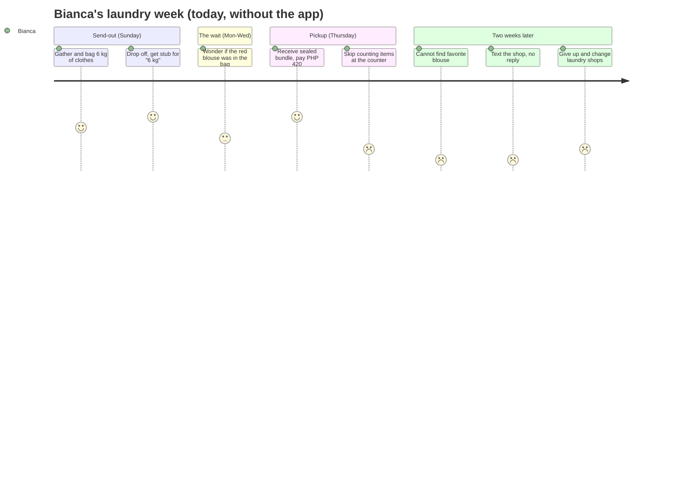
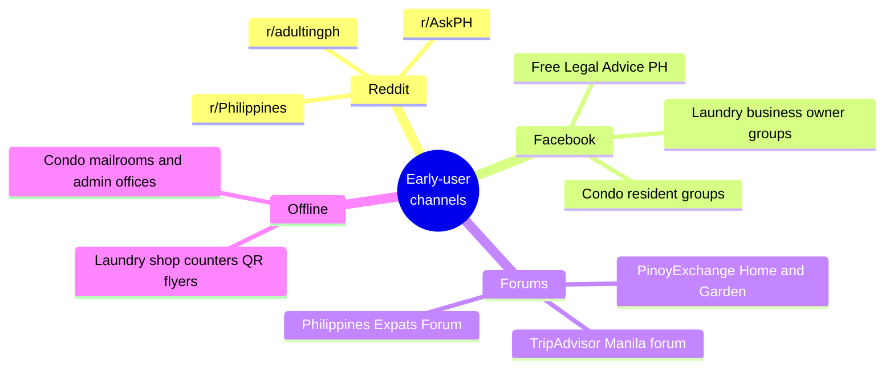

# Target Customer — Persona & Field Evidence

> **Document date:** 3 July 2026 · **Geography:** Metro Manila, Philippines
> **Research method & limitations:** All evidence was gathered via web search on 3 July 2026. This research environment cannot open pages directly (network egress is restricted) and Reddit blocks Anthropic's crawler outright, so quotes below are reproduced **as indexed by the search engine** from the cited pages — each entry is tagged ✅ (near-verbatim as indexed) or ⚠️ (summarized from the indexed snippet; wording may differ on the live page). Tagalog text is followed by an English translation in parentheses.

---

## Part 1 — Primary persona

### "Bianca", 31 — the condo-dwelling professional who outsources her laundry

| Attribute | Detail |
|---|---|
| **Age / life stage** | 28–38, single or newly married, no household help |
| **Location** | Rented or owned condo/apartment in Makati, BGC/Taguig, Ortigas, or Quezon City — Metro Manila's 14.0M-person urban core ([PSA 2024 Census](https://psa.gov.ph/content/highlights-national-capital-region-ncr-population-2024-census-population-2024-popcen)) |
| **Work** | Mid-level professional — marketing, BPO team lead, software developer, finance analyst, nurse on rotating shifts. Hybrid schedule, long commutes |
| **Income** | ₱40,000–₱120,000/month household income; time-poor rather than cash-poor |
| **Living situation** | No in-unit washer/dryer, or a shared building laundry room she avoids; building rules often prohibit hanging laundry on balconies |
| **Laundry behavior** | Sends 4–8 kg weekly to a nearby per-kilo shop (₱45–₱80/kg, [LaundryAtlas](https://laundryatlas.com/blog/how-much-does-laundry-cost-philippines)) or books a pickup service; spends **₱300–₱1,000+/month** |

### Goals

1. Reclaim weekends — laundry handled with near-zero mental overhead.
2. Keep her work wardrobe intact — office shirts, blouses, and activewear are her "uniform" and cost real money to replace.
3. Know *which* laundry shop she can actually trust (she has 3–5 within walking distance — competition is fierce among the Philippines' 20,000+ laundromats, [Philippine Laundry Outlook 2026](https://isitcleanph.com/2026/02/21/is-it-clean-unveils-key-findings-of-1st-philippine-laundry-outlook/)).
4. If something *does* go missing, get it back or get paid — without a fight she can't win.

### Frustrations

1. **"Parang may kulang." ("Something feels missing.")** — The bundle comes back plastic-wrapped and folded; she can't tell if all 8 pairs of socks made it home without unpacking everything, which she never does at the counter.
2. Discovering a missing blouse **two weeks later**, when the shop's answer is inevitably "wala kaming nakita" ("we didn't see anything").
3. The claim stub records **3.5 kg**, not "1 CK blouse, 6 Uniqlo shirts…". Kilos are useless in a dispute.
4. Shops that don't answer calls or texts about a missing item (documented pattern — see evidence #1 below).
5. Filing a DTI complaint or small claim requires an itemized list with values — which she doesn't have ([Respicio & Co.](https://www.respicio.ph/commentaries/compensation-claim-for-laundry-service-lost-clothes-philippines)).

### Where she hangs out online

- **Reddit:** r/Philippines, r/adultingph, r/AskPH, r/phinvest (adulting/condo-living advice threads)
- **Facebook:** condo/building resident groups, Free Legal Advice PH (350k+ members ask exactly these questions — [example post](https://www.facebook.com/groups/freelegaladvice/posts/24512876708337203/)), neighborhood buy-and-sell groups where laundry shops advertise
- **Forums:** [PinoyExchange Home & Garden](https://www.pinoyexchange.com/discussion/411774/laundry-service), [TripAdvisor Manila forum](https://www.tripadvisor.com/ShowTopic-g298573-i3261-k6851347-Laundry_shops-Manila_Metro_Manila_Luzon.html) (for expats/travelers)
- **TikTok / YouTube:** condo-living hacks, #adultingph content
- **Messaging:** Viber building groups; texts directly with the laundry shop's cellphone number

### Tools she uses today (for this problem)

| Tool | How she uses it | Why it fails |
|---|---|---|
| Handwritten claim stub | Shoved in a bag pocket | Proves kilos and price, not contents |
| Phone camera | Occasional photo of the laundry pile | Unstructured; nobody counts socks off a photo |
| Notes app / Google Keep | A few power users list items | Tedious, no receive-side checklist, abandoned after 2 loads |
| Spreadsheet | Rare, hardcore cases | Same, plus unusable at a counter |
| Memory | The default | The whole problem |

### A week in Bianca's laundry life

### What she already pays for (willingness-to-pay signals)

- **The laundry itself:** ₱300–₱1,000+/month, recurring, non-negotiable ([LaundryAtlas](https://laundryatlas.com/blog/how-much-does-laundry-cost-philippines); per-visit spend ₱150–₱300, [FilipiKnow](https://filipiknow.net/laundry-business-philippines/))
- **Convenience premiums:** pickup/delivery laundry services in Metro Manila (e.g., [Washwell](https://www.washwell.ph/pricing), [Lalaba](https://app.lalaba.ph/), [Laundrify PH](https://play.google.com/store/apps/details?id=ph.laundrify.customer)) — she'll pay above walk-in per-kilo rates to not carry the bag
- **App subscriptions:** streaming, cloud storage, and productivity apps in the ₱99–₱250/month band are normal for this segment; wardrobe apps monetize at comparable prices globally (Whering ≈ ₱429/month, Stylebook ≈ ₱368 one-time — see [`04-competitive-analysis.md`](./04-competitive-analysis.md))
- **Implication:** a laundry-tracking app is monetizable at **₱0 free tier + ₱49–₱99/month premium**, i.e., a fraction of one laundry load per month.

---

## Part 2 — Deep research: 10 real people & what they actually said

> Sourcing note: Reddit and X could not be crawled from this environment (Reddit blocks the crawler; X content is not indexed for search here), so the roster leans on blogs, Quora, forums, review platforms, and Facebook groups — all public, all linked. Fidelity tags: ✅ near-verbatim as indexed · ⚠️ summarized from indexed snippet.

| # | Person / handle | Platform & link | What they said about the problem | Tag |
|---|---|---|---|---|
| 1 | **Kate** (blogger, Pasig City) | [anythingbykate, WordPress, 30 Mar 2015](https://anythingbykate.wordpress.com/2015/03/30/laundry-shops-in-the-philippines-are-the-worst/) | Titled her post **"Laundry Shops in the Philippines are the worst."** Fabric Wash (near Puregold, C. Raymundo) *"lost my favorite ankle-length socks"*; Bubble Bubbles Laundry (Maybunga) lost a T-shirt — she *"called and texted"* with **no response**, and when she visited, staff had no information. She shop-hopped across multiple Pasig laundry shops and kept hitting lost items and quality issues. | ✅ |
| 2 | **Member, Free Legal Advice PH** (Facebook group) | [Facebook group post](https://www.facebook.com/groups/freelegaladvice/posts/24512876708337203/) | Asked the group: **"How to recover lost clothes from a laundry service?"** — a consumer reduced to crowdsourcing legal remedies for missing laundry. | ✅ |
| 3 | **Laundry-shop owner** (Facebook laundry-business group, Oct 2025) | [Facebook group post](https://www.facebook.com/groups/256527077319261/posts/818056974499599/) | Thread on **"Resolving laundry customer complaints effectively"** — the shop side of the same war: owners trade tactics for handling lost/damaged-item complaints, confirming the dispute volume from the supply side. | ⚠️ |
| 4 | **Quora asker** | [Quora](https://www.quora.com/How-can-I-recover-my-clothes-from-a-dry-cleaning-business-that-closed-down-suddenly-without-contacting-customers) | **"How can I recover my clothes from a dry-cleaning business that closed down suddenly without contacting customers?"** — total-loss scenario: shop gone, clothes gone, no record. | ✅ |
| 5 | **Quora asker** | [Quora](https://www.quora.com/How-do-I-get-back-my-laundry-from-a-dry-cleaner-who-refuses-to-give-it-back) | **"How do I get back my laundry from a dry cleaner who refuses to give it back?"** | ✅ |
| 6 | **Quora asker** | [Quora](https://www.quora.com/Is-there-any-recourse-I-have-if-the-dry-cleaners-lose-my-coat) | **"Is there any recourse I have if the dry cleaners lose my coat?"** Community answers: keep receipts, document items, escalate to small claims — i.e., the documentation this app generates. | ✅ |
| 7 | **NeoGAF user** (thread starter, Oct 2017) | [NeoGAF](https://www.neogaf.com/threads/the-dry-cleaner-lost-all-of-my-clothes.1448819/) | Thread: **"The Dry Cleaner Lost All of my Clothes"** — cleaner sent his clothes to another location; they never came back the next business day. Replies pile on with similar stories and legal-remedy advice. | ⚠️ |
| 8 | **Trustpilot reviewer, Laundry Town** | [Trustpilot](https://www.trustpilot.com/review/www.laundrytown.com) | Warned **"beware"** after laundry wasn't returned on schedule and WhatsApp messages went unanswered (it eventually arrived). Same silence-after-handoff pattern as #1, on a review platform. | ✅ |
| 9 | **ComplaintsBoard user vs FabricPro Dryclean & Laundry** | [ComplaintsBoard](https://www.complaintsboard.com/fabricpro-dryclean-laundry-services-700-jacket-discoloured-worn-out-c235882) | A **US$700 (≈ ₱43,000) jacket returned "discoloured & worn out"**; other complaints on the service cite missing buttons and damaged clips — per-item value at stake dwarfs the wash fee. | ✅ |
| 10 | **Nomad, Philippines Expats Forum** | [philippines-expats.com](https://www.philippines-expats.com/topic/35179-philippine-laundry-service/) | Ten years nomadic across 43 countries: weekly laundry was an **"unanticipated problem"** — hotel per-piece pricing so bad that *"washing and drying one pair of socks often costs more than buying new ones,"* pushing him to local per-kilo shops (and their tracking problem). | ✅ |
| 11 | **PinoyExchange posters, "Laundry Service" thread** | [PinoyExchange Home & Garden](https://www.pinoyexchange.com/discussion/411774/laundry-service) | Long-running Filipino forum thread swapping laundry-shop recommendations and warnings — the pre-Reddit home of "which shop won't lose my clothes?" | ⚠️ |
| 12 | *(counter-example)* **Wash ME Laundromat, Agusan del Sur** | [PEP.ph, 17 Jan 2022](https://www.pep.ph/news/kuwentong-kakaiba/163262/honesty-laundry-shop-agusan-del-sur-a717-20220117) | A shop went **viral** simply for returning money and jewelry found in customers' pockets — *"pinusuan ng netizens"* ("netizens reacted with heart/love emojis"). That basic honesty is newsworthy proves how low baseline trust is. | ✅ |

### The systemic paper trail (beyond individuals)

- Philippine law firms publish recurring guidance because these disputes recur: document the claim stub, **"list the missing items with brand, size, and estimated price,"** send a demand letter citing Civil Code Arts. 1169–1170 and RA 7394, escalate to the **DTI Consumer Protection Division**, then small claims (up to **₱400,000** in Metro Manila) — [Respicio & Co. (1)](https://www.respicio.ph/commentaries/compensation-claim-for-laundry-service-lost-clothes-philippines), [(2)](https://www.respicio.ph/commentaries/laundry-shop-lost-or-damaged-clothes-liability-and-small-claims-in-the-philippines), [(3)](https://www.lawyer-philippines.com/articles/consumer-rights-and-liability-of-service-providers-for-lost-or-damaged-items). One commentary's example: of **2 kilos sent, only two pairs of pajamas and three shorts came back**.
- Even at the funded, tech-enabled end: Rinse (US, US$46.5M raised) draws BBB complaints of lost items, missing undergarments, wrong-address deliveries, and a **US$169 refund only after the customer supplied proof** — [BBB](https://www.bbb.org/us/ca/san-francisco/profile/dry-cleaners/rinse-inc-1116-542458/complaints), [Honest Brand Reviews](https://www.honestbrandreviews.com/reviews/rinse-review/). "Proof" is the product this app creates.

### Communities to recruit early users from

### What they're already willing to pay for

1. **Per-kilo laundry, weekly** — ₱45–₱80/kg walk-in ([LaundryAtlas](https://laundryatlas.com/blog/how-much-does-laundry-cost-philippines)); ₱150–₱300 per visit ([FilipiKnow](https://filipiknow.net/laundry-business-philippines/)).
2. **Pickup/delivery premium** — Metro Manila services like [Washwell](https://www.washwell.ph/pricing) (15+ years serving 5-star hotels, now direct-to-door), [Lalaba](https://app.lalaba.ph/), [Laundrify PH](https://play.google.com/store/apps/details?id=ph.laundrify.customer), and [GoodWork](https://www.globe.com.ph/blog/home-service-apps-for-chores) monetize convenience on top of the wash itself.
3. **Peace-of-mind subscriptions** — globally, people pay Whering ≈ ₱429/month or Stylebook ≈ ₱368 one-time just to *organize* clothes; protecting those clothes in transit is a stronger job-to-be-done at a comparable price point.

---

### Sources

- [PSA — Highlights of the NCR Population, 2024 Census of Population](https://psa.gov.ph/content/highlights-national-capital-region-ncr-population-2024-census-population-2024-popcen)
- [LaundryAtlas — How Much Does Laundry Cost in the Philippines?](https://laundryatlas.com/blog/how-much-does-laundry-cost-philippines)
- [FilipiKnow — Laundry Business Philippines 2025](https://filipiknow.net/laundry-business-philippines/)
- [Is It Clean — Philippine Laundry Outlook 2026](https://isitcleanph.com/2026/02/21/is-it-clean-unveils-key-findings-of-1st-philippine-laundry-outlook/)
- [anythingbykate — Laundry Shops in the Philippines are the worst](https://anythingbykate.wordpress.com/2015/03/30/laundry-shops-in-the-philippines-are-the-worst/)
- [Facebook — Free Legal Advice group post](https://www.facebook.com/groups/freelegaladvice/posts/24512876708337203/) · [Laundry-business group post](https://www.facebook.com/groups/256527077319261/posts/818056974499599/)
- [Quora (1)](https://www.quora.com/How-can-I-recover-my-clothes-from-a-dry-cleaning-business-that-closed-down-suddenly-without-contacting-customers) · [Quora (2)](https://www.quora.com/How-do-I-get-back-my-laundry-from-a-dry-cleaner-who-refuses-to-give-it-back) · [Quora (3)](https://www.quora.com/Is-there-any-recourse-I-have-if-the-dry-cleaners-lose-my-coat)
- [NeoGAF — The Dry Cleaner Lost All of my Clothes](https://www.neogaf.com/threads/the-dry-cleaner-lost-all-of-my-clothes.1448819/)
- [Trustpilot — Laundry Town reviews](https://www.trustpilot.com/review/www.laundrytown.com)
- [ComplaintsBoard — FabricPro complaint](https://www.complaintsboard.com/fabricpro-dryclean-laundry-services-700-jacket-discoloured-worn-out-c235882)
- [Philippines Expats Forum — Philippine Laundry Service](https://www.philippines-expats.com/topic/35179-philippine-laundry-service/)
- [PinoyExchange — Laundry Service thread](https://www.pinoyexchange.com/discussion/411774/laundry-service)
- [TripAdvisor — Manila forum: Laundry shops](https://www.tripadvisor.com/ShowTopic-g298573-i3261-k6851347-Laundry_shops-Manila_Metro_Manila_Luzon.html)
- [PEP.ph — Viral honesty laundry shop, Agusan del Sur](https://www.pep.ph/news/kuwentong-kakaiba/163262/honesty-laundry-shop-agusan-del-sur-a717-20220117)
- [Respicio & Co. (compensation claims)](https://www.respicio.ph/commentaries/compensation-claim-for-laundry-service-lost-clothes-philippines) · [Respicio & Co. (small claims)](https://www.respicio.ph/commentaries/laundry-shop-lost-or-damaged-clothes-liability-and-small-claims-in-the-philippines) · [Lawyer-Philippines.com](https://www.lawyer-philippines.com/articles/consumer-rights-and-liability-of-service-providers-for-lost-or-damaged-items)
- [BBB — Rinse, Inc. complaints](https://www.bbb.org/us/ca/san-francisco/profile/dry-cleaners/rinse-inc-1116-542458/complaints) · [Honest Brand Reviews — Rinse](https://www.honestbrandreviews.com/reviews/rinse-review/)
