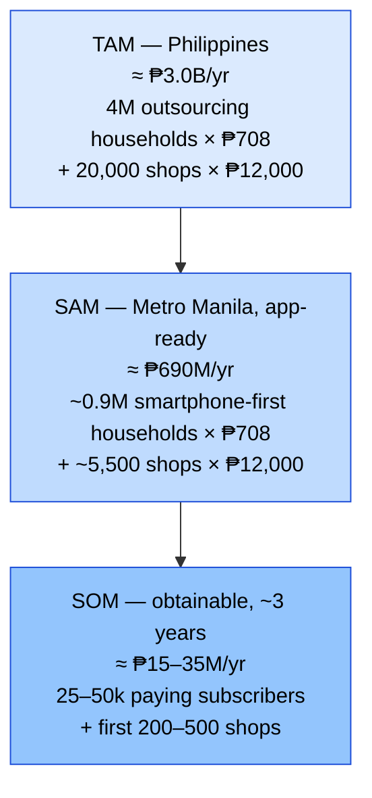
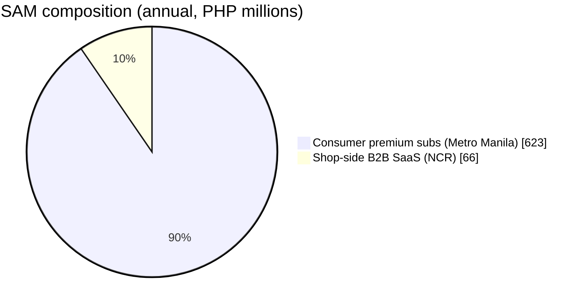

# Market Research — TAM / SAM / SOM (Metro Manila first)

> **Document date:** 3 July 2026 · **Currency:** Philippine pesos (₱)
> **FX reference:** US$1 ≈ **₱61.43** as of 3 July 2026 ([exchange-rates.org](https://www.exchange-rates.org/exchange-rate-history/usd-php-2026), [PhilNews](https://philnews.ph/2026/07/02/usd-to-php-exchange-rate-today-thursday-july-2-2026)). Dollar figures from foreign sources are converted at this rate and rounded.
> **Model:** B2C consumer app first (busy professionals), shop-side B2B offering later.

---

## 1. The spend pool we ride on (top-down)

The app doesn't replace laundry spend — it protects it. The relevant "host market" is outsourced laundry services in the Philippines:

| Signal | Figure | Source |
|---|---|---|
| PH **laundry services** industry revenue (forecast trend to 2024) | ≈ **US$88.2M ≈ ₱5.4B**/yr and rising | [Statista forecast](https://www.statista.com/forecasts/1221915/laundry-services-revenue-in-the-philippines) |
| PH **coin-operated/commercial laundry** market | ≈ **US$25M ≈ ₱1.5B**, Metro Manila / Cebu / Davao dominant | [Ken Research](https://www.kenresearch.com/philippines-coin-operated-commercial-laundry-market) |
| Laundromats operating nationwide | **20,000+**, mostly single-shop, >80% under 1,000 kg/day capacity | [Philippine Laundry Outlook 2026](https://isitcleanph.com/2026/02/21/is-it-clean-unveils-key-findings-of-1st-philippine-laundry-outlook/) |
| Operator concentration | ~**half** of surveyed operators in **NCR + Region IV** | [Philippine Laundry Outlook 2026](https://isitcleanph.com/2026/02/21/is-it-clean-unveils-key-findings-of-1st-philippine-laundry-outlook/) |
| Demand trajectory | **63%** of operators reported higher volumes in 2025 (urbanization; households outsourcing more); **90%** expect stable/positive 2026 | [Philippine Laundry Outlook 2026](https://isitcleanph.com/2026/02/21/is-it-clean-unveils-key-findings-of-1st-philippine-laundry-outlook/) |
| PH **home & laundry care products** (detergents etc. — adjacent context, not our market) | US$3.2B ≈ ₱197B (2025) | [IMARC](https://www.imarcgroup.com/philippines-home-laundry-care-market) |
| Global tailwind | Tech startups piling into wash-and-fold for busy professionals; on-demand laundry apps growing at a reported ~34% CAGR (2024–2030) | [Forbes, 20 Jan 2026](https://www.forbes.com/sites/elainepofeldt/2026/01/20/with-laundry-becoming-a-mounting-chore-for-busy-professionals-tech-startups-see-opportunity-in-wash-and-fold/) |

Other analyst coverage of this market, for deeper diligence: [Euromonitor — Laundry Care in the Philippines](https://www.euromonitor.com/laundry-care-in-the-philippines/report), [6Wresearch — PH Dry-Cleaning & Laundry Services 2025–2031](https://www.6wresearch.com/industry-report/philippines-dry-cleaning-and-laundry-services-market-outlook), [Research and Markets — Dry Cleaning & Laundry Services 2026](https://www.researchandmarkets.com/reports/5939646/dry-cleaning-laundry-services-market-report).

## 2. How many people have this problem (bottom-up)

**Anchor facts.** Metro Manila (NCR) population: **14,001,751** (2024 Census, [PSA](https://psa.gov.ph/content/highlights-national-capital-region-ncr-population-2024-census-population-2024-popcen)) ≈ **3.6–3.8M households** at ~3.8 persons/household. A small Metro Manila laundromat serves **30–50 customers/day** at **₱150–₱300 per visit** ([FilipiKnow](https://filipiknow.net/laundry-business-philippines/)); shops gross **₱30,000–₱100,000/month** ([Digido](https://digido.ph/articles/laundry-business-philippines)); walk-in pricing runs **₱45–₱80/kg** ([LaundryAtlas](https://laundryatlas.com/blog/how-much-does-laundry-cost-philippines)).

**Derivation (assumptions labeled).**

| Step | Estimate | Basis |
|---|---|---|
| Regular customers per shop | 150–250 households | *Assumption*: 30–50 customers/day × ~6 days ÷ weekly visit cadence |
| Nationwide laundry-outsourcing households | **3–5M** | 20,000 shops × 150–250 regulars |
| NCR shops | ~5,000–6,000 | *Assumption*: NCR ≈ 25–30% of shops (operators survey: half in NCR + Region IV) |
| **Metro Manila laundry-outsourcing households** | **~0.9–1.4M** | 5,000–6,000 shops × regulars; cross-check: 25–35% of NCR's ~3.7M households |
| Their annual laundry spend | ₱7,200–₱14,400/household (₱600–₱1,200/mo) | Weekly 4–8 kg at ₱45–₱80/kg; ₱150–₱300/visit |
| **Metro Manila outsourced-laundry spend pool** | **≈ ₱8–17B/yr** | 1.0–1.4M households × spend (implies national Statista figure undercounts informal shops — common for PH services data) |

**Monetization assumptions for the app:** freemium consumer app, premium at **₱59/month (₱708/yr)**; later B2B shop subscription at **₱1,000/month (₱12,000/yr)** — priced below CleanCloud's entry tier (≈ ₱1,840/mo, [CleanCloud pricing](https://cleancloudapp.com/pricing)).

## 3. TAM / SAM / SOM (annual revenue potential, ₱)

| Layer | Definition | Math | Value |
|---|---|---|---|
| **TAM** | Every PH household that regularly outsources laundry + every laundromat, at full price | 4M × ₱708 + 20,000 × ₱12,000 | **≈ ₱3.0B/yr** |
| **SAM** | Metro Manila households reachable by an English/Taglish smartphone app + NCR shops | (1.1M × ~80%) × ₱708 + 5,500 × ₱12,000 | **≈ ₱690M/yr** |
| **SOM** | Realistic 3-year capture: 3–5% of SAM via community-led growth (r/adultingph, condo FB groups, shop-counter QR flyers) | 25–50k paying subs × ₱708 + 200–500 shops × ₱12,000 | **≈ ₱15–35M/yr** |

### Sensitivity: the honest caveat

The SAM hinges on **paid-conversion willingness**. If only 3% of active users ever pay (typical utility-app floor), consumer SAM compresses to ~₱20M — which is why the **B2B2C pivot** (shops pay to offer verified itemized receipts as a trust badge) is structurally important: the shop side has 20,000 identifiable buyers already spending on differentiation in a price-compressed market ([Philippine Laundry Outlook 2026](https://isitcleanph.com/2026/02/21/is-it-clean-unveils-key-findings-of-1st-philippine-laundry-outlook/)).

## 4. What makes this a ₱61M / ₱614M / ₱6.1B opportunity

(₱ equivalents of the classic US$1M / US$10M / US$100M ARR milestones at ₱61.43/US$.)

| Milestone | ARR | What has to be true | Plausibility check |
|---|---|---|---|
| **₱61M** (US$1M) | ~72k consumer subs at ₱59/mo, **or** ~43k subs + ~1,500 shops at ₱1,000/mo | Metro Manila only. 72k subs ≈ 6–8% of the ~1.1M outsourcing households. Requires the receive-time reconciliation moment to become habit | Within SAM; ambitious but city-scale |
| **₱614M** (US$10M) | Capture approaching full SAM | PH-wide consumer + **B2B2C**: shops bundle the app as their digital receipt/trust badge; add claims-evidence exports, item-value insurance partnerships | Requires owning the shop counter, not just the customer's phone |
| **₱6.1B** (US$100M) | 2× the entire PH SAM | **Regional platform**: same per-kilo, trust-poor laundry culture across SEA (Indonesia, Vietnam, Thailand); revenue layers beyond subs — payments at the counter, micro-insurance on garments, shop OS. Comparable scale: Laundrygo (Korea) passed 2M orders on a US$37M ≈ ₱2.3B Series C ([TechCrunch](https://techcrunch.com/2022/11/21/softbank-backed-on-demand-laundry-startup-laundrygo-picks-up-37m-series-c/)) | Only reachable as SEA platform, not PH tracker |

## 5. Funded startups in this space (proof investors fund laundry)

| Startup | What it does | Funding (₱ at 61.43/US$) | Source |
|---|---|---|---|
| **Rinse** (US, SF, founded 2013) | On-demand laundry & dry-cleaning pickup/delivery | **US$46.5M ≈ ₱2.86B** total over 5 rounds; latest **US$23M ≈ ₱1.41B** strategic round from **LG** (early 2025) | [Tracxn](https://tracxn.com/d/companies/rinse/__8V03iTVRvm-yJdQGEVjL8htAmc4HTnhjYRZC2eWpu-g), [Inc.](https://www.inc.com/ali-donaldson/laundry-delivery-startup-rinse-raises-23-million-funding-round-from-appliance-maker-lg/91148186) |
| **Laundryheap** (UK, London) | 24-hour laundry collection/delivery, 10+ countries | **≈ US$23–28M ≈ ₱1.4–1.7B** total (trackers disagree: Crunchbase-family sources US$22.9M; Tracxn US$27.95M incl. US$6.25M Series B-II, Mar 2025) | [Crunchbase](https://www.crunchbase.com/organization/laundryheap), [Tracxn](https://tracxn.com/d/companies/laundryheap/__jZ6Z9Own0hEZSAjhVkzgei-xkXHMSl4nmNDlRn7zCGM/funding-and-investors), [TechCrunch (2017 seed)](https://techcrunch.com/2017/10/09/laundryheap/) |
| **Laundrygo** (South Korea) | App-based overnight laundry; AI sorting; 2M+ orders | **US$37M ≈ ₱2.27B** Series C (Nov 2022), led by H&Q Korea with SoftBank Ventures, Altos, Aju IB | [TechCrunch](https://techcrunch.com/2022/11/21/softbank-backed-on-demand-laundry-startup-laundrygo-picks-up-37m-series-c/), [KoreaTechDesk](https://koreatechdesk.com/laundrygo-makes-waves-in-mobile-laundry-industry-surpassing-2-million-orders-setting-record-sales) |

**Reading:** capital flows to laundry *logistics*, not laundry *accountability*. All three funded players still generate lost-item complaints (see Rinse's [BBB record](https://www.bbb.org/us/ca/san-francisco/profile/dry-cleaners/rinse-inc-1116-542458/complaints)) — the trust layer is unclaimed, and in the Philippines the fragmented 20,000-shop structure makes a customer-owned tracker the only approach that works across every shop. No Philippine laundry-app startup with a disclosed venture round surfaced in this research — consistent with a market of bootstrapped local services ([Washwell](https://www.washwell.ph/), [Lalaba](https://app.lalaba.ph/), [Laundrify](https://play.google.com/store/apps/details?id=ph.laundrify.customer)) and open white space.

## 6. Growth drivers to watch

- **Urbanization + condo living**: NCR grew 0.91%/yr to 14.0M (2024); QC alone is 3.08M ([PSA](https://psa.gov.ph/content/highlights-national-capital-region-ncr-population-2024-census-population-2024-popcen)).
- **Outsourcing habit compounding**: 63% of operators saw higher volumes in 2025 ([PLO 2026](https://isitcleanph.com/2026/02/21/is-it-clean-unveils-key-findings-of-1st-philippine-laundry-outlook/)).
- **Shop-side arms race**: easier equipment financing → more shops → price compression → shops need trust differentiation ([PLO 2026](https://isitcleanph.com/2026/02/21/is-it-clean-unveils-key-findings-of-1st-philippine-laundry-outlook/)) — our future B2B wedge.

---

### Sources

- [PSA — NCR 2024 Census highlights](https://psa.gov.ph/content/highlights-national-capital-region-ncr-population-2024-census-population-2024-popcen) · [Manila Standard — Metro Manila tops 14 million](https://manilastandard.net/business/314625153/metro-manilas-population-tops-14-million-mark-2024-census.html)
- [Statista — Laundry services revenue, Philippines](https://www.statista.com/forecasts/1221915/laundry-services-revenue-in-the-philippines)
- [Ken Research — Philippines Coin-Operated Commercial Laundry Market](https://www.kenresearch.com/philippines-coin-operated-commercial-laundry-market)
- [Is It Clean — Philippine Laundry Outlook 2026 key findings](https://isitcleanph.com/2026/02/21/is-it-clean-unveils-key-findings-of-1st-philippine-laundry-outlook/)
- [IMARC — Philippines Home & Laundry Care Market](https://www.imarcgroup.com/philippines-home-laundry-care-market) · [Euromonitor](https://www.euromonitor.com/laundry-care-in-the-philippines/report) · [6Wresearch](https://www.6wresearch.com/industry-report/philippines-dry-cleaning-and-laundry-services-market-outlook) · [Research and Markets](https://www.researchandmarkets.com/reports/5939646/dry-cleaning-laundry-services-market-report)
- [LaundryAtlas — laundry costs PH](https://laundryatlas.com/blog/how-much-does-laundry-cost-philippines) · [FilipiKnow — laundry business PH](https://filipiknow.net/laundry-business-philippines/) · [Digido — laundry business PH](https://digido.ph/articles/laundry-business-philippines)
- [Forbes — Tech startups see opportunity in wash-and-fold (Jan 2026)](https://www.forbes.com/sites/elainepofeldt/2026/01/20/with-laundry-becoming-a-mounting-chore-for-busy-professionals-tech-startups-see-opportunity-in-wash-and-fold/)
- [Inc. — Rinse raises $23M from LG](https://www.inc.com/ali-donaldson/laundry-delivery-startup-rinse-raises-23-million-funding-round-from-appliance-maker-lg/91148186) · [Tracxn — Rinse](https://tracxn.com/d/companies/rinse/__8V03iTVRvm-yJdQGEVjL8htAmc4HTnhjYRZC2eWpu-g)
- [Crunchbase — Laundryheap](https://www.crunchbase.com/organization/laundryheap) · [Tracxn — Laundryheap funding](https://tracxn.com/d/companies/laundryheap/__jZ6Z9Own0hEZSAjhVkzgei-xkXHMSl4nmNDlRn7zCGM/funding-and-investors) · [TechCrunch — Laundryheap £2M (2017)](https://techcrunch.com/2017/10/09/laundryheap/) · [EU-Startups — €2.8M (2021)](https://www.eu-startups.com/2021/02/on-demand-laundry-platform-laundryheap-raises-e2-8-million-to-continue-international-expansion/)
- [TechCrunch — Laundrygo $37M Series C](https://techcrunch.com/2022/11/21/softbank-backed-on-demand-laundry-startup-laundrygo-picks-up-37m-series-c/) · [KoreaTechDesk — Laundrygo 2M orders](https://koreatechdesk.com/laundrygo-makes-waves-in-mobile-laundry-industry-surpassing-2-million-orders-setting-record-sales)
- [CleanCloud — pricing](https://cleancloudapp.com/pricing) · [BBB — Rinse complaints](https://www.bbb.org/us/ca/san-francisco/profile/dry-cleaners/rinse-inc-1116-542458/complaints)
- FX: [exchange-rates.org — USD/PHP 2026](https://www.exchange-rates.org/exchange-rate-history/usd-php-2026) · [PhilNews — USD/PHP 2 July 2026](https://philnews.ph/2026/07/02/usd-to-php-exchange-rate-today-thursday-july-2-2026)
