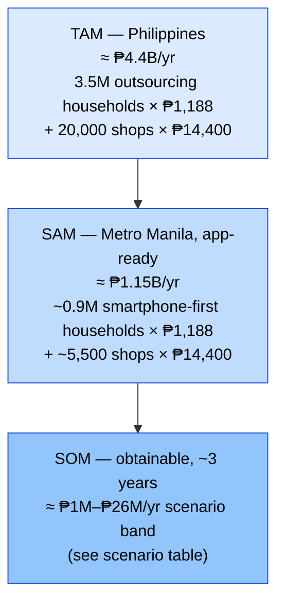
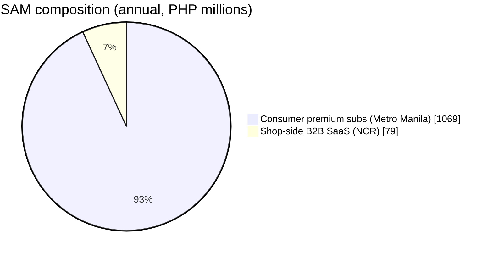
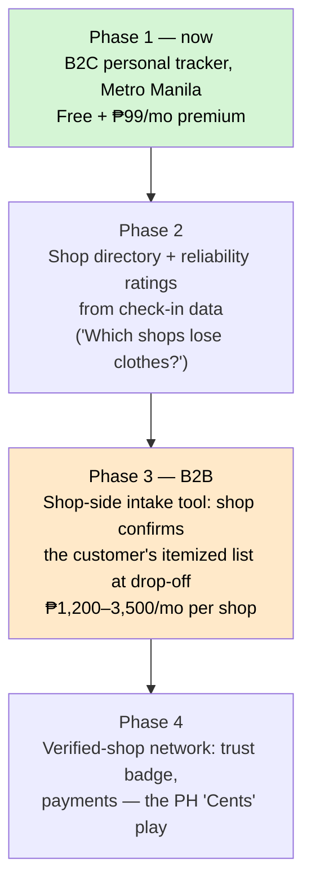

# Market Research — TAM / SAM / SOM (Metro Manila first)

> **Document date:** 3 July 2026 · **Currency:** Philippine pesos (₱)
> **FX reference:** US$1 ≈ **₱61.43** as of 3 July 2026 ([exchange-rates.org](https://www.exchange-rates.org/exchange-rate-history/usd-php-2026), [PhilNews](https://philnews.ph/2026/07/02/usd-to-php-exchange-rate-today-thursday-july-2-2026)). Dollar figures from foreign sources are converted at this rate and rounded.
> **Model:** B2C consumer app first (busy professionals), shop-side B2B offering later.

---

## 1. The spend pool we ride on (top-down)

The app doesn't replace laundry spend — it protects it. The relevant "host market" is outsourced laundry services in the Philippines:

| Signal | Figure | Source |
|---|---|---|
| PH **laundry services** industry revenue (forecast trend to 2024) | ≈ **US$88.2M ≈ ₱5.4B**/yr and rising — a paywalled 2024 forecast, also cited in PH business press ([The Business Manual](https://thebusinessmanual-onemega.com/business-101/best-practices/how-entrepreneurs-built-biggest-fully-owned-laundromat-weclean/)); likely undercounts informal cash-based shops | [Statista forecast](https://www.statista.com/forecasts/1221915/laundry-services-revenue-in-the-philippines) |
| Supply-side consolidation signal | WeClean: 0 → **65+ fully-owned Metro Manila branches** since 2017, ≈ US$4M (₱246M) ARR | [The Business Manual](https://thebusinessmanual-onemega.com/business-101/best-practices/how-entrepreneurs-built-biggest-fully-owned-laundromat-weclean/) |
| PH **coin-operated/commercial laundry** market | ≈ **US$25M ≈ ₱1.5B**, Metro Manila / Cebu / Davao dominant | [Ken Research](https://www.kenresearch.com/philippines-coin-operated-commercial-laundry-market) |
| Laundromats operating nationwide | **20,000+**, mostly single-shop, >80% under 1,000 kg/day capacity | [Philippine Laundry Outlook 2026](https://isitcleanph.com/2026/02/21/is-it-clean-unveils-key-findings-of-1st-philippine-laundry-outlook/) |
| Operator concentration | ~**half** of surveyed operators in **NCR + Region IV** | [Philippine Laundry Outlook 2026](https://isitcleanph.com/2026/02/21/is-it-clean-unveils-key-findings-of-1st-philippine-laundry-outlook/) |
| Demand trajectory | **63%** of operators reported higher volumes in 2025 (urbanization; households outsourcing more); **90%** expect stable/positive 2026 | [Philippine Laundry Outlook 2026](https://isitcleanph.com/2026/02/21/is-it-clean-unveils-key-findings-of-1st-philippine-laundry-outlook/) |
| PH **home & laundry care products** (detergents etc. — adjacent context, not our market) | US$3.2B ≈ ₱197B (2025) | [IMARC](https://www.imarcgroup.com/philippines-home-laundry-care-market) |
| Global tailwind | Tech startups piling into wash-and-fold for busy professionals; on-demand laundry apps growing at a reported ~34% CAGR (2024–2030) | [Forbes, 20 Jan 2026](https://www.forbes.com/sites/elainepofeldt/2026/01/20/with-laundry-becoming-a-mounting-chore-for-busy-professionals-tech-startups-see-opportunity-in-wash-and-fold/) |

Other analyst coverage of this market, for deeper diligence: [Euromonitor — Laundry Care in the Philippines](https://www.euromonitor.com/laundry-care-in-the-philippines/report), [6Wresearch — PH Dry-Cleaning & Laundry Services 2025–2031](https://www.6wresearch.com/industry-report/philippines-dry-cleaning-and-laundry-services-market-outlook), [Research and Markets — Dry Cleaning & Laundry Services 2026](https://www.researchandmarkets.com/reports/5939646/dry-cleaning-laundry-services-market-report).

## 2. How many people have this problem (bottom-up)

**Anchor facts.** Metro Manila (NCR) population: **14,001,751** (2024 Census, [PSA](https://psa.gov.ph/content/highlights-national-capital-region-ncr-population-2024-census-population-2024-popcen)) ≈ **3.5–3.8M households** (PSA/Statista household series: 3.51M as of 2021, [Statista](https://www.statista.com/statistics/1424615/household-population-metro-manila-philippines/)). A small Metro Manila laundromat serves **30–50 customers/day** at **₱150–₱300 per visit** ([FilipiKnow](https://filipiknow.net/laundry-business-philippines/)); shops gross **₱30,000–₱100,000/month at 20–40% net margins** ([Digido](https://digido.ph/articles/laundry-business-philippines)); walk-in pricing is tiered — budget **₱23–₱35/kg**, standard **₱45–₱80/kg** ([Flexwasher](https://www.flexwasher.com/profitable-laundry-business-in-philippines/), [LaundryAtlas](https://laundryatlas.com/blog/how-much-does-laundry-cost-philippines)); typical franchise entry is **under ₱500K**, keeping shop supply growing ([Unicapital](https://unicapital-inc.com/blog/laundry-shop-franchise-philippines/)).

**Derivation (assumptions labeled).**

| Step | Estimate | Basis |
|---|---|---|
| Regular customers per shop | 150–250 households | *Assumption*: 30–50 customers/day × ~6 days ÷ weekly visit cadence |
| Nationwide laundry-outsourcing households | **3–5M** | 20,000 shops × 150–250 regulars |
| NCR shops | ~5,000–6,000 | *Assumption*: NCR ≈ 25–30% of shops (operators survey: half in NCR + Region IV) |
| **Metro Manila laundry-outsourcing households** | **~0.9–1.4M** | 5,000–6,000 shops × regulars; cross-check: 25–35% of NCR's ~3.7M households |
| Their annual laundry spend | ₱7,200–₱14,400/household (₱600–₱1,200/mo) | Weekly 4–8 kg at ₱45–₱80/kg; ₱150–₱300/visit |
| **Metro Manila outsourced-laundry spend pool** | **≈ ₱8–17B/yr** | 1.0–1.4M households × spend (implies national Statista figure undercounts informal shops — common for PH services data) |

**Monetization assumptions for the app:** freemium consumer app, premium at **₱99/month (₱1,188/yr)** with a typical utility-app free→paid conversion of **4–8%**; later B2B shop subscription at **₱1,200–₱3,500/month** (sizing model uses the ₱1,200/mo entry tier = ₱14,400/yr) — undercutting CleanCloud's current US$75–325/store/month (≈ ₱4,600–₱20,000) by 3–10× ([CleanCloud pricing](https://cleancloudapp.com/pricing), [Merchant Maverick](https://www.merchantmaverick.com/best-laundromat-pos/)). *Caveat from the local scan (doc 04 §2.2): local PH POS already sells at ₱0–999/mo, so the B2B offer is a verification add-on/badge priced ₱300–₱1,000/mo, not a POS replacement — treat ₱1,200/mo as the blended ceiling in the model.*

## 3. TAM / SAM / SOM (annual revenue potential, ₱)

| Layer | Definition | Math | Value |
|---|---|---|---|
| **TAM** | Every PH household that regularly outsources laundry + every laundromat, at full price | 3–4M households × ₱1,188 + 20,000 × ₱14,400 | **≈ ₱4–5B/yr** |
| **SAM** | Metro Manila households reachable by an English/Taglish smartphone app + NCR shops | (1.1M × ~80%) × ₱1,188 + 5,500 × ₱14,400 | **≈ ₱1.15B/yr** |
| **SOM** | Realistic 3-year capture via community-led growth (r/adultingph, condo FB groups, shop-counter QR flyers) | scenario-dependent — see below | **≈ ₱1M–₱26M/yr** |

### SOM scenarios: the honest read

A theoretical SAM only converts through two hard filters: **MAU capture** (what share of the 0.9M ever actively uses the app) and **free→paid conversion** (utility apps run 4–8%). Three scenarios, year 3:

| Scenario | MAU capture | Paying users | B2B shops | Annual revenue |
|---|---|---|---|---|
| **Conservative** (B2C only, organic) | ~1% ≈ 12,000 MAU | 6% ≈ 720 subs × ₱1,188 | 0 | **≈ ₱0.9M** |
| **Base** (B2C + early B2B) | ~4% ≈ 50,000 MAU | 6% ≈ 3,000 subs × ₱1,188 | 100 × ₱14,400 | **≈ ₱5M** |
| **Optimistic** (habit + shop pull) | ~15% ≈ 180,000 MAU | 8% ≈ 14,400 subs × ₱1,188 | 500 × ₱18,000 avg | **≈ ₱26M** |

**The honest read:** as a standalone B2C subscription utility, the conservative case is *lifestyle-project scale* (< ₱1M/yr) — perfectly fine for a personal-need starter app, and break-even is trivial (infra < ₱2K/month at small scale; development is founder time). The path to bigger numbers runs through the **B2B2C pivot**: shops pay to offer verified itemized receipts as a trust badge, and the shop side has 20,000 identifiable buyers already spending on differentiation in a price-compressed market ([Philippine Laundry Outlook 2026](https://isitcleanph.com/2026/02/21/is-it-clean-unveils-key-findings-of-1st-philippine-laundry-outlook/)).

**The hidden asset is the data flywheel:** aggregated check-in discrepancy data ("Shop X: 0 lost items across 1,240 loads") is a shop-reliability dataset nobody in the Philippines has. It converts the B2C tool into B2B leverage — shops will want the badge.

## 4. What makes this a ₱61M / ₱614M / ₱6.1B opportunity

(₱ equivalents of the classic US$1M / US$10M / US$100M ARR milestones at ₱61.43/US$.)

| Milestone | ARR | What has to be true | Plausibility check |
|---|---|---|---|
| **₱61M** (US$1M) | ~51k consumer subs at ₱99/mo, **or** ~30k subs + ~2,000 shops at ₱1,200/mo | Metro Manila only. 51k paying subs ≈ 5% of the ~1.1M outsourcing households — well past the optimistic SOM scenario. Requires the receive-time reconciliation moment to become habit *and* shop-side pull | Beyond year-3 SOM; needs the Phase 2–3 flywheel working |
| **₱614M** (US$10M) | Capture approaching full SAM | PH-wide consumer + **B2B2C**: shops bundle the app as their digital receipt/trust badge; add claims-evidence exports, item-value insurance partnerships | Requires owning the shop counter, not just the customer's phone |
| **₱6.1B** (US$100M) | ~5× the entire PH SAM | **Regional platform**: same per-kilo, trust-poor laundry culture across SEA (Indonesia, Vietnam, Thailand); revenue layers beyond subs — payments at the counter, micro-insurance on garments, shop OS. Comparable scale: Laundrygo (Korea) passed 2M orders on a US$37M ≈ ₱2.3B Series C ([TechCrunch](https://techcrunch.com/2022/11/21/softbank-backed-on-demand-laundry-startup-laundrygo-picks-up-37m-series-c/)); Cents processes US$1B/yr in payments across 4,500+ US locations ([PR Newswire](https://www.prnewswire.com/news-releases/cents-raises-140-million-from-sumeru-equity-partners-to-support-and-drive-innovation-for-laundry-smbs-302725686.html)) | Only reachable as SEA platform, not PH tracker |

### Nearer-term revenue ladder (₱5M / ₱50M / ₱500M)

The US$-milestone table above is the venture framing; for a founder-built app the more actionable ladder is:

| Annual revenue | B2C-only path (₱99/mo premium) | Blended B2C + B2B path |
|---|---|---|
| **₱5M** (≈ US$81K) | ~4,200 paying subs (≈ 70K MAU at 6% conversion) — achievable in NCR with strong condo-community organic growth | ~2,000 subs + **~150 shops** at ₱1,200/mo |
| **₱50M** (≈ US$814K) | ~42,000 paying subs → ~700K MAU ≈ most of Metro Manila's realistic MAU pool — unrealistic as a paid tracker alone | ~10,000 subs + **~2,600 shops** at ₱1,200/mo, or ~1,100 shops on a ₱3,500/mo POS-lite tier — i.e., become the Philippine CleanCloud with a consumer-verification moat |
| **₱500M** (≈ US$8.1M) | Not credible as B2C tracking alone | Regional (PH + SEA) shop platform + payments take-rate — the Cents playbook; requires venture funding |

## 5. Funded startups in this space (proof investors fund laundry)

| Startup | What it does | Funding (₱ at 61.43/US$) | Source |
|---|---|---|---|
| **Cents** (US, NY) | B2B laundry POS + payments + hardware "operating system"; 4,500+ locations, US$1B payments/yr | **US$140M ≈ ₱8.6B Series C** (Mar 2026, led by Sumeru Equity Partners; US$110M primary + US$30M secondary) — the largest software raise in the laundry vertical; **US$184M ≈ ₱11.3B total** per Tracxn | [PR Newswire](https://www.prnewswire.com/news-releases/cents-raises-140-million-from-sumeru-equity-partners-to-support-and-drive-innovation-for-laundry-smbs-302725686.html), [Fintech Global](https://fintech.global/2026/03/26/cents-raises-140m-in-series-c-led-by-sumeru-equity/), [Tracxn](https://tracxn.com/d/companies/cents/__yxiP-gXq_ChEvBZ3hQsO6IhqoifY12AlSySLcq-6as0) |
| **Rinse** (US, SF, founded 2013) | On-demand laundry & dry-cleaning pickup/delivery; 100M+ garments cleaned | **US$70M+ ≈ ₱4.3B+ total**; latest **US$23M ≈ ₱1.41B Series D** led by **LG Electronics** (Feb 2025)¹ | [Rinse blog](https://www.rinse.com/blog/rinse/rinse-series-d-fundraise/), [Inc.](https://www.inc.com/ali-donaldson/laundry-delivery-startup-rinse-raises-23-million-funding-round-from-appliance-maker-lg/91148186), [TechCrunch](https://techcrunch.com/2025/04/09/tired-of-doing-laundry-these-startups-want-to-help/) |
| **Laundryheap** (UK, London) | 24-hour laundry collection/delivery, 10+ countries; grew by acquiring Laundrapp and GetLavado | **≈ US$23–28M ≈ ₱1.4–1.7B** total (trackers disagree: Crunchbase-family sources US$22.9M; Tracxn US$27.95M incl. US$6.25M Series B-II, Mar 2025) | [Crunchbase](https://www.crunchbase.com/organization/laundryheap), [Tracxn](https://tracxn.com/d/companies/laundryheap/__jZ6Z9Own0hEZSAjhVkzgei-xkXHMSl4nmNDlRn7zCGM/funding-and-investors), [CB Insights](https://www.cbinsights.com/company/laundryheap/financials) |
| **Laundrygo** (South Korea) | App-based overnight laundry; AI sorting; 2M+ orders | **US$37M ≈ ₱2.27B** Series C (Nov 2022), led by H&Q Korea with SoftBank Ventures, Altos, Aju IB | [TechCrunch](https://techcrunch.com/2022/11/21/softbank-backed-on-demand-laundry-startup-laundrygo-picks-up-37m-series-c/), [KoreaTechDesk](https://koreatechdesk.com/laundrygo-makes-waves-in-mobile-laundry-industry-surpassing-2-million-orders-setting-record-sales) |
| **Poplin** (ex-SudShare, US) | Gig-economy wash-and-fold marketplace, 500+ US cities | **US$10M ≈ ₱614M** (2022, as SudShare) | [Tracxn](https://tracxn.com/d/companies/poplin/__xIWF82jNKtIYI0TAlV15uDzDJ0vFbuc_knT7Qu2sH5A), [Crunchbase](https://www.crunchbase.com/organization/sudshare) |
| **WeClean** (Philippines 🇵🇭) | Fully-owned Metro Manila laundromat chain (65+ branches, ≈ US$4M ARR) | **US$900K ≈ ₱55M** raised in its Metro Manila expansion push | [The Independent Investor](https://theindependentinvestor.ph/manila-based-laundry-business-weclean-finds-prosperity-in-the-pandemic/), [The Business Manual](https://thebusinessmanual-onemega.com/business-101/best-practices/how-entrepreneurs-built-biggest-fully-owned-laundromat-weclean/) |
| **Washio** (US) — *cautionary tale* | On-demand laundry pioneer (2013) | Raised **US$16.8M ≈ ₱1.0B**, shut down Aug 2016; assets went to Rinse | [TechCrunch](https://techcrunch.com/2016/08/30/washio-on-demand-laundry-service-shuts-down-operations/) |

¹ *Discrepancy note: Tracxn lists Rinse at US$46.5M total; Rinse's own Series D announcement and press coverage say "over US$70M since inception." The company's own figure is used here.*

**Reading:** capital flows to laundry *logistics and shop software*, not laundry *accountability*. The funded B2C players still generate lost-item complaints (see Rinse's [BBB record](https://www.bbb.org/us/ca/san-francisco/profile/dry-cleaners/rinse-inc-1116-542458/complaints)), and Tracxn's sector tracker counts ~1,460 on-demand-laundry startups globally with 124 funded — yet none with consumer-side itemized send/receive verification as the core product ([Tracxn sector page](https://tracxn.com/d/trending-business-models/startups-in-ondemand-laundry-services/__TPsXBpL0vS8hKmxb-0XGTpaB05l3a8fHOp0F9wz0TmI/companies); count as reported by Tracxn, not independently verified). Washio's death shows the failure mode is logistics cash-burn — an asset-light tracker avoids it. In the Philippines, the only disclosed raise found is WeClean's ₱55M for brick-and-mortar expansion; the local software layer is bootstrapped services ([Washwell](https://www.washwell.ph/), [Lalaba](https://app.lalaba.ph/), [Laundrify](https://play.google.com/store/apps/details?id=ph.laundrify.customer)) — the trust layer remains open white space. Read either as (a) an overlooked wedge or (b) too small to fund standalone; the dhobi-tracker evidence in [`04-competitive-analysis.md`](./04-competitive-analysis.md) suggests it's a *wedge* — small alone, valuable as the trust layer of a bigger shop platform.

## 6. Growth drivers to watch

- **Urbanization + condo living**: NCR grew 0.91%/yr to 14.0M (2024); QC alone is 3.08M ([PSA](https://psa.gov.ph/content/highlights-national-capital-region-ncr-population-2024-census-population-2024-popcen)).
- **Outsourcing habit compounding**: 63% of operators saw higher volumes in 2025 ([PLO 2026](https://isitcleanph.com/2026/02/21/is-it-clean-unveils-key-findings-of-1st-philippine-laundry-outlook/)).
- **Shop-side arms race**: easier equipment financing → more shops → price compression → shops need trust differentiation ([PLO 2026](https://isitcleanph.com/2026/02/21/is-it-clean-unveils-key-findings-of-1st-philippine-laundry-outlook/)) — our future B2B wedge.

---

### Sources

- [PSA — NCR 2024 Census highlights](https://psa.gov.ph/content/highlights-national-capital-region-ncr-population-2024-census-population-2024-popcen) · [Manila Standard — Metro Manila tops 14 million](https://manilastandard.net/business/314625153/metro-manilas-population-tops-14-million-mark-2024-census.html)
- [Statista — Laundry services revenue, Philippines](https://www.statista.com/forecasts/1221915/laundry-services-revenue-in-the-philippines)
- [Ken Research — Philippines Coin-Operated Commercial Laundry Market](https://www.kenresearch.com/philippines-coin-operated-commercial-laundry-market)
- [Is It Clean — Philippine Laundry Outlook 2026 key findings](https://isitcleanph.com/2026/02/21/is-it-clean-unveils-key-findings-of-1st-philippine-laundry-outlook/)
- [IMARC — Philippines Home & Laundry Care Market](https://www.imarcgroup.com/philippines-home-laundry-care-market) · [Euromonitor](https://www.euromonitor.com/laundry-care-in-the-philippines/report) · [6Wresearch](https://www.6wresearch.com/industry-report/philippines-dry-cleaning-and-laundry-services-market-outlook) · [Research and Markets](https://www.researchandmarkets.com/reports/5939646/dry-cleaning-laundry-services-market-report)
- [LaundryAtlas — laundry costs PH](https://laundryatlas.com/blog/how-much-does-laundry-cost-philippines) · [FilipiKnow — laundry business PH](https://filipiknow.net/laundry-business-philippines/) · [Digido — laundry business PH](https://digido.ph/articles/laundry-business-philippines)
- [Forbes — Tech startups see opportunity in wash-and-fold (Jan 2026)](https://www.forbes.com/sites/elainepofeldt/2026/01/20/with-laundry-becoming-a-mounting-chore-for-busy-professionals-tech-startups-see-opportunity-in-wash-and-fold/)
- [PR Newswire — Cents raises $140M Series C](https://www.prnewswire.com/news-releases/cents-raises-140-million-from-sumeru-equity-partners-to-support-and-drive-innovation-for-laundry-smbs-302725686.html) · [Fintech Global — Cents Series C](https://fintech.global/2026/03/26/cents-raises-140m-in-series-c-led-by-sumeru-equity/) · [Tracxn — Cents](https://tracxn.com/d/companies/cents/__yxiP-gXq_ChEvBZ3hQsO6IhqoifY12AlSySLcq-6as0)
- [Rinse — Series D announcement](https://www.rinse.com/blog/rinse/rinse-series-d-fundraise/) · [Inc. — Rinse raises $23M from LG](https://www.inc.com/ali-donaldson/laundry-delivery-startup-rinse-raises-23-million-funding-round-from-appliance-maker-lg/91148186) · [TechCrunch — laundry startups roundup](https://techcrunch.com/2025/04/09/tired-of-doing-laundry-these-startups-want-to-help/) · [Tracxn — Rinse](https://tracxn.com/d/companies/rinse/__8V03iTVRvm-yJdQGEVjL8htAmc4HTnhjYRZC2eWpu-g)
- [Tracxn — Poplin](https://tracxn.com/d/companies/poplin/__xIWF82jNKtIYI0TAlV15uDzDJ0vFbuc_knT7Qu2sH5A) · [Crunchbase — SudShare/Poplin](https://www.crunchbase.com/organization/sudshare) · [TechCrunch — Washio shuts down (2016)](https://techcrunch.com/2016/08/30/washio-on-demand-laundry-service-shuts-down-operations/) · [Tracxn — on-demand laundry sector](https://tracxn.com/d/trending-business-models/startups-in-ondemand-laundry-services/__TPsXBpL0vS8hKmxb-0XGTpaB05l3a8fHOp0F9wz0TmI/companies)
- [The Business Manual — WeClean feature](https://thebusinessmanual-onemega.com/business-101/best-practices/how-entrepreneurs-built-biggest-fully-owned-laundromat-weclean/) · [The Independent Investor — WeClean raises $900,000](https://theindependentinvestor.ph/manila-based-laundry-business-weclean-finds-prosperity-in-the-pandemic/)
- [Statista — Households in Metro Manila](https://www.statista.com/statistics/1424615/household-population-metro-manila-philippines/) · [Unicapital — laundry franchise PH](https://unicapital-inc.com/blog/laundry-shop-franchise-philippines/) · [Flexwasher — laundry business profitability PH](https://www.flexwasher.com/profitable-laundry-business-in-philippines/) · [Merchant Maverick — best laundromat POS](https://www.merchantmaverick.com/best-laundromat-pos/)
- [Crunchbase — Laundryheap](https://www.crunchbase.com/organization/laundryheap) · [Tracxn — Laundryheap funding](https://tracxn.com/d/companies/laundryheap/__jZ6Z9Own0hEZSAjhVkzgei-xkXHMSl4nmNDlRn7zCGM/funding-and-investors) · [TechCrunch — Laundryheap £2M (2017)](https://techcrunch.com/2017/10/09/laundryheap/) · [EU-Startups — €2.8M (2021)](https://www.eu-startups.com/2021/02/on-demand-laundry-platform-laundryheap-raises-e2-8-million-to-continue-international-expansion/)
- [TechCrunch — Laundrygo $37M Series C](https://techcrunch.com/2022/11/21/softbank-backed-on-demand-laundry-startup-laundrygo-picks-up-37m-series-c/) · [KoreaTechDesk — Laundrygo 2M orders](https://koreatechdesk.com/laundrygo-makes-waves-in-mobile-laundry-industry-surpassing-2-million-orders-setting-record-sales)
- [CleanCloud — pricing](https://cleancloudapp.com/pricing) · [BBB — Rinse complaints](https://www.bbb.org/us/ca/san-francisco/profile/dry-cleaners/rinse-inc-1116-542458/complaints)
- FX: [exchange-rates.org — USD/PHP 2026](https://www.exchange-rates.org/exchange-rate-history/usd-php-2026) · [PhilNews — USD/PHP 2 July 2026](https://philnews.ph/2026/07/02/usd-to-php-exchange-rate-today-thursday-july-2-2026)
