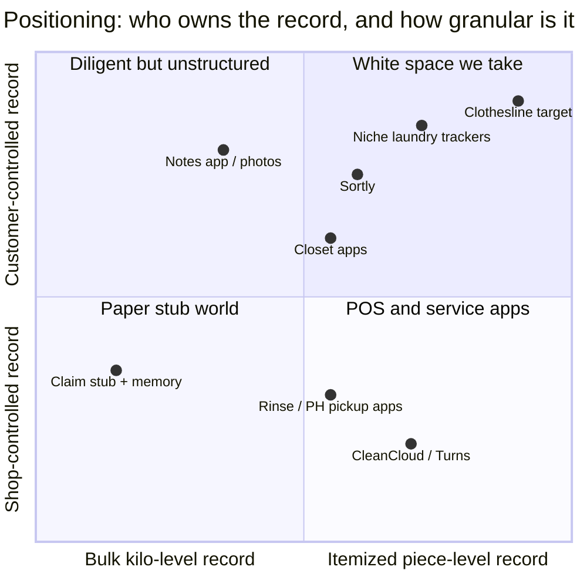

# Competitive Analysis — Existing Products & Substitutes

> **Document date:** 3 July 2026 · **Currency:** ₱ (US$1 ≈ ₱61.43, see [`03-market-research.md`](./03-market-research.md))
> Scope: anything a Metro Manila professional could use *today* to keep track of clothes sent to a laundry shop.

---

## 1. The top 5 competitors / substitutes

### #1 — The status quo: claim stub + memory (+ occasional notes-app list or photo)

*The real competitor. Free, universal, and the thing to beat.*

| | |
|---|---|
| **Does well** | Zero friction, zero cost, works at every shop; the stub is accepted by the shop as the claim token |
| **Falls short** | Records kilos and price, never contents; no receive-side check; photos/notes are unstructured and get abandoned; useless as dispute evidence — which is why PH law firms tell customers to reconstruct item lists *after* the loss ([Respicio & Co.](https://www.respicio.ph/commentaries/compensation-claim-for-laundry-service-lost-clothes-philippines)) |
| **Pricing / rating / funding** | Free / n.a. / n.a. |
| **What makes a user switch** | An itemizing flow faster than scribbling in Notes (< 60s with presets), plus one "gotcha" moment — the app catching a missing item at the counter once pays for years of habit |

### #2 — Niche personal laundry trackers (Laundry Tracker, LaundrySpace, hobby projects)

*Proof the need exists; execution and distribution are weak.*

| | |
|---|---|
| **Examples** | [Laundry Tracker (krishnas infotech, Google Play)](https://play.google.com/store/apps/details?id=com.krishnasinfotech.laundrytracker&hl=en) — track date, per-cloth counts, vendor rates, mark received, export reports; [Laundry Tracker 2.4 (AppsKraft)](https://laundry-tracker.soft112.com/) — same concept, manage "transactions with your laundry person"; [LaundrySpace (App Store)](https://apps.apple.com/us/app/laundryspace/id6738030788); open-source hobby builds ([GitHub example](https://github.com/Alphaspiderman/Laundry-Tracker)) |
| **Does well** | Closest feature match to our concept: item counts, vendor rates, give/receive reconciliation flows, pending-transaction check-off, date-wise reports. These apps digitize the Indian *dhobi diary* — the paper ledger households keep with their laundry person — proving the give/receive-reconcile flow is a real, recurring consumer job |
| **Falls short** | Dated UI (Dropbox/Bluetooth-export era), India-centric per-piece dhobi rate-card model rather than PH per-kilo shop workflow; no photo evidence, no discrepancy/dispute artifact; negligible traction — download counts/ratings not even surfaced in search results (flagged: could not verify store metrics from this environment); no shop directory, no evidence-export tailored to PH disputes (DTI/small claims), no Taglish localization. Note: the "laundry tracker" keyword is also contested in app stores by unrelated *machine-monitoring* apps for shared laundry rooms (PayRange, CSC GO) — an ASO consideration |
| **Pricing / rating / funding** | Free or ad-supported / unverified / none found |
| **What makes a user switch** | Modern UX, PH-localized flow (shop + kilos + piece counts), receive-checklist speed, trustworthy backup/sync |

### #3 — Generic inventory apps: Sortly

*Powerful, wrong-shaped, and priced for businesses.*

| | |
|---|---|
| **Does well** | Mature item cataloging: photos, folders, QR/barcode, exports; polished apps; ~90% satisfaction across 986 reviews on aggregate review sites ([Research.com](https://research.com/software/reviews/sortly)) |
| **Falls short** | Built for stockrooms, not send/receive loops — no "load", no counterparty, no reconciliation event. Top complaints: **subscription hikes of 300%+** and removal of affordable personal tiers, **data loss after updates** ("all of my items except one were completely deleted"), ads in the free tier, weak support follow-up ([JustUseApp reviews](https://justuseapp.com/en/app/529353551/sortly-inventory-simplified/reviews), [App Store reviews](https://apps.apple.com/us/app/sortly-inventory-simplified/id529353551?see-all=reviews&platform=iphone)) |
| **Pricing / rating / funding** | From **US$49/mo ≈ ₱3,010/mo** — 50× our target price ([The Retail Exec](https://theretailexec.com/tools/sortly-review/)); VC-backed inventory SaaS |
| **What makes a user switch** | Anyone using Sortly for laundry is massively over-tooled and overpaying; a ₱0–59 purpose-built loop wins on price and fit instantly |

### #4 — Wardrobe/closet apps: Stylebook, Whering, Indyx

*Adjacent job: they know what you own, not what you handed to the shop.*

| | |
|---|---|
| **Does well** | Beautiful garment catalogs with AI background removal; outfit planning, cost-per-wear analytics (Stylebook), 10M+ claimed users (Whering); Indyx free tier is generous with strong auto-tagging ([Nouva comparison](https://www.nouva.app/blog/best-wardrobe-apps-2026-comparison), [Indyx comparison](https://www.myindyx.com/blog/the-best-wardrobe-apps)) |
| **Falls short** | No concept of custody: nothing tracks garments *leaving* the house and *coming back*; cataloging a full closet is hours of upfront work (our app needs 60 seconds per load); no dispute/evidence angle |
| **Pricing / rating / funding** | Stylebook **≈ ₱368 one-time** (iOS only); Whering free + **≈ ₱429/mo** premium; Indyx free + styling services from **≈ ₱9,200/lookbook** ([Nouva](https://www.nouva.app/blog/best-wardrobe-apps-2026-comparison)); Whering is VC-backed, Indyx seed-stage |
| **What makes a user switch** | They don't need to switch — they need to *add*. Integration/import is a partnership opportunity; a user who already catalogs clothes is the easiest convert to load tracking |

### #5 — Laundry service software & service apps (shop-side POS apps + on-demand services)

*They itemize only inside their own walls — and they still lose clothes.*

**Shop-POS customer apps** — [CleanCloud](https://cleancloudapp.com/) (Capterra **4.7/5**, 215 reviews; current pricing **US$75–325/store/mo ≈ ₱4,600–₱20,000/mo**, annual from US$89¹ — [CleanCloud pricing](https://cleancloudapp.com/pricing), [Merchant Maverick](https://www.merchantmaverick.com/best-laundromat-pos/)) and [Turns](https://www.turnsapp.com/) (**US$150–250/mo ≈ ₱9,215–₱15,360/mo**; now part of PayRange, [Software Finder](https://softwarefinder.com/retail/turns-pos)). Complaints: admin UX bugs (saving kicks you to home screen; promo-code lockups), barcode scanning that doesn't warn on duplicate item entry, order/item tracking inconsistencies, one-way customer texting, new customers forced to log in before seeing prices, and "tired of the lack of ownership of issues" ([Capterra reviews](https://www.capterra.com/p/133390/CleanCloud/reviews/), [Software Advice](https://www.softwareadvice.com/retail/cleancloud-profile/)); Turns users cite many small missing features ([GetApp](https://www.getapp.com/retail-consumer-services-software/a/sifabso-1/)). Two more benchmarks bracket the category: **Cents** — the venture-scale endgame (US$140M Series C, 4,500+ US locations; US-centric, hardware-heavy, quote-based pricing, no PH presence — [PR Newswire](https://www.prnewswire.com/news-releases/cents-raises-140-million-from-sumeru-equity-partners-to-support-and-drive-innovation-for-laundry-smbs-302725686.html)) and **Quick Dry Cleaning (QDC)** — the budget end (from **US$49/mo ≈ ₱3,010**, plans to US$139; Capterra ≈ 4.7/5; India-rooted, praised for WhatsApp/SMS pickup reminders — [Capterra](https://www.capterra.com/p/122528/Quick-Dry-Cleaning-Software/)). Even QDC's cheapest tier exceeds what a typical ₱30K–₱100K/month Metro Manila shop will pay, which is why the local market stays on paper.

¹ *Older Capterra/G2 listings still show US$30–110/mo; CleanCloud's own page and 2026 aggregators show US$75–325. The current-price range is used here.*

**On-demand service apps** — [Rinse](https://www.rinse.com/) (US$70M+ raised; wash-and-fold at **US$2.99/lb ≈ ₱405/kg — 5–9× Metro Manila's ₱45–80/kg**): BBB complaints of **lost items, neighbors' laundry picked up by mistake, wrong-address delivery, ₱600-equivalent token credits**, and refunds only after the customer supplies proof ([BBB](https://www.bbb.org/us/ca/san-francisco/profile/dry-cleaners/rinse-inc-1116-542458/complaints), [Honest Brand Reviews](https://www.honestbrandreviews.com/reviews/rinse-review/), [Whisk review](https://whisklaundry.com/blog/rinse-laundry-review-pricing/)). [Laundryheap](https://www.laundryheap.com/) and gig-marketplace [Poplin](https://poplin.co/) (US$10M raised as SudShare) track *order status*, not items — lost/mixed items are a common complaint class in gig laundry. **Metro Manila has no dominant on-demand laundry app**: small locals exist ([Washwell](https://www.washwell.ph/pricing), [Lalaba](https://app.lalaba.ph/), [Laundrify PH](https://play.google.com/store/apps/details?id=ph.laundrify.customer), Mr. Jeff, GoodWork — [Globe blog](https://www.globe.com.ph/blog/home-service-apps-for-chores)), but most shop pickup/delivery is improvised via **GrabExpress/Lalamove couriers and Facebook Messenger booking** ([Triple i Consulting](https://www.tripleiconsulting.com/how-start-laundromat-business-philippines/)) — a *longer* hand-off chain (customer → courier → shop) that makes item verification more valuable, with nobody providing it.

| | |
|---|---|
| **Does well** | Real order lifecycle (pickup → wash → deliver), notifications, payments; CleanCloud even offers branded customer apps for shops |
| **Falls short** | **The shop controls the record.** Itemization (if any) reflects what the *shop* logged, vanishes when you switch shops, and covers only the ~1 shop in thousands that pays for the POS. Disputes remain "your word vs. their system." And the funded services *still* lose items |
| **What makes a user switch** | Nothing to switch — 95%+ of Metro Manila's 20,000+ shops run on paper stubs ([PLO 2026](https://isitcleanph.com/2026/02/21/is-it-clean-unveils-key-findings-of-1st-philippine-laundry-outlook/)). Our app is the customer-side record that works at *every* shop, POS or not |

## 2. Feature gap matrix

| Capability | Stub + Notes | Niche trackers | Sortly | Closet apps | Shop POS / service apps | **Clothesline (target)** |
|---|:---:|:---:|:---:|:---:|:---:|:---:|
| Works at **any** laundry shop | ✅ | ✅ | ✅ | ✅ | ❌ shop-bound | ✅ |
| Per-load "manifest" (shop + date) | ❌ | ⚠️ partial | ❌ | ❌ | ✅ shop-side only | ✅ |
| Item + piece-count entry < 60s | ❌ | ⚠️ clunky | ❌ | ❌ hours of setup | ❌ | ✅ presets/templates |
| **Receive-side reconciliation checklist** | ❌ | ⚠️ basic | ❌ | ❌ | ❌ | ✅ core loop |
| Discrepancy flagged at the counter | ❌ | ❌ | ❌ | ❌ | ❌ | ✅ |
| Per-shop trust history | ❌ | ⚠️ vendor rates only | ❌ | ❌ | ❌ | ✅ |
| PH-ready evidence export (DTI / small claims) | ❌ | ❌ | ❌ | ❌ | ❌ | ✅ |
| Discrepancy flag + evidence artifact (timestamped) | ❌ | ❌ | ❌ | ❌ | ❌ | ✅ core |
| Offline-first (shop counters often have no signal) | ✅ paper | ✅ | ⚠️ | ⚠️ | ❌ | ✅ |
| Taglish / ₱ / per-kilo localization | n.a. | ❌ | ❌ | ❌ | ⚠️ some local services | ✅ |
| Price for a consumer | Free | Free | ≈ ₱3,010/mo | ₱0–429/mo | n.a. (shop pays ₱4,600–20,000/mo) | ₱0 + ₱49–99/mo |

## 3. The one thing none of them does well

> **Closing the loop at the moment of receipt.** Every product either records inventory at rest (Sortly, closet apps), records the order for the shop (POS, service apps), or records nothing structured at all (stub, notes). **None of them puts an itemized send-out manifest in the customer's hand and then walks them through a piece-by-piece check-off at pickup, flagging the missing shirt while the customer is still standing at the counter — the only moment the dispute is still winnable.** That reconciliation event, plus the per-shop trust history and PH-ready evidence export it generates, is the whole product. It's also structurally defensible here: with 20,000+ mostly single-shop, paper-based laundromats, no shop-side player can cover the market — only a customer-owned record can.

## 4. Strategic implications

1. **Beat Notes, not Rinse.** Onboarding and per-load speed are the entire game; the competitor with 99% share is a paper stub.
2. **Price under impulse threshold**: free core loop; ₱49–99/mo premium (history, photos, exports) — 30–60× cheaper than the nearest structured tool (Sortly).
3. **Borrow closet-app polish** (photo capture, templates) without their setup burden.
4. **Acquisition moment = first lost item** (₱800–₱5,000 replacement cost). Be present in condo Facebook groups and r/adultingph right where *"nawalan ako ng damit sa laundry"* ("I lost clothes at the laundry") complaint posts appear.
5. **B2B later, from strength**: once customers demand itemized receipts, sell shops counter-side confirmation at ₱1,200–3,500/mo — 3–10× under CleanCloud's US$75–325/mo while doing the one job POS ignores (customer-verified counts), plus a "Verified Shop" trust badge fed by reconciliation data.

---

### Sources

- [Respicio & Co. — compensation claims for lost laundry](https://www.respicio.ph/commentaries/compensation-claim-for-laundry-service-lost-clothes-philippines)
- [Google Play — Laundry Tracker (krishnas infotech)](https://play.google.com/store/apps/details?id=com.krishnasinfotech.laundrytracker&hl=en) · [Soft112 — Laundry Tracker 2.4](https://laundry-tracker.soft112.com/) · [App Store — LaundrySpace](https://apps.apple.com/us/app/laundryspace/id6738030788) · [GitHub — Laundry-Tracker](https://github.com/Alphaspiderman/Laundry-Tracker)
- [Capterra — Sortly reviews](https://www.capterra.com/p/169199/Sortly-Pro/reviews/) · [JustUseApp — Sortly reviews](https://justuseapp.com/en/app/529353551/sortly-inventory-simplified/reviews) · [The Retail Exec — Sortly review](https://theretailexec.com/tools/sortly-review/) · [Research.com — Sortly](https://research.com/software/reviews/sortly) · [App Store — Sortly](https://apps.apple.com/us/app/sortly-inventory-simplified/id529353551)
- [Nouva — Best wardrobe apps 2026](https://www.nouva.app/blog/best-wardrobe-apps-2026-comparison) · [Indyx — wardrobe app comparisons](https://www.myindyx.com/blog/the-best-wardrobe-apps) · [Kat Sturges — Whering vs Indyx vs Style DNA](http://www.kathrynsturges.com/home/2025/4/8/comparison-between-wardrobe-apps)
- [Capterra — CleanCloud](https://www.capterra.com/p/133390/CleanCloud/) · [Capterra — CleanCloud reviews](https://www.capterra.com/p/133390/CleanCloud/reviews/) · [CleanCloud — pricing](https://cleancloudapp.com/pricing) · [G2 — CleanCloud](https://www.g2.com/products/cleancloud/reviews) · [Merchant Maverick — best laundromat POS](https://www.merchantmaverick.com/best-laundromat-pos/) · [Software Advice — CleanCloud](https://www.softwareadvice.com/retail/cleancloud-profile/)
- [PR Newswire — Cents $140M Series C](https://www.prnewswire.com/news-releases/cents-raises-140-million-from-sumeru-equity-partners-to-support-and-drive-innovation-for-laundry-smbs-302725686.html) · [Capterra — Quick Dry Cleaning Software](https://www.capterra.com/p/122528/Quick-Dry-Cleaning-Software/)
- [Poplin](https://poplin.co/) · [Tracxn — Poplin funding](https://tracxn.com/d/companies/poplin/__xIWF82jNKtIYI0TAlV15uDzDJ0vFbuc_knT7Qu2sH5A) · [Triple i Consulting — laundromat business PH (GrabExpress pattern)](https://www.tripleiconsulting.com/how-start-laundromat-business-philippines/)
- [Software Finder — Turns POS](https://softwarefinder.com/retail/turns-pos) · [GetApp — Turns](https://www.getapp.com/retail-consumer-services-software/a/sifabso-1/) · [Turns (PayRange)](https://www.turnsapp.com/)
- [BBB — Rinse complaints](https://www.bbb.org/us/ca/san-francisco/profile/dry-cleaners/rinse-inc-1116-542458/complaints) · [Honest Brand Reviews — Rinse](https://www.honestbrandreviews.com/reviews/rinse-review/) · [Whisk — Rinse review & pricing](https://whisklaundry.com/blog/rinse-laundry-review-pricing/) · [Tracxn — Rinse funding](https://tracxn.com/d/companies/rinse/__8V03iTVRvm-yJdQGEVjL8htAmc4HTnhjYRZC2eWpu-g)
- [Washwell — pricing](https://www.washwell.ph/pricing) · [Lalaba](https://app.lalaba.ph/) · [Google Play — Laundrify PH](https://play.google.com/store/apps/details?id=ph.laundrify.customer) · [Globe — home service apps](https://www.globe.com.ph/blog/home-service-apps-for-chores)
- [Is It Clean — Philippine Laundry Outlook 2026](https://isitcleanph.com/2026/02/21/is-it-clean-unveils-key-findings-of-1st-philippine-laundry-outlook/)
