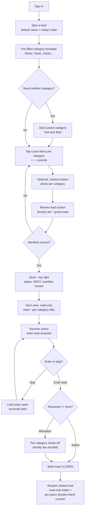

# Product Requirements Document — Clothesline (Phase 1: MVP)

> **Product:** Clothesline — a personal laundry send/receive tracker
> **Phase:** 1 of 3 (MVP)
> **Document date:** 3 July 2026
> **Platform:** Progressive Web App (PWA), mobile-first, offline-capable

---

## 1. Problem Statement

Busy professionals in Metro Manila routinely outsource their laundry to neighborhood per-kilo shops. The process is informal: clothes are weighed, a handwritten claim stub records kilos (not contents), and days later a sealed bundle comes back. **No customer-owned, itemized record exists of what was actually sent** — so when a piece goes missing, the customer usually can't prove it, sometimes can't even be sure of it, and typically discovers the loss too late to do anything about it.

This isn't a minor annoyance. Philippine legal commentary treats lost or damaged laundry as common enough to warrant published, step-by-step guides for demand letters, DTI complaints, and small-claims filings — and every one of those remedies starts with documentation the customer almost never has. Disputes default in the shop's favor simply because the shop's tally sheet is the only record of the hand-off.

**One-sentence problem statement:** Metro Manila professionals who outsource laundry by the kilo have no itemized record of what they hand over, so missing clothes are discovered late, disputed without evidence, and usually written off.

Clothesline's MVP closes this gap with a fast, itemized send/receive checklist that catches discrepancies **while the customer is still at the counter** — the only moment a dispute is actually winnable.

---

## 2. Target Users

### Primary persona — "Bianca," 31, condo-dwelling professional

| Attribute | Detail |
|---|---|
| Location | Rents/owns a condo or apartment in Metro Manila (Makati, BGC, Ortigas, QC) |
| Living situation | No in-unit washer/dryer; building rules often prohibit balcony drying |
| Laundry behavior | Sends 4–8 kg weekly to a nearby per-kilo shop; spends ₱500–₱1,200/month |
| Devices | Android-first mid-range smartphone; comfortable with app-based routines (GCash, Grab, Shopee) |
| Core need | A record of what she sent, fast enough to use at a counter, that tells her immediately if something's missing |

### What she needs from the MVP specifically

1. A way to itemize a load in well under a minute — she won't use anything slower than the claim stub she already gets for free.
2. A way to catch a shortfall **before she leaves the shop**, not two weeks later.
3. Something that works with no or weak signal, since shop counters are often dead zones.
4. Zero account-setup friction — she'll abandon anything that asks for a password she has to remember.

### Secondary persona (not designed for in this phase)
The laundry shop itself. Phase 1 does not build anything the shop interacts with — it's purely a consumer-side tool. (Shop-side interaction begins in Phase 3.)

---

## 3. Expected Workflow (Happy Path)

This section walks through the product end-to-end as Bianca would actually experience it, from opening the app to closing a fully reconciled load. It's the "happy flow" the MVP is designed around — everything in [Core Features](#4-core-features) exists to serve these steps. Phases 2 (AI photo capture) and 3 (shop involvement) deliberately add complexity on top of this baseline and are **out of scope here**; this workflow assumes no AI and no shop-side interaction.

### 3.1 Narrative walkthrough

1. **Sign in.** Bianca opens the app and signs in passwordlessly (email code/magic link). No password to remember.
2. **Start a load.** She creates a new load. By default the load is **named after the current date** (editable), so she doesn't have to think of a name at the counter.
3. **Pre-filled category template appears.** The load opens with a **pre-filled set of common categories** already laid out — e.g., Shirts, Pants, Socks — so she can start counting immediately without setup.
4. **Add custom categories (optional).** If she has something the template doesn't cover, she adds her own category through a **free-text field** (e.g., "Bedsheets", "Jerseys"). The new category joins the list for this load.
5. **Count the items.** For each category she **taps the counter** to add pieces (tap-tap-tap = 3), and can tap a minus control to correct an over-count. She repeats across categories until the load reflects what's physically in front of her.
6. **Attach photos (optional).** Next to each category is a **camera button**. She can tap it to photograph that item type for documentation. This is entirely optional — skipping it never blocks anything.
7. **Review the load screen.** The load screen reads like a laundry list: the load name (the date), each category with its running count, and the grand total (e.g., "Shirts 6, Pants 2, Socks 8 — 16 items"). She can keep adjusting counts until it's right.
8. **Send.** When the manifest matches what she's handing over, she taps **Send** (top-right). The load moves to **Sent** status — her signal that these clothes are now with the laundry shop. The sent manifest is **locked as the source-of-truth record**.
9. **Sent view (read-only).** Opening a load that's already been sent shows everything **read-only**: the total number of items sent, plus the per-category tally of exactly what went out. Nothing here can be edited — it's the record she'll reconcile against.
10. **Receive — enter total received.** When she picks the laundry up, she taps a **Receive** action (top-right / prominent, user-friendly placement). She's prompted to **type the total number of items received**. This step is **skippable** — she can defer it and the load simply stays open.
    - **Total received matches total sent →** the load is marked **Closed** (reconciled). Done in seconds.
    - **Skipped →** allowed; the load stays open and she can reconcile later.
11. **Closed load — per-piece double-check.** She can reopen a closed (or sent) load at any time. The **sent totals stay read-only**, but each category still exposes an **add/minus tap-counter for the receiving side** — so she can physically count pieces as they come back and confirm she got the correct number for each category, without ever altering the original sent record.

### 3.2 States in this flow

| State | What it means | What's editable |
|---|---|---|
| **Draft / Counting** | Load created, still itemizing | Categories and counts fully editable; photos addable |
| **Sent** | Clothes handed to the shop; manifest locked | Sent counts read-only; Receive action available |
| **Closed** | Received total entered and reconciled | Sent counts read-only; receive-side counter available for double-checking pieces |

### 3.3 Flow diagram

---

## 4. Core Features

### 4.1 Authentication
- **Passwordless email sign-in** — user enters email, receives a one-time code or magic link, is authenticated immediately.
- No password creation, no password recovery flow, no separate signup step.

### 4.2 Create a Load
- User creates a new load by entering:
  - Shop name
  - Shop location
  - Send-out date
- This becomes the load's header record.

### 4.3 Itemize (Category Tap-Counter)
- Predefined clothing categories (e.g., Shirts, Trousers, Socks, Underwear, Towels, etc.).
- Tapping a category increments its count by one (tap-tap-tap = 3).
- A running total across all categories is shown as the load's manifest summary (e.g., "Shirts: 6, Trousers: 2, Socks: 8 — 16 items total").
- No per-item (individual piece) data entry in Phase 1 — category + count only.

### 4.4 Duplicate Load
- From the home screen or an open load, a menu action ("Duplicate") creates a new load.
- **Only the clothing categories carry over** (e.g., if the original had Shirts, Trousers, Socks as active categories, the duplicate starts with those same categories present).
- Everything else resets: shop, location, date, all counts return to zero, and all photos are cleared.
- This is the MVP's answer to "reusable templates" — no separate template object is needed.

### 4.5 Photos (Optional)
- **Bundle photo** — one optional photo per load, doubles as the load's thumbnail/icon.
- **Per-category photos** — optional photos attached manually at the category level.
- Neither is required to create, send, or close a load.

### 4.6 Send
- User marks the load "sent." This locks the itemized manifest as the sent-state record — the source of truth for reconciliation.

### 4.7 Receive & Reconcile (Counter-Side)
- User opens the sent load and enters a **single total count received**.
- The app compares total received vs. total sent:
  - **Match** → load closes immediately (green state). Done in seconds.
  - **Mismatch** → the app automatically prompts an item-by-item, category-level check-off right there, so the user can identify and dispute the specific shortfall with the shop while still present.

### 4.8 Reconcile at Home (Optional)
- After leaving the counter, the user may return to any closed or open load and do a category-by-category check-off for her own records.
- This is entirely optional and not required to close a load — it exists for diligent users who want a fuller record.

### 4.9 Offline-First Operation
- Built as an installable PWA.
- Core flows (create load, itemize, mark sent, enter received count) must work with no network connection, given that shop counters are frequently low- or no-signal environments.
- Data syncs when connectivity returns.

### 4.10 Shop Record-Keeping
- Every load stores which shop and location it was sent to.
- Phase 1 does pure data capture only — no scoring, no analytics, no aggregation. This is the foundation Phase 3's reliability metrics will be built on.

---

## 5. Out of Scope (Phase 1)

- **Shop-side confirmation or two-sided receipts** — the shop has no interaction with the app in this phase. (Planned for Phase 3.)
- **AI/camera-based clothing detection** — all itemization is manual tap-counting in Phase 1. (Planned for Phase 2.)
- **Per-shop reliability history or analytics** — data is captured but not surfaced as insights in this phase. (Planned for Phase 3.)
- **Evidence-pack export** (formatted for DTI complaints/demand letters) — backlog, not scheduled in any current phase.
- **Pickup-due reminders** — backlog, not scheduled in any current phase.
- **Payments, delivery logistics, garment care instructions.**
- **RFID/barcode tagging** — enterprise linen-tracking territory, not relevant to this consumer tool.
- **Multi-user/household accounts** — Phase 1 is single-user only.

---

## 6. Success Metrics

Recommended for Phase 1, split into **usability metrics** (is the product fast/frictionless enough to actually get used) and **adoption/engagement metrics** (is it being used at all, and repeatedly):

### Usability
- **Time to itemize a load:** target < 60 seconds from "create load" to "mark sent" for a typical load (6–10 items across 2–4 categories). This is the make-or-break number — if itemizing is slower than doing nothing, the app fails its core premise.
- **Time to reconcile a matched load:** target < 30 seconds (single total-count entry, no mismatch).
- **Time to reconcile a mismatched load:** target < 90 seconds including the item-by-item check-off prompt.

### Adoption & Engagement
- **Activation rate:** % of signed-up users who create and send at least one load within their first session.
- **Retention (repeat use):** % of users who log a second load within 14 days of their first — this is the real signal that the app has replaced memory/claim-stub habits, since laundry is a recurring weekly behavior.
- **Loads per active user per month:** benchmark against the ~4x/month cadence implied by weekly laundry behavior; a healthy user should be logging most or all of their real-world loads, not just trying it once.
- **Discrepancy detection rate:** % of loads that surface a mismatch at the counter. This isn't a "growth" metric, but it's the single number that validates the core value proposition — it's direct evidence the tool is catching something the old process missed.
- **Photo attachment rate (optional feature usage):** % of loads with at least one photo attached — signals whether the optional evidence-building behavior is being adopted, which matters for future phases (evidence export, AI photo capture).

### A note on what NOT to over-index on early
Given this is a solo, pre-launch build, raw user-count growth metrics (e.g., total signups) are less informative than the usability and retention numbers above. A small number of users who keep coming back and who occasionally catch a real discrepancy is stronger validation than a large number who try it once.

---

## 7. Open Questions

1. **Default clothing categories** — what's the initial fixed list of categories (Shirts, Trousers, Socks, Underwear, Towels, Bedsheets, etc.)? Does the user need the ability to add a custom category in Phase 1, or is a fixed list sufficient to start?
2. **Load states beyond "sent" and "closed"** — is there a need for a "draft" state (load created but not yet sent), or does creating a load immediately imply intent to send?
3. **Data retention** — how long are closed loads and their photos retained? Any storage limits to plan for, especially for photo-heavy users?
4. **What happens on a "received more than sent" mismatch** — the discrepancy flag is framed around shortfalls, but what if the count is *higher* than expected (e.g., another customer's item got mixed in)? Does this need distinct handling from a shortfall?
5. **Multiple loads open at the same shop simultaneously** — can a user have two loads in-flight to the same shop at once (e.g., a regular wash and a delicates load sent separately)? Does the UI need to disambiguate these clearly?
6. **Notification/reminder for "load sent, not yet reconciled"** — even though pickup reminders are backlogged, is any lightweight nudge needed to prompt her to open the app when she picks up laundry, or is that left entirely to the user's memory in Phase 1?

---

### Source documents
- [`01-problem-statement.md`](./01-problem-statement.md)
- [`02-target-customer.md`](./02-target-customer.md)
- [`06-product-feature-roadmap.md`](./06-product-feature-roadmap.md)
- Founder brainstorm sessions, 3 July 2026
