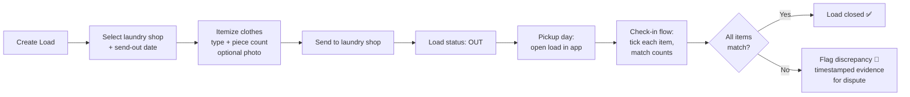
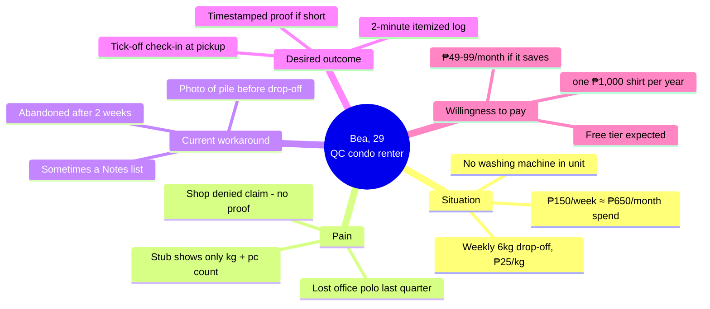

# Document 1 — Problem Statement & Target Customer Persona

**Project:** Personal Laundry Tracking App (working concept)
**Geography:** Metro Manila, Philippines
**Model:** B2C-first, with future B2B (laundry shop) integration
**Date:** July 2026
**Currency:** Philippine Peso (₱); USD conversions assume ₱56 = US$1

---

## 1. Problem Statement

### 1.1 The problem

Busy professionals in Metro Manila increasingly outsource laundry to neighborhood laundry shops and laundromats. The standard hand-off process is informal: the customer drops off a bag, the shop weighs it, and issues a paper claim stub that typically records only the **weight and total piece count** — not an itemized list of garments. When the customer picks up the load days later, there is **no practical way to verify that every item sent was returned**.

The consequences:

- **Lost or missing items are discovered late or never.** Without an itemized record, a missing shirt is often only noticed weeks later ("where's my other office polo?"), at which point the claim is unprovable.
- **Disputes are asymmetric.** The shop's tally sheet is the only record. The customer has no independent evidence of what was handed over, so "he said, she said" disputes default in the shop's favor.
- **The burden of proof is real and legally recognized.** The problem is common enough in the Philippines that legal primers exist specifically for lost-laundry claims. Philippine law treats laundry custody as a deposit-like contract, and guidance for claimants explicitly lists the evidence needed: an **official receipt/service ticket with date, count, and description**, plus **photographs of garments** — exactly the records most customers don't keep ([Respicio & Co., "Compensation Claim for Laundry Service Lost Clothes Philippines," May 2025](https://www.respicio.ph/commentaries/compensation-claim-for-laundry-service-lost-clothes-philippines)). The same primer notes DTI-mediated complaints and small-claims court as escalation paths — remedies that all hinge on documentation the customer usually lacks.
- **Existing "solutions" are manual and fragile.** Customers who do track use ad-hoc methods: phone photos of the pile, notes apps, or trusting the shop's stub. None supports a structured *send → receive → reconcile* flow.

### 1.2 Problem statement (canonical form)

> **Metro Manila professionals who outsource laundry to third-party laundry shops have no reliable, low-effort way to record exactly what they send out and verify what they get back, resulting in undetected lost items, unwinnable disputes, and eroded trust — because the only record of the transaction is the shop's own weight-based paper stub.**

### 1.3 Proposed solution (starter scope)

A lightweight mobile app that mirrors a simplified **inventory receipt process**, applied to laundry:

The discrepancy record (what was logged at send-out, what failed check-in, timestamps, optional photos) becomes the customer's evidence — precisely the documentation Philippine legal guidance says a claimant needs.

### 1.4 Why now

- **The supply side is booming.** Laundry outsourcing in the Philippines is a growth industry driven by condo living and busy urban lifestyles; Philippine laundry-service revenue was forecast at roughly **US$88.2M (≈ ₱4.94B)** by 2024 per Statista figures cited in local business press ([The Business Manual](https://thebusinessmanual-onemega.com/business-101/best-practices/how-entrepreneurs-built-biggest-fully-owned-laundromat-weclean/)). Single chains like WeClean now operate **65 fully-owned branches in Metro Manila alone** (same source). More transactions → more hand-offs → more lost-item exposure.
- **The trust layer hasn't kept up.** Shop-side POS software exists (see Document 3), but virtually all of it serves the *shop*, not the customer, and the ubiquitous mom-and-pop shops in Metro Manila mostly still run on paper stubs.

---

## 2. Primary Persona

### 2.1 Persona: **"Bea," the Condo-Dwelling Metro Manila Professional**

| Attribute | Detail |
|---|---|
| **Age** | 25–38 |
| **Location** | Metro Manila (NCR) — Quezon City, Makati, BGC/Taguig, Mandaluyong, Pasig condo corridors. NCR population is 14.0M as of the 2024 census ([PSA](https://psa.gov.ph/content/highlights-national-capital-region-ncr-population-2024-census-population-2024-popcen)); Mandaluyong and Taguig are the fastest-growing cities, both dense condo markets |
| **Occupation** | IT/BPO professional, consultant, nurse, finance analyst, government employee — full-time office or hybrid work |
| **Income** | ₱30,000–₱90,000/month (mid-market professional band) |
| **Living situation** | Rents or owns a studio/1BR condo or apartment; no washing machine, no space for one, or building rules/utility costs make in-unit laundry impractical — the exact demand driver the industry itself cites: laundromats serve "busy professionals, students, and households lacking access to personal washing machines" ([Triple i Consulting](https://www.tripleiconsulting.com/how-start-laundromat-business-philippines/)) |
| **Laundry behavior** | Drops off 5–8 kg weekly or bi-weekly at a neighborhood shop; pays ₱20–35/kg wash-dry-fold ([Flexwasher PH industry overview](https://www.flexwasher.com/profitable-laundry-business-in-philippines/)); ~₱600–₱1,200/month total spend |
| **Devices** | Android-first smartphone (mid-range), heavy user of GCash/Maya, Grab, Shopee, Lazada |

### 2.2 Goals

1. Never lose a garment to the laundry shop again — or at least *know immediately* when one goes missing.
2. Keep the drop-off/pickup process fast; tracking must take under 2 minutes or it won't happen.
3. Have evidence in hand if a dispute happens (per the legal guidance above, documentation is what wins claims).
4. Optionally: know spending per shop, per month, and which shop is most reliable.

### 2.3 Frustrations

- The shop stub says "7.5 kg / 32 pcs" — useless for identifying *which* 32 pieces.
- Missing items are discovered too late to prove anything.
- Office wear (branded polos, slacks, uniforms) is expensive to replace — the sample demand letter in the Philippine legal primer literally itemizes a **₱4,950 Zara blazer and ₱1,290 Uniqlo shirts** as typical lost-laundry claims ([Respicio & Co.](https://www.respicio.ph/commentaries/compensation-claim-for-laundry-service-lost-clothes-philippines)).
- Counting clothes piece-by-piece at the counter feels awkward and slows everyone down.
- Shops disclaim liability with "not responsible for loss" signage (which the same legal primer notes is largely void under PH consumer law — but customers don't know that, and can't act without records).

### 2.4 Where they hang out online

- **Reddit:** r/Philippines, r/adultingph, r/phinvest, r/PHcareers, r/manila — adulting, condo-living, and service-recommendation threads
- **Facebook:** condo/building community groups, HOA groups, neighborhood buy-and-sell groups where laundry shop recommendations and complaints circulate
- **TikTok/Instagram:** condo-living and "adulting hacks" content
- **X/Twitter:** venting about services; brand complaint tagging

### 2.5 Tools they use today (the "competition" for this job)

| Current tool | How it's used | Why it fails |
|---|---|---|
| Shop's paper stub | Weight + total piece count | No itemization; easily lost; shop-controlled |
| Phone camera | Photo of the laundry pile pre-dropoff | Unstructured; no counts; no check-in flow |
| Notes app / Google Keep | Typed list of items | Manual reconciliation; no status; abandoned quickly |
| Spreadsheet | Power users only | High friction on mobile; overkill |
| Memory | Default for most | The whole problem |

### 2.6 What they already pay for (willingness-to-pay signals)

- Laundry service itself: **₱600–₱1,200+/month** recurring
- Convenience premiums: Grab rides, food delivery fees, GrabUnlimited-type subscriptions
- App subscriptions in the **₱49–₱250/month** band (streaming, cloud storage, productivity)
- Replacing lost garments: a single lost office shirt (₱800–₱1,500) exceeds a year of a ₱99/month subscription — this is the core value anchor

### 2.7 Real voices from the community

> **Sourcing note & caveat:** The strongest evidence artifact found through verifiable public sources is the existence of a dedicated Philippine legal primer on lost-laundry compensation claims — including DTI complaint procedures and a template demand letter for missing garments ([Respicio & Co., 2025](https://www.respicio.ph/commentaries/compensation-claim-for-laundry-service-lost-clothes-philippines)). Law firms write primers for problems clients actually bring them; this is indirect but strong validation that lost-laundry disputes are a recurring, real-money problem in the Philippines.
>
> Individual Reddit/X posts on this topic exist in communities like r/Philippines and r/adultingph (typical patterns paraphrased below), but they are not reliably indexable via search engines at the time of writing, so **direct quote-level citations could not be verified and are not presented as quotes**. Treat the patterns below as directional, pending a manual community scan (recommended next step — 30 minutes of manual Reddit/Facebook group searching would close this gap).

Recurring complaint patterns observed in PH online communities (paraphrased, not quoted):

1. Discovering an item missing days/weeks after pickup, with the shop denying responsibility for lack of proof.
2. Shops counting pieces differently at drop-off vs. what the customer believes was sent ("they said 28 pcs, I counted 30 at home").
3. Damaged or swapped items (receiving someone else's similar garment).
4. Advice threads recommending exactly the manual workarounds in §2.5 — take photos, list items in Notes — validating that users already attempt this job with inferior tools.
5. Requests for laundry shop recommendations framed around *trustworthiness* ("hindi nawawalan ng damit" — *"doesn't lose clothes"*) rather than price, signaling that item security is a selection criterion.

### 2.8 Secondary personas (later)

- **The multi-household manager:** sends laundry for a family or shared unit; higher item volume, higher stakes.
- **The laundry shop owner (B2B pivot):** small Metro Manila shop (₱30K–₱100K/month gross revenue, 20–40% margins per [Digido](https://digido.ph/articles/laundry-business-philippines)) that wants to *offer* verified itemized intake as a trust differentiator. This persona activates the B2B phase and is profiled in Document 3.

---

## 3. Persona-to-problem fit summary

*(Diagram note: "short" flag = discrepancy found at check-in.)*

---

## Sources

1. Respicio & Co. Law, *Compensation Claim for Laundry Service Lost Clothes (Philippines)*, May 2025 — https://www.respicio.ph/commentaries/compensation-claim-for-laundry-service-lost-clothes-philippines
2. Philippine Statistics Authority, *Highlights of the NCR Population, 2024 POPCEN* — https://psa.gov.ph/content/highlights-national-capital-region-ncr-population-2024-census-population-2024-popcen
3. The Business Manual, *How Entrepreneurs Built the Biggest Fully-Owned Laundromat (WeClean)* — https://thebusinessmanual-onemega.com/business-101/best-practices/how-entrepreneurs-built-biggest-fully-owned-laundromat-weclean/
4. Triple i Consulting, *How to Start a Laundromat Business in the Philippines*, May 2025 — https://www.tripleiconsulting.com/how-start-laundromat-business-philippines/
5. Flexwasher, *Is the Laundry Business Profitable in the Philippines?* — https://www.flexwasher.com/profitable-laundry-business-in-philippines/
6. Digido, *Why Laundry Business Is a Good Business in the Philippines*, May 2025 — https://digido.ph/articles/laundry-business-philippines
