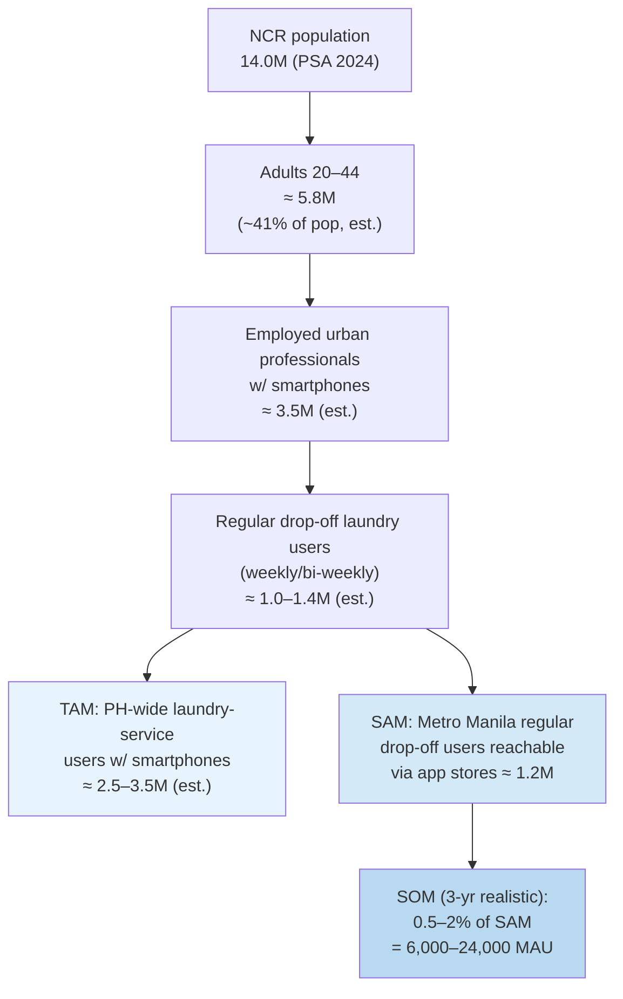
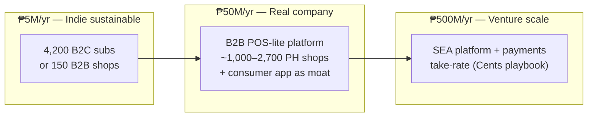
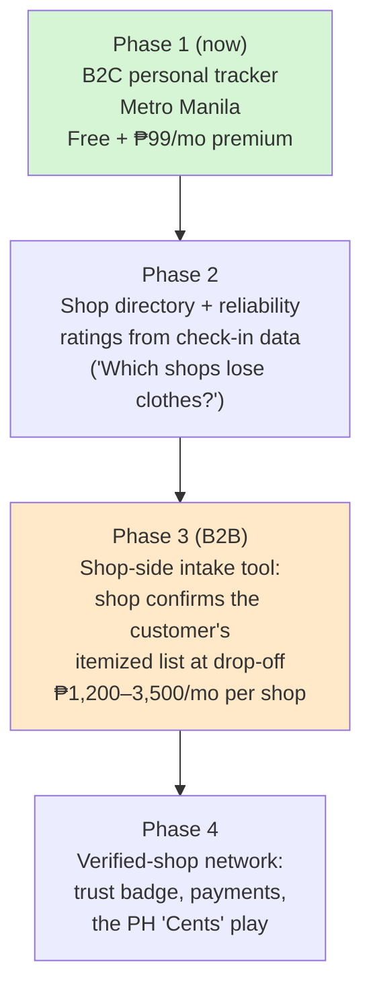

# Document 2 — Market Research: TAM / SAM / SOM

**Project:** Personal Laundry Tracking App — Metro Manila, Philippines
**Model:** B2C-first (consumer app), later B2B (laundry shop integration)
**Date:** July 2026
**Currency:** Philippine Peso (₱); USD conversions assume **₱56 = US$1** (assumption — adjust at analysis time)

---

## 1. Market context: the demand engine

The app doesn't monetize laundry itself — it monetizes *trust in the laundry hand-off*. Its addressable market therefore scales with the number of people who regularly hand clothes to a third party.

Key verified anchors:

- **Metro Manila (NCR) population: 14,001,751** as of 1 July 2024, ~12.4% of the national 112.7M ([PSA, 2024 POPCEN](https://psa.gov.ph/content/highlights-national-capital-region-ncr-population-2024-census-population-2024-popcen)).
- **Philippine laundry services revenue was forecast at ~US$88.2M (≈ ₱4.94B) by 2024** per Statista figures cited in Philippine business press ([The Business Manual](https://thebusinessmanual-onemega.com/business-101/best-practices/how-entrepreneurs-built-biggest-fully-owned-laundromat-weclean/)). Note: the broader IMARC "home & laundry care" figure of US$3.2B for 2025 is dominated by detergents/consumer products and is *not* the service market ([IMARC](https://www.imarcgroup.com/philippines-home-laundry-care-market)) — cited here only to warn against conflating the two.
- **Typical Metro Manila wash-dry-fold pricing: ₱20–₱35/kg** ([Flexwasher](https://www.flexwasher.com/profitable-laundry-business-in-philippines/); corroborated by franchise guides).
- **Supply-side boom:** single operator WeClean runs **65 fully-owned Metro Manila branches** ([The Business Manual](https://thebusinessmanual-onemega.com/business-101/best-practices/how-entrepreneurs-built-biggest-fully-owned-laundromat-weclean/)); small shops gross **₱30K–₱100K/month at 20–40% net margins** ([Digido](https://digido.ph/articles/laundry-business-philippines)); typical franchise entry is **under ₱500K** ([Unicapital](https://unicapital-inc.com/blog/laundry-shop-franchise-philippines/)). Low entry cost + solid margins = thousands of shops, overwhelmingly paper-based.
- Industry growth drivers named repeatedly in PH sources: **condo living, dual-income households, urban professionals without washing machines** ([Aviaan](https://aviaanaccounting.com/business-plan-for-laundromat-business-in-phillipines/); [Triple i Consulting](https://www.tripleiconsulting.com/how-start-laundromat-business-philippines/)).

---

## 2. Bottom-up market sizing (B2C, Metro Manila first)

### 2.1 The funnel

> **Estimation note:** PSA publishes population but not "regular drop-off laundry users." The 1.0–1.4M NCR figure is derived: ≈3.5M NCR households (Statista/PSA household series shows 3.51M household population units as of the 2021 series — [Statista](https://www.statista.com/statistics/1424615/household-population-metro-manila-philippines/)), of which condo/apartment renters without in-unit machines are conservatively 25–35%, discounted for households using labanderas (home laundrywomen) or self-service only. Treat as a directional estimate to be validated with a survey.

### 2.2 TAM / SAM / SOM (annual revenue potential, B2C)

Monetization assumption: **freemium**, premium tier at **₱99/month (₱1,188/yr)**, with 4–8% free→paid conversion (typical utility-app band).

| Tier | Definition | Users | Revenue math | Annual ₱ |
|---|---|---|---|---|
| **TAM** | All PH smartphone users who regularly use third-party laundry (NCR + Cebu + Davao + other metros) | ~3.0M | 3.0M × ₱1,188 if all paid (theoretical ceiling) | **≈ ₱3.6B** |
| **SAM** | Metro Manila regular drop-off users, app-store reachable, English/Taglish UI | ~1.2M | 1.2M × ₱1,188 theoretical | **≈ ₱1.4B** |
| **SOM (Yr 3)** | Realistic capture: 1% of SAM as MAU, 6% paying | 12,000 MAU → 720 paying | 720 × ₱1,188 | **≈ ₱0.86M** |

**The honest read:** as a standalone B2C subscription utility, the 3-year SOM is *lifestyle-project scale* (< ₱1M/yr), not venture scale. That is fine for the stated goal ("a personal project that addresses my need and even others"). The path to bigger numbers runs through B2B — see §4.

### 2.3 Revenue-tier ladder: what ₱5M / ₱50M / ₱500M requires

(₱500M ≈ US$8.9M; for reference the classic $1M/$10M/$100M ≈ ₱56M/₱560M/₱5.6B at ₱56:$1.)

| Annual revenue target | B2C-only path (₱99/mo premium) | Blended B2C + B2B path |
|---|---|---|
| **₱5M** (~US$89K) | ~4,200 paying subs → ~70,000 MAU at 6% conversion. Achievable in NCR alone with strong organic/condo-community growth. | 2,000 paying subs + **150 shops** on a ₱1,200/mo shop-side tier. |
| **₱50M** (~US$0.9M) | ~42,000 paying subs → ~700K MAU = **58% of Metro Manila SAM**. Unrealistic for a paid tracker; requires national + SEA expansion or a much higher ARPU. | 10,000 paying subs + **~2,700 shops** at ₱1,200/mo, or ~1,000 shops at a ₱3,500/mo POS-lite tier — i.e., become a Philippine CleanCloud with a consumer-verification moat. |
| **₱500M** (~US$8.9M) | Not credible as B2C tracking alone. | Regional (PH + SEA) shop platform + payments take-rate (the Cents playbook: Cents processes **US$1B/yr in payments across 4,500+ locations** — [The SaaS News](https://www.thesaasnews.com/news/cents-raises-140-million-in-series-c)). Requires venture funding and a multi-year platform play. |

---

## 3. Funded-startup benchmarks (validation that money flows here)

| Company | Segment | Funding (latest / total) | ₱ equivalent | Signal for this project |
|---|---|---|---|---|
| **Cents** (US) | B2B laundry POS/payments platform | **US$140M Series C, Mar 2026** (Sumeru Equity Partners); **US$184M total**; 4,500+ locations, US$1B payments/yr ([PR Newswire](https://www.prnewswire.com/news-releases/cents-raises-140-million-from-sumeru-equity-partners-to-support-and-drive-innovation-for-laundry-smbs-302725686.html); [Tracxn](https://tracxn.com/d/companies/cents/__yxiP-gXq_ChEvBZ3hQsO6IhqoifY12AlSySLcq-6as0)) | ≈ **₱7.8B** Series C; ₱10.3B total | Largest-ever laundry-tech raise; proves the *shop-platform* endgame is venture-fundable |
| **Rinse** (US) | B2C pickup/delivery laundry | **US$23M Series D, Feb 2025** led by **LG Electronics**; **US$70M+ total** since 2013 ([TechCrunch](https://techcrunch.com/2025/04/09/tired-of-doing-laundry-these-startups-want-to-help/)) | ≈ ₱1.29B round; ₱3.9B+ total | B2C laundry convenience monetizes — but as a *service*, not a tracker |
| **Laundryheap** (UK) | B2C on-demand laundry, multi-country | Series B-II **US$6.25M, Mar 2025**; ~US$23–28M total ([CB Insights](https://www.cbinsights.com/company/laundryheap/financials); [Tracxn](https://tracxn.com/d/companies/laundryheap/__jZ6Z9Own0hEZSAjhVkzgei-xkXHMSl4nmNDlRn7zCGM)) | ≈ ₱350M round; ~₱1.3–1.6B total | International expansion via acquisitions (Laundrapp, GetLavado) |
| **Poplin** (ex-SudShare, US) | Gig-economy laundry marketplace | **US$10M, 2022** ([Tracxn](https://tracxn.com/d/companies/poplin/__xIWF82jNKtIYI0TAlV15uDzDJ0vFbuc_knT7Qu2sH5A)) | ≈ ₱560M | Marketplace model; 500+ US cities |
| **Washio** (US) — cautionary | B2C on-demand laundry | Shut down **2016**; assets absorbed by Rinse ([TechCrunch](https://techcrunch.com/2025/04/09/tired-of-doing-laundry-these-startups-want-to-help/)) | — | On-demand laundry logistics burn cash; asset-light tracking avoids this failure mode |

**Key finding:** across 1,460 tracked on-demand-laundry startups globally, 124 are funded ([Tracxn sector page](https://tracxn.com/d/trending-business-models/startups-in-ondemand-laundry-services/__TPsXBpL0vS8hKmxb-0XGTpaB05l3a8fHOp0F9wz0TmI/companies)) — yet **no funded startup was found whose core product is consumer-side itemized send/receive verification** for third-party shops. The category is either (a) an overlooked wedge or (b) too small to fund standalone. Evidence in Document 3 (tiny existing tracker apps, India-focused) suggests it's a *wedge*: small alone, valuable as the trust layer of a bigger shop platform.

---

## 4. Strategic read

- **Phase 1 economics:** dev cost is your own time (you're the builder); infra < ₱2K/month at small scale. Break-even is trivially low — this de-risks the whole exploration.
- **The data flywheel is the hidden asset:** aggregated check-in discrepancy data ("Shop X: 0 lost items across 1,240 loads") is a shop-reliability dataset nobody in the Philippines has. It converts the B2C tool into B2B leverage: shops will want the badge.
- **Currency/estimate caveats:** ₱56:$1 assumed throughout; PSA does not publish "laundry-user" counts, so funnel middle layers are explicit estimates; the Statista PH laundry-services figure is a 2024 forecast cited via secondary press, not a primary report (paywalled).

---

## Sources

1. PSA, *Highlights of the NCR Population, 2024 POPCEN* — https://psa.gov.ph/content/highlights-national-capital-region-ncr-population-2024-census-population-2024-popcen
2. Philstar, *Philippines population reached 112.7 million in 2024* — https://www.philstar.com/headlines/2025/07/18/2458844/philippines-population-reached-1127-million-2024-psa
3. Statista (PSA series), *Households in Metro Manila* — https://www.statista.com/statistics/1424615/household-population-metro-manila-philippines/
4. The Business Manual, *WeClean laundromat feature* (Statista PH laundry revenue forecast) — https://thebusinessmanual-onemega.com/business-101/best-practices/how-entrepreneurs-built-biggest-fully-owned-laundromat-weclean/
5. IMARC Group, *Philippines Home & Laundry Care Market* — https://www.imarcgroup.com/philippines-home-laundry-care-market
6. Flexwasher, *Is the Laundry Business Profitable in the Philippines?* — https://www.flexwasher.com/profitable-laundry-business-in-philippines/
7. Digido, *Why Laundry Business Is a Good Business in the Philippines* — https://digido.ph/articles/laundry-business-philippines
8. Unicapital, *How to Start a Laundry Shop Franchise in the Philippines* — https://unicapital-inc.com/blog/laundry-shop-franchise-philippines/
9. Triple i Consulting, *Laundromat Business Philippines Guide* — https://www.tripleiconsulting.com/how-start-laundromat-business-philippines/
10. Aviaan, *Business Plan for Laundromat Business in the Philippines* — https://aviaanaccounting.com/business-plan-for-laundromat-business-in-phillipines/
11. PR Newswire, *Cents Raises $140 Million (Series C)* — https://www.prnewswire.com/news-releases/cents-raises-140-million-from-sumeru-equity-partners-to-support-and-drive-innovation-for-laundry-smbs-302725686.html
12. The SaaS News, *Cents Raises $140M in Series C* — https://www.thesaasnews.com/news/cents-raises-140-million-in-series-c
13. Tracxn, *Cents profile* — https://tracxn.com/d/companies/cents/__yxiP-gXq_ChEvBZ3hQsO6IhqoifY12AlSySLcq-6as0
14. TechCrunch, *Tired of doing laundry? These startups want to help* (Rinse $23M Series D/LG; Washio shutdown) — https://techcrunch.com/2025/04/09/tired-of-doing-laundry-these-startups-want-to-help/
15. CB Insights, *Laundryheap financials* — https://www.cbinsights.com/company/laundryheap/financials
16. Tracxn, *Poplin profile* — https://tracxn.com/d/companies/poplin/__xIWF82jNKtIYI0TAlV15uDzDJ0vFbuc_knT7Qu2sH5A
17. Tracxn, *On-demand Laundry Services sector* — https://tracxn.com/d/trending-business-models/startups-in-ondemand-laundry-services/__TPsXBpL0vS8hKmxb-0XGTpaB05l3a8fHOp0F9wz0TmI/companies
