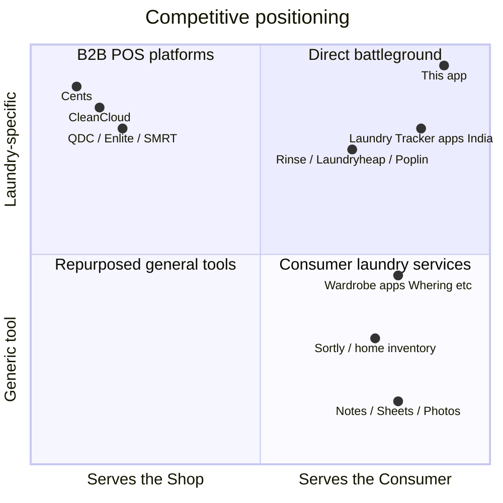
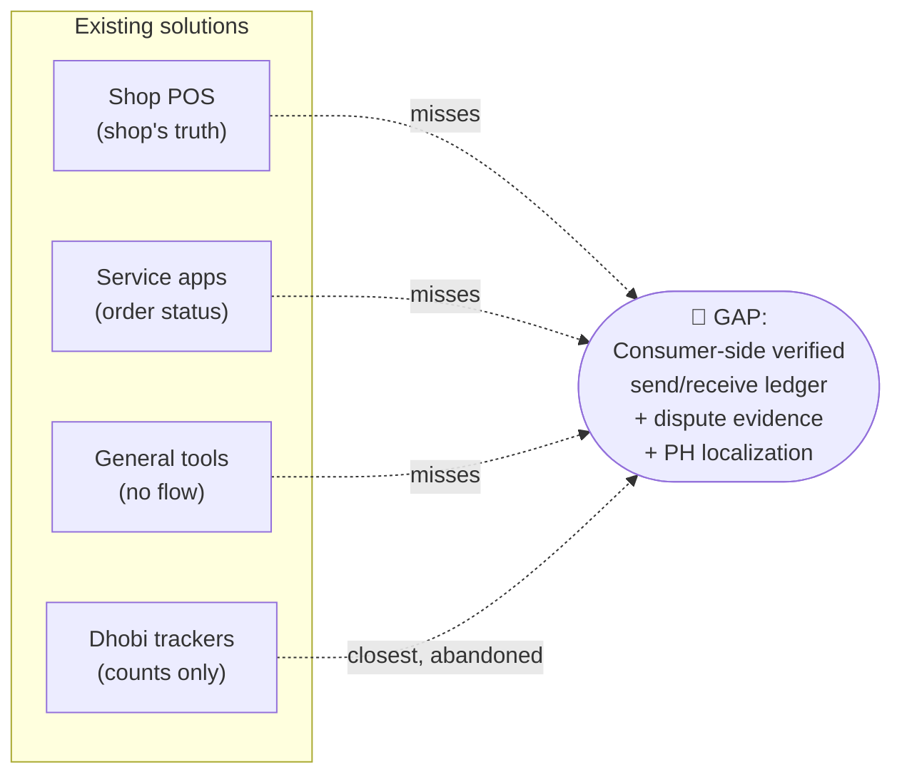

# Document 3 — Competitive Landscape & Feature Gap Analysis

**Project:** Personal Laundry Tracking App — Metro Manila, Philippines
**Date:** July 2026
**Currency:** ₱ (₱56 = US$1 assumed)

---

## 1. The competitive map

Three substitute categories compete for the job "make sure my laundry comes back complete" — plus one small direct-competitor cluster.

---

## 2. Category A — Laundry shop POS / management software (**B2B**)

**Market they cater to:** shop owners/operators. **What makes them distinct:** they optimize the shop's operations (orders, payments, routes); the end customer is a record in someone else's database.

### A1. CleanCloud — the incumbent benchmark

- **What it is:** all-in-one POS for laundromats/dry cleaners; barcode garment tracking, pickup/delivery apps, notifications ([cleancloudapp.com](https://cleancloudapp.com/)).
- **Rating:** **4.7/5 on Capterra (215 reviews)** ([Capterra](https://www.capterra.com/p/133390/CleanCloud/reviews/)).
- **Pricing:** **US$99–325/store/month (≈ ₱5,500–₱18,200)**, annual from US$89 ([Merchant Maverick](https://www.merchantmaverick.com/best-laundromat-pos/); [CleanCloud pricing](https://cleancloudapp.com/pricing)).
- **Does well:** fast counter workflow, barcode/garment tracking, SMS/email "order ready" notifications customers love, strong support reputation.
- **Falls short (from verified reviews):** barcode scanning doesn't warn on duplicate item entry; order/item tracking inconsistencies reported; clunky admin UX ("kicks you back to Home Screen" after each save); promo-code bugs; multi-vendor support runaround for hardware; new customers forced to log in before seeing prices ([Capterra reviews](https://www.capterra.com/p/133390/CleanCloud/reviews/); [Software Advice](https://www.softwareadvice.com/retail/cleancloud-profile/)).
- **Critical gap for our thesis:** itemization exists *only if the shop pays for and operates it*. The customer gets notifications, not an independent record. At ₱5,500+/month, it is priced out of the typical Metro Manila shop grossing ₱30K–₱100K/month.
- **What would make a user switch (shop-side):** price. A ₱1,200–3,500/month PH-localized intake tool undercuts CleanCloud by 3–10×.

### A2. Cents — the venture-scale platform

- **What it is:** integrated software + hardware + payments; POS, machine payments, delivery dispatch, AI customer service.
- **Scale/funding:** 4,500+ US locations, US$1B payments/yr; **US$140M Series C (Mar 2026, ≈ ₱7.8B), US$184M total** ([PR Newswire](https://www.prnewswire.com/news-releases/cents-raises-140-million-from-sumeru-equity-partners-to-support-and-drive-innovation-for-laundry-smbs-302725686.html); [Tracxn](https://tracxn.com/d/companies/cents/__yxiP-gXq_ChEvBZ3hQsO6IhqoifY12AlSySLcq-6as0)).
- **Falls short (for this market):** US-centric, hardware-heavy, enterprise pricing (quote-based; one Capterra reviewer switched *to* CleanCloud citing dislike of Cents' sales/customer service — [Capterra](https://www.capterra.com/p/133390/CleanCloud/reviews/)). No PH presence found.
- **Distinct:** the endgame template for the B2B phase — but zero consumer-side independent verification.

### A3. Quick Dry Cleaning (QDC), Enlite, SMRT Systems, Curbside Laundries

- QDC: **4.7/5 Capterra (59 reviews)**, from **US$49/month (≈ ₱2,750)**; praised for WhatsApp/SMS pickup reminders and garment tracking; India-rooted ([Capterra comparison](https://www.capterra.com/compare/122528-133390/Quick-Dry-Cleaning-Software-vs-CleanCloud)).
- SMRT/Enlite/Curbside: dry-cleaner-oriented US products; Curbside noted as expensive by a reviewer ([Capterra](https://www.capterra.com/p/133390/CleanCloud/reviews/)).
- **Shared gap:** all shop-owned records; none give the customer an independent send/receive ledger. No evidence of meaningful Metro Manila penetration — the local market runs on paper stubs and, at most, generic POS.

---

## 3. Category B — Consumer laundry pickup/delivery apps (**B2C service**)

**Market they cater to:** consumers outsourcing the *entire* laundry chore. **Distinct:** they own the full logistics loop, so "tracking" means order status, not item verification. None operate in the Philippines.

| Player | Distinct positioning | Funding / scale | Item-level verification for user? |
|---|---|---|---|
| **Rinse** (US) | Premium "Uber of laundry," W-2 valets, 24hr rush; 100M+ garments cleaned | US$23M Series D (LG, Feb 2025); US$70M+ total ([TechCrunch](https://techcrunch.com/2025/04/09/tired-of-doing-laundry-these-startups-want-to-help/)) | Internal itemization for dry-cleaning billing; user cannot pre-log and reconcile |
| **Laundryheap** (UK/global) | Multi-country on-demand; grew by acquiring Laundrapp, GetLavado | ~US$23–28M total; US$6.25M Series B-II Mar 2025 ([CB Insights](https://www.cbinsights.com/company/laundryheap/financials)) | Order-status tracking only |
| **Poplin** (US) | Gig marketplace ("laundry pros"), 500+ cities | US$10M (2022) ([Tracxn](https://tracxn.com/d/companies/poplin/__xIWF82jNKtIYI0TAlV15uDzDJ0vFbuc_knT7Qu2sH5A)) | No; common complaint class in gig laundry is precisely lost/mixed items |
| **PH local scene** | No dominant Metro Manila on-demand laundry app found; pickup/delivery is done shop-by-shop, often via **GrabExpress/Lalamove couriers or Facebook Messenger booking** ([Triple i Consulting](https://www.tripleiconsulting.com/how-start-laundromat-business-philippines/) notes GrabExpress integration as the common pattern) | — | The hand-off chain gets *longer* (customer → courier → shop), making item verification **more** valuable, with nobody providing it |

**What would make a user switch to our app:** nothing to switch *from* in PH — these services don't exist locally. The takeaway is instead that global B2C laundry apps validated consumer willingness to pay for laundry convenience, while leaving item-level trust unsolved even inside their own loops.

---

## 4. Category C — Repurposed general tools (**prosumer/DIY**)

**Market:** everyone; **Distinct:** free and already installed — the true competitor for Phase 1.

| Tool | Used how | Fatal flaw for this job |
|---|---|---|
| Phone camera | Photo of pile before drop-off | No counts, no reconciliation, no history |
| Google Keep / Notes | Typed item list | Manual check-in; no load status; abandoned |
| Google Sheets | Power-user grid | Mobile-hostile; no reminders/photos inline |
| **Sortly** & home-inventory apps | Item inventory w/ photos, QR | Built for static possessions, not out-and-back cycles; subscription (US$/mo) overkill |
| **Wardrobe apps** (Whering, Indyx, Stylebook, Acloset) | Digitize closet, plan outfits | Closet cataloging ≠ custody tracking; none found with a send-out/receive-back verification flow |

None implements the two-sided *dispatch → receipt → discrepancy* state machine. That flow is the product.

---

## 5. Direct competitors — dedicated laundry tracker apps

This is the most important finding: **a small direct-competitor cluster exists, built for the India dhobi (home laundry-person) use case.**

| App | Feature set | Market & distinctness | Weaknesses / gap |
|---|---|---|---|
| **Laundry Tracker** (AppsKraft lineage, Android) | Give clothes / receive clothes flows; per-item rates; pending-transaction check-off; monthly reports; reminders; export via email/Dropbox; 15+ themes ([Soft112 listing](https://laundry-tracker.soft112.com/)) | Explicitly built to "manage transactions with your laundry person (**dhobi** in India)" — replaces the paper *dhobi diary* | Dated UI (Dropbox/Bluetooth export era); India rate-card model, not PH per-kilo shops; no photos; no shop directory; minimal updates; obscure distribution |
| **Laundry Tracker** (Krishnas Infotech, Google Play) | Track date, counts per cloth type, rates, multiple vendors ([Google Play](https://play.google.com/store/apps/details?id=com.krishnasinfotech.laundrytracker&hl=en)) | Same dhobi-ledger niche | Ad-supported utility; no receipt-verification emphasis; no localization for PH |
| **"Laundry tracker" (facility apps)** — PayRange, CSC GO, LaundryConnect | Machine cycle status/payment in shared laundry rooms ([SelfOp](https://www.selfoplaundry.com/blog/improving-customer-service-with-a-laundry-tracker)) | Different job entirely: machine monitoring, not garment custody | Not competitors; noted to avoid keyword confusion — the term "laundry tracker" is contested in app stores |

**Interpretation:** the dhobi-tracker apps prove (a) the give/receive-reconcile flow is a real, recurring consumer job, and (b) nobody has productized it *well* — these are hobby-grade apps with old UX, no photo evidence, no discrepancy/dispute artifact, and zero Philippine localization (per-kilo pricing, Taglish, GCash-era design, condo-shop context).

---

## 6. Feature gap matrix

| Feature | CleanCloud (B2B) | Cents (B2B) | Rinse / Laundryheap (B2C svc) | Notes/Sheets/Photos | Wardrobe apps | India Laundry Trackers | **This app** |
|---|:---:|:---:|:---:|:---:|:---:|:---:|:---:|
| Itemized piece-level logging | ✅ (shop-side) | ✅ (shop-side) | ⚠️ internal | ⚠️ manual | ✅ (closet) | ✅ | ✅ |
| **Consumer-owned record, independent of shop** | ❌ | ❌ | ❌ | ✅ | ✅ | ✅ | ✅ |
| **Receipt-verification / check-in flow** | ❌ (customer side) | ❌ | ❌ | ❌ | ❌ | ⚠️ basic | ✅ core |
| **Discrepancy flag + evidence artifact** | ❌ | ❌ | ❌ | ❌ | ❌ | ❌ | ✅ core |
| Photo attachment per load/item | ✅ shop | ✅ shop | ❌ | ⚠️ unstructured | ✅ | ❌ | ✅ |
| Multi-shop support + shop history | n/a | n/a | n/a | ❌ | ❌ | ✅ (vendors) | ✅ |
| Reminders (pickup due) | ✅ SMS to cust. | ✅ | ✅ | ⚠️ | ❌ | ✅ | ✅ |
| History / spend analytics | ✅ shop | ✅ shop | ✅ orders | ⚠️ | ❌ | ✅ reports | ✅ |
| Offline-first (counter has no signal) | ⚠️ | ⚠️ | ❌ | ✅ | ⚠️ | ✅ | ✅ |
| PH localization (₱/kg, Taglish, local shop model) | ❌ | ❌ | ❌ (no PH ops) | n/a | ❌ | ❌ | ✅ |
| Consumer price | free (shop pays ₱5.5–18K/mo) | quote | pay-per-service | free | freemium | free w/ ads | free + ₱99/mo |

### The one thing none of them does well

> **A consumer-owned, itemized send/receive verification ledger for third-party laundry shops — with a timestamped discrepancy record usable as dispute evidence — localized for the Philippine per-kilo laundry-shop model.**

Shop software records what *the shop* says it received. Service apps track *order status*. General tools have no reconciliation flow. The dhobi trackers come closest but stop at counting — no photos, no evidence artifact, no PH context, and near-abandoned execution. The discrepancy-evidence angle is uniquely defensible in the Philippines, where legal guidance on lost-laundry claims explicitly turns on exactly this documentation ([Respicio & Co.](https://www.respicio.ph/commentaries/compensation-claim-for-laundry-service-lost-clothes-philippines)).

---

## 7. Switching triggers (summary)

| From | Trigger to switch to this app |
|---|---|
| Memory / nothing | First lost item (₱800–5,000 replacement cost) — acquisition moment; target condo FB groups right after "nawalan ako ng damit sa laundry" (*"I lost clothes at the laundry"*) complaint posts |
| Photos/Notes | 2-minute structured flow beats their own hack; reminders they can't build themselves |
| Dhobi tracker apps | Modern UX, photos, discrepancy evidence, PH model — trivially better |
| (Shops, Phase 3) from paper stubs | ₱1,200–3,500/mo intake tool + "Verified Shop" trust badge vs. CleanCloud at ₱5,500–18,200/mo |

---

## Sources

1. CleanCloud — https://cleancloudapp.com/ and pricing — https://cleancloudapp.com/pricing
2. Capterra, CleanCloud reviews (4.7/5, 215) — https://www.capterra.com/p/133390/CleanCloud/reviews/
3. Software Advice, CleanCloud profile — https://www.softwareadvice.com/retail/cleancloud-profile/
4. Merchant Maverick, *Best Laundromat POS* (CleanCloud US$99–325/store/mo) — https://www.merchantmaverick.com/best-laundromat-pos/
5. Capterra, QDC vs CleanCloud comparison — https://www.capterra.com/compare/122528-133390/Quick-Dry-Cleaning-Software-vs-CleanCloud
6. PR Newswire, Cents US$140M Series C — https://www.prnewswire.com/news-releases/cents-raises-140-million-from-sumeru-equity-partners-to-support-and-drive-innovation-for-laundry-smbs-302725686.html
7. Tracxn, Cents profile (US$184M total) — https://tracxn.com/d/companies/cents/__yxiP-gXq_ChEvBZ3hQsO6IhqoifY12AlSySLcq-6as0
8. TechCrunch, laundry startups roundup (Rinse Series D/LG; Washio) — https://techcrunch.com/2025/04/09/tired-of-doing-laundry-these-startups-want-to-help/
9. CB Insights, Laundryheap financials — https://www.cbinsights.com/company/laundryheap/financials
10. Tracxn, Poplin profile — https://tracxn.com/d/companies/poplin/__xIWF82jNKtIYI0TAlV15uDzDJ0vFbuc_knT7Qu2sH5A
11. Soft112, Laundry Tracker app listing (give/receive dhobi flow) — https://laundry-tracker.soft112.com/
12. Google Play, Laundry Tracker (Krishnas Infotech) — https://play.google.com/store/apps/details?id=com.krishnasinfotech.laundrytracker&hl=en
13. SelfOp Laundry, *Improving Customer Service with a Laundry Tracker* (facility-tracker distinction) — https://www.selfoplaundry.com/blog/improving-customer-service-with-a-laundry-tracker
14. Triple i Consulting, *Laundromat Business Philippines Guide* (GrabExpress delivery pattern) — https://www.tripleiconsulting.com/how-start-laundromat-business-philippines/
15. Respicio & Co., *Compensation Claim for Laundry Service Lost Clothes Philippines* — https://www.respicio.ph/commentaries/compensation-claim-for-laundry-service-lost-clothes-philippines
