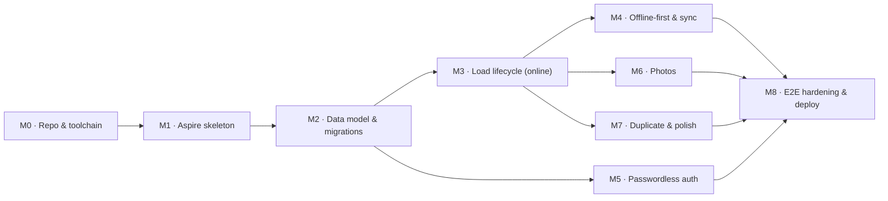
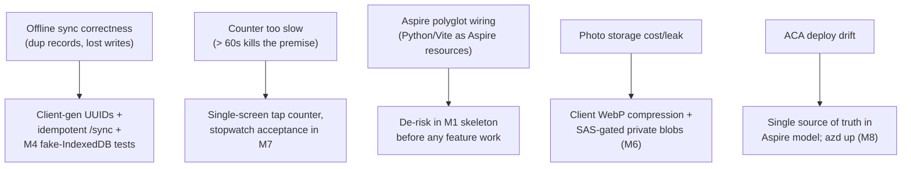

# Implementation Plan — Clothesline (Phase 1: MVP)

> **Companion to:** [`technical-implementation-spec.md`](./technical-implementation-spec.md)
> **Phase:** 1 of 3 (MVP)
> **Document date:** 3 July 2026
> **Status:** Draft for build
> **Audience:** the person(s) building the MVP. This turns the spec's *design* into an *ordered build plan* — milestones, tasks, dependencies, and acceptance criteria. It does not restate the design; cross-references point back to spec sections (e.g. "spec §5.2").

---

## 1. Approach

Build **thin, end-to-end, and offline-critical-path first.** The riskiest, most differentiating requirement is *offline-first at the counter* (spec §7), so the plan front-loads the walking skeleton (Aspire graph + one real request/response) and the core load lifecycle **before** polish (photos, auth email delivery, deploy hardening).

Sequencing principles:
- **Skeleton before features** — get `aspire run` booting both containers + Postgres/Azurite on day one.
- **Vertical slices** — each milestone delivers a demoable user-visible capability, not a horizontal layer.
- **Offline is not a "phase at the end"** — the client is built local-first from M3 onward; the sync endpoint lands as soon as there's state to sync.
- **Tests ride with the code** — pytest/Vitest per milestone; Playwright e2e (incl. the offline flow) gates the milestones that complete a user journey.

Effort tags are **T-shirt sizes** (S/M/L), not calendar estimates — this is a solo pre-launch build (PRD §5).

---

## 2. Milestones at a glance

| # | Milestone | Delivers | Depends on |
|---|---|---|---|
| M0 | Repo & toolchain | Dev container + repo scaffolding, CI skeleton | — |
| M1 | Aspire walking skeleton | `aspire run` boots web + api + Postgres + Azurite; one live `/health` round-trip | M0 |
| M2 | Data model & migrations | SQLAlchemy models + Alembic; empty domain modules | M1 |
| M3 | Load lifecycle (online) | Create → itemize → send → receive/reconcile via API + basic UI | M2 |
| M4 | Offline-first & sync | IndexedDB local store, service worker, `/sync`, mutation outbox | M3 |
| M5 | Passwordless auth | `/auth/start`+`/verify`, JWT session, sign-in screen, Mailpit locally | M2 |
| M6 | Photos | Bundle + per-category photos, pre-signed Blob upload, offline capture | M3 |
| M7 | Duplicate & polish | Duplicate flow, counter UX targets, empty/error states | M3 |
| M8 | E2E hardening & deploy | Full Playwright suite (incl. offline) + `azd up` to ACA | M4, M5, M6, M7 |

### Dependency graph

---

## 3. Milestones in detail

### M0 — Repo & toolchain  ·  size **S**
Foundation so every later milestone builds/tests uniformly.

- [ ] Confirm dev container boots (`.devcontainer/`): Python 3.12 + `uv`, Node LTS, .NET SDK + Aspire workload, docker-in-docker.
- [ ] Scaffold folder structure per spec §3: `aspire/Clothesline.AppHost`, `src/backend/clothesline_api`, `src/backend/clothesline_tests`, `src/frontend/clothesline-web`, `src/frontend/clothesline-e2e`.
- [ ] Backend `pyproject.toml` managed by `uv`; add ruff + mypy + pytest.
- [ ] Frontend `clothesline-web` via Vite (React + TS); add eslint + prettier + Vitest.
- [ ] CI skeleton: lint + typecheck + (empty) test jobs for both stacks.

**Acceptance:** fresh clone → open dev container → `uv run pytest` and `npm run test` both run (zero tests) green; CI passes on push.

---

### M1 — Aspire walking skeleton  ·  size **M**
The single most important early milestone: prove the topology (spec §2).

- [ ] Aspire AppHost declares: `clothesline-api` (Python/FastAPI container), `clothesline-web` (Vite container), a **Postgres** resource, and **Azurite** (Blob emulator).
- [ ] AppHost wires connection strings / service discovery into both apps via env vars (no hand-maintained config).
- [ ] FastAPI `GET /health` returning `{status:"ok"}` + DB ping.
- [ ] React app fetches `/health` and renders the status → proves web ↔ api ingress + CORS.
- [ ] Multi-stage Dockerfiles for both containers (spec §11.3).

**Acceptance:** `aspire run` boots the full graph; dashboard shows all resources healthy; the web app displays the live API health status.

---

### M2 — Data model & migrations  ·  size **M**
Persistence for the domain (spec §4).

- [ ] SQLAlchemy 2.x async models: `User`, `Load`, `LoadItem`, `Photo` (spec §4.1), with `updated_at`/`deleted_at` for sync.
- [ ] Alembic wired for migrations; initial migration creates the schema.
- [ ] Client-generated UUID PKs accepted on write (spec §7).
- [ ] Static category catalog (spec §4.3) shared as config on server (validation) and client (offline seed).
- [ ] Empty domain packages stubbed: `auth/`, `loads/`, `media/`, `sync/` (spec §5.1), each with `router/service/models/schemas`.
- [ ] pytest: a throwaway-Postgres fixture (testcontainers or the Aspire dev DB).

**Acceptance:** `alembic upgrade head` builds the schema; a round-trip integration test inserts and reads back a `Load` with items via the session layer.

---

### M3 — Load lifecycle, online  ·  size **L**
The core user journey end-to-end, network-connected (spec §3.2–3.8, §5.2, §5.4).

Backend:
- [ ] `POST /loads`, `GET /loads`, `GET /loads/{id}`, `PATCH /loads/{id}` (draft edits).
- [ ] `POST /loads/{id}/send` — freezes `total_sent`, `draft → sent` (spec §4.2).
- [ ] `POST /loads/{id}/receive` — match → `closed`; mismatch → returns delta (spec §5.4), incl. **surplus** (received > sent, PRD O4).
- [ ] `POST /loads/{id}/reconcile` — per-category check-off; closes load.
- [ ] All queries scoped to `user_id` (use a stub user until M5).

Frontend:
- [ ] Home / load list; create-load screen; **tap-counter** grid (spec §6.2).
- [ ] Load detail + "Mark sent"; receive screen (single number) → match celebration / mismatch check-off.
- [ ] Category check-off screen (shared by mismatch + optional home reconcile).

Tests:
- [ ] pytest for the reconcile/send/duplicate service logic (match, mismatch, surplus, freeze-on-send).
- [ ] Vitest for tap-counter increment/decrement + running total, and the mismatch → check-off branch.

**Acceptance:** online, a user can create → itemize → send → receive a matched load (closes) and a mismatched load (check-off → closes); Playwright smoke covers both.

---

### M4 — Offline-first & sync  ·  size **L**
Make the M3 journey work with no network (spec §6.4, §7). **Highest-risk milestone.**

- [ ] IndexedDB store (via `idb`/Dexie) as the client system of record; all M3 mutations write locally first.
- [ ] Service worker via `vite-plugin-pwa` (Workbox): precache app shell + category catalog; installable manifest.
- [ ] Mutation **outbox** queue with client-generated UUIDs; sync indicator (non-blocking).
- [ ] Backend `POST /sync`: idempotent upsert-by-id push + changes-since-cursor pull; last-writer-wins by `updated_at` (spec §7).
- [ ] Reconnect handler flushes the outbox and pulls server changes; monotonic status transitions never regress.

Tests:
- [ ] Vitest against fake-IndexedDB for outbox + merge/LWW logic.
- [ ] pytest for `/sync` idempotency (replay the same op → no duplicate/drift).

**Acceptance:** with the network fully offline, create → itemize → send → receive completes; on reconnect the load appears server-side exactly once. (Playwright offline test added in M8.)

---

### M5 — Passwordless auth  ·  size **M**
Replace the stub user with real sign-in (spec §3.1 PRD, §5.5).

- [ ] `POST /auth/start` — issue OTP + magic-link token (hashed, single-use, short-TTL); always 200 (no enumeration).
- [ ] `POST /auth/verify` — OTP or token → session JWT (+ refresh); create user on first verify.
- [ ] `GET /auth/me`; JWT middleware; scope all load queries to the authenticated user.
- [ ] Email delivery abstraction; **Mailpit/log sink** wired via Aspire locally (no real mail).
- [ ] Frontend sign-in screen + magic-link deep-link handler; persist tokens to survive offline (spec §9 tradeoff).

Tests:
- [ ] pytest for start/verify (single-use, expiry, first-verify user creation, no-enumeration).

**Acceptance:** a user signs in via OTP read from Mailpit and via magic link; authenticated requests are scoped to their own loads.

---

### M6 — Photos  ·  size **M**
Optional evidence capture (spec §3.5 PRD, §8).

- [ ] `POST /loads/{id}/photos` → returns pre-signed Blob **upload** URL; `GET …/{pid}` → short-lived read SAS.
- [ ] Client compresses to WebP, uploads bytes directly to Blob (Azurite locally).
- [ ] Bundle photo doubles as load thumbnail; per-category photos on the counter/check-off tiles.
- [ ] Offline capture: store bytes in IndexedDB with `local_only`, upload on reconnect (metadata rides `/sync`, bytes go out-of-band).

**Acceptance:** attach a bundle + a category photo online and offline-then-synced; thumbnail renders in the load list; blobs are SAS-gated (not public).

---

### M7 — Duplicate & polish  ·  size **S–M**
The "template" mechanic + hitting the usability targets (spec §3.4/§5.3, §6.3).

- [ ] Duplicate action (home list ⋮ + open load): new `draft` carrying **categories only**; counts/photos/shop/location/date reset (spec §5.3). Works offline client-side; `/duplicate` endpoint for the online/cross-device path.
- [ ] Counter UX pass: large thumb-reachable tiles, single-tap increment with feedback, always-visible running total (PRD < 60s target).
- [ ] Empty states, error/toast states, sync-status affordance, install prompt.

**Acceptance:** duplicating a load reproduces its category set and nothing else; a stopwatch test of create → itemize (6–10 items) → mark sent lands under the PRD's 60s target.

---

### M8 — E2E hardening & deploy  ·  size **M**
Prove the whole thing and ship it (spec §10.3, §11).

- [ ] Playwright e2e (`clothesline-e2e`) against the Aspire graph, using pre-installed Chromium at `/opt/pw-browsers/chromium` (no `playwright install`):
  - passwordless sign-in (OTP from Mailpit)
  - create → itemize → send → receive **match**
  - create → send → receive **mismatch** → check-off → close
  - **offline** create+itemize+send+receive → reconnect → assert single server-side load
  - duplicate (categories only) and photo attach (bundle + category via Azurite)
- [ ] CI gate wired in order: lint/typecheck → pytest → Vitest → build containers → Playwright (spec §10.4).
- [ ] `azd up`: provision ACA env + Postgres Flexible Server + Blob from the Aspire model; deploy both containers; secrets via Key Vault (spec §9, §11).
- [ ] Smoke the deployed environment; confirm HTTPS ingress and the PWA installs on a phone.

**Acceptance:** full Playwright suite green in CI; `azd up` yields a live ACA deployment where a phone can install the PWA and complete the counter flow end-to-end.

---

## 4. Cross-cutting workstreams

Run alongside the milestones rather than as discrete steps:

- **Testing** — pytest + Vitest land with each milestone; Playwright grows through M8 (spec §10).
- **CI/CD** — skeleton in M0, gate assembled in M8; keep it green throughout.
- **Security** — no-enumeration auth, hashed single-use tokens, user-scoped queries, SAS-gated photos, secrets via Key Vault (spec §9). Verify per relevant milestone, not bolted on at the end.
- **Observability** — lean on the Aspire dashboard (logs/traces/metrics) locally from M1; wire ACA logging at deploy.

---

## 5. Risks & mitigations

| Risk | Likelihood | Mitigation |
|---|---|---|
| Offline sync produces duplicates / lost updates | Med | Client-generated UUIDs; idempotent upsert-by-id `/sync`; LWW is safe because Phase 1 is single-user (spec §7); dedicated M4 tests |
| Aspire polyglot orchestration friction | Med | Prove it in the M1 skeleton before building features; keep Dockerfiles simple |
| Itemize flow misses the < 60s target | Med | Single-screen counter (spec §6.3); stopwatch acceptance check in M7 |
| Photo storage cost / accidental public exposure | Low | Compress client-side; private container + short-lived SAS only (spec §8) |
| Scope creep from PRD open questions | Med | Decisions already fixed in spec §14; treat changes as explicit re-scoping |

---

## 6. Definition of Done (Phase 1)

The MVP is done when:
1. A phone-installed PWA completes **create → itemize → send → receive** for both matched and mismatched loads — **fully offline** — and syncs on reconnect.
2. Passwordless sign-in works end-to-end.
3. Duplicate, photos (bundle + per-category), and optional home reconcile all function.
4. The full Playwright suite (including the offline path) is green in CI.
5. `azd up` deploys the Aspire graph to Azure Container Apps and the deployed app passes a phone smoke test.
6. The PRD usability targets (spec §13 / PRD §5) are met on a real device: itemize < 60s, matched reconcile < 30s, mismatched reconcile < 90s.
