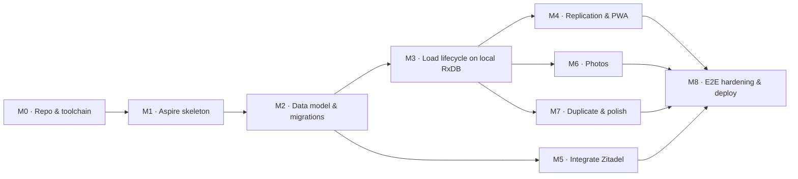
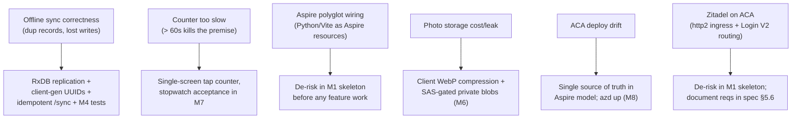

# Implementation Plan — Clothesline (Phase 1: MVP)

> **Companion to:** [`technical-implementation-spec.md`](./technical-implementation-spec.md)
> **Phase:** 1 of 3 (MVP)
> **Document date:** 3 July 2026
> **Status:** Draft for build
> **Audience:** the person(s) building the MVP. This turns the spec's *design* into an *ordered build plan* — milestones, tasks, dependencies, and acceptance criteria. It does not restate the design; cross-references point back to spec sections (e.g. "spec §5.2").

---

## 1. Approach

Build **thin, end-to-end, and local-first.** The riskiest, most differentiating requirement is *offline-first at the counter* (spec §7), so the plan front-loads the walking skeleton (Aspire graph) and then builds the **entire load lifecycle against the local RxDB** before wiring server replication. The app is usable offline from M3; M4 makes it durable across devices.

Sequencing principles:
- **Skeleton before features** — get `aspire run` booting the containers + Postgres/Azurite on day one.
- **Local-first, not "offline bolted on later"** — M3 builds every flow as **RxDB writes** (client is the system of record); M4 adds the generic `/sync/{collection}` replication + PWA shell.
- **Vertical slices** — each milestone delivers a demoable user-visible capability, not a horizontal layer.
- **Tests ride with the code** — pytest/Vitest per milestone; Playwright e2e (incl. the offline flow) gates the milestones that complete a user journey.

Effort tags are **T-shirt sizes** (S/M/L), not calendar estimates — this is a solo pre-launch build (PRD §6).

---

## 2. Milestones at a glance

| # | Milestone | Delivers | Depends on |
|---|---|---|---|
| M0 | Repo & toolchain | Dev container + repo scaffolding, CI skeleton | — |
| M1 | Aspire walking skeleton | `aspire run` boots web + api + Postgres + Azurite + Zitadel core + Login V2; one live `/health` round-trip | M0 |
| M2 | Data model & migrations | `clothesline_db` (SQLAlchemy models + Alembic); empty domain modules | M1 |
| M3 | Load lifecycle on local RxDB | Create → itemize → send → receive/reconcile/duplicate as local RxDB writes + UI (works offline, no server) | M2 |
| M4 | Replication & PWA | Generic `/sync/{collection}` pull/push + RxDB replication, push-time validators, service worker/install, polling | M3 |
| M5 | Integrate Zitadel (passwordless) | OIDC/PKCE to Login V2, JWKS validation, minimal user upsert, Mailpit locally | M2 |
| M6 | Photos | Bundle + per-category photos, pre-signed Blob upload, offline capture | M3 |
| M7 | Duplicate & polish | Duplicate flow, counter UX targets, empty/error states | M3 |
| M8 | E2E hardening & deploy | Full Playwright suite (incl. offline) + `azd up` to ACA | M4, M5, M6, M7 |

### Dependency graph

---

## 3. Milestones in detail

### M0 — Repo & toolchain  ·  size **S**
Foundation so every later milestone builds/tests uniformly.

- [ ] Confirm dev container boots (`.devcontainer/`): Python 3.12 + `uv`, Node LTS, .NET SDK + Aspire workload, docker-in-docker.
- [ ] Scaffold folder structure per spec §3: `aspire/Clothesline.AppHost`, `src/backend/clothesline_db`, `src/backend/clothesline_api`, `src/backend/clothesline_tests`, `src/frontend/clothesline-web`, `src/frontend/clothesline-e2e`.
- [ ] Backend `pyproject.toml` managed by `uv`; add ruff + mypy + pytest.
- [ ] Frontend `clothesline-web` via Vite (React + TS); add eslint + prettier + Vitest.
- [ ] CI skeleton: lint + typecheck + (empty) test jobs for both stacks.

**Acceptance:** fresh clone → open dev container → `uv run pytest` and `npm run test` both run (zero tests) green; CI passes on push.

---

### M1 — Aspire walking skeleton  ·  size **M**
The single most important early milestone: prove the topology (spec §2.1), including the polyglot + prebuilt-image wiring.

- [ ] Aspire AppHost declares: `clothesline-api` (Python/FastAPI), `clothesline-web` (Vite), a **Postgres** resource (app + zitadel databases), **Azurite** (Blob emulator), **Zitadel core** + **Login V2** (prebuilt images, plain-HTTP dev mode), and **Mailpit** (OTP sink).
- [ ] AppHost wires connection strings, the OIDC issuer/JWKS URL, and service discovery into the apps via env vars (no hand-maintained config).
- [ ] FastAPI `GET /health` returning `{status:"ok"}` + DB ping.
- [ ] React app fetches `/health` and renders the status → proves web ↔ api ingress + CORS.
- [ ] Multi-stage Dockerfiles for `clothesline-api` and `clothesline-web` (spec §11.5).

**Acceptance:** `aspire run` boots the full graph; dashboard shows all resources healthy (incl. Zitadel core + Login V2); the web app displays the live API health status.

---

### M2 — Data model & migrations (`clothesline_db`)  ·  size **M**
Persistence for the domain, in the shared data package (spec §3, §4, §5.1).

- [ ] Create the **`clothesline_db`** package (uv workspace member): SQLAlchemy 2.x async models `User {id, sub, email}`, `Load`, `LoadItemCategory` (with `count_mode`), `LoadItem`, `Photo`, `PhotoLink` (spec §4.1), with `updated_at`/`deleted_at` for sync.
- [ ] `PhotoLink` polymorphic junction (`entity_type`/`entity_id`, `is_primary`) with unique `(photo_id, entity_type, entity_id)` + lookup `(entity_type, entity_id)` indexes (spec §4.1).
- [ ] **Sync-ready columns**: `updated_at` (epoch-ms, **server-authored** via DB default/trigger) + `deleted_at`; per-table index on `(user-scope, updated_at, id)` for ordered pulls (spec §7).
- [ ] Alembic migration project **inside `clothesline_db`**; initial migration creates the schema. (Execution is a pipeline step, not an ACA job — spec §11.2.)
- [ ] Client-generated UUID PKs accepted on write (spec §7).
- [ ] Static category **template** (spec §4.3) shared as config on server (validation) and client (offline seed).
- [ ] Empty `clothesline_api` packages stubbed (spec §5.1): `auth/`, `sync/` (generic handler), `domain/` (per-collection validators), `media/` — importing models from `clothesline_db`.
- [ ] pytest: a throwaway-Postgres fixture whose schema is built by running the `clothesline_db` migrations (exercises the real Alembic path).

**Acceptance:** `alembic upgrade head` from `clothesline_db` builds the schema; a round-trip integration test inserts and reads back a `Load` with items via the session layer.

---

### M3 — Load lifecycle on local RxDB  ·  size **L**
The full user journey as **local RxDB writes** — no server round-trip (PRD §4.2–4.8; spec §5.3, §5.4, §6). The app is usable offline at the end of this milestone; durability across devices comes in M4.

Client store:
- [ ] Set up **RxDB** (IndexedDB storage) with the five **collections** + `jsonSchema` derived from spec §4.1: `loads`, `load_item_categories`, `load_items`, `photos`, `photo_links` (client-generated UUID PKs, `updated_at`, `_deleted`).

Flows (all local writes, business logic client-side):
- [ ] **Create** — new `loads` doc (`name` = today's date, optional shop fields) + **pre-seeded template `load_item_categories`** (spec §4.3); add-custom-category (free text) + remove-category.
- [ ] **Itemize** — tap-counter in **manual mode**; first tap/number-entry flips `count_mode = manual` permanently (spec §4.4). (Auto/photo-driven counting lands in M6.)
- [ ] **Send** — set `status = sent`, freeze `total_sent`; sent manifest becomes read-only in the UI.
- [ ] **Receive** — number entry **or Skip**: match → `closed`; mismatch/skip → per-category check; **surplus** allowed (spec §5.4).
- [ ] **Reconcile** — receive-side add/minus counter writes `count_received` only; closes the load.
- [ ] **Duplicate** — new date-named draft carrying the source's category set only (spec §5.3).

Screens: home/load list, create/edit (**H1 name → optional shop fields → category list**), tap-counter, load detail + "Mark sent", receive (number/Skip), category check-off (spec §6.2).

Tests:
- [ ] Vitest on **local-domain logic over RxDB** (in-memory storage): send-freezes-manifest, receive match/mismatch/skip routing, duplicate (date-named, categories-only), manual `count_mode` takeover, custom-category add/remove.

**Acceptance:** with **no server running**, a user can create (date-named, pre-seeded categories, add a custom one) → itemize → send → receive a matched load (closes), a mismatched load (check → closes), and a skipped-total load (check → closes) — all against local RxDB.

---

### M4 — Replication & PWA  ·  size **L**
Make M3's local data durable and cross-device via **RxDB replication** against the generic `/sync/{collection}` contract (spec §5.2, §7). **Highest-risk milestone.**

Server (`clothesline_api`):
- [ ] **Generic `GET/POST /sync/{collection}`** pull/push handlers over the shared `id`/`updated_at`/`deleted_at` shape: pull ordered by `(updated_at, id)` from a checkpoint; push idempotent upsert-by-id returning **conflicts only**; server **authors `updated_at`**; `_deleted` tombstones (spec §7).
- [ ] **Per-collection validators** (`domain/`): user ownership + invariants (freeze `total_sent`, reject edits to a `sent` manifest → returned as conflict). Scope every collection to the authenticated user (stub user until M5).

Client:
- [ ] One `replicateRxCollection` per collection → `/sync/{collection}`, `deletedField: '_deleted'`, `live: true`, retry; **pull-on-reconnect + interval polling** (SSE deferred to Phase 3).
- [ ] Service worker via `vite-plugin-pwa` (Workbox): precache app shell + category template; installable manifest; sync-status indicator (non-blocking).

Tests:
- [ ] pytest for the `/sync` contract: pull ordering/checkpoint iteration, push **idempotency**, **conflict** on stale `assumed_master_state`, tombstone replication, read-only-manifest invariant.
- [ ] Vitest for replication wiring against a fake RxDB storage.

**Acceptance:** create → itemize → send → receive fully **offline**, then reconnect → the load + its categories/items appear server-side **exactly once**; a second client pulls them; editing a `sent` manifest is rejected as a conflict. (Playwright offline e2e in M8.)

---

### M5 — Integrate Zitadel (passwordless)  ·  size **M**
Replace the stub user with real sign-in delegated to Zitadel (PRD §4.1; spec §5.5–5.6). No auth UI or token issuance is built by us.

- [ ] Configure the Zitadel instance: a passwordless project with **email-OTP as the primary factor** and **JIT user creation** (no signup); Login V2 enabled (`LOGINV2_REQUIRED`).
- [ ] Frontend: **OIDC Authorization Code + PKCE** client that redirects to **Login V2** for the email-code exchange, handles the callback, and persists tokens to survive offline (spec §9 tradeoff).
- [ ] Backend `auth/`: **JWKS validation middleware** (issuer + audience checks) on every request; `GET /auth/me` returns the current user.
- [ ] Minimal **user upsert** — on first authenticated request, upsert `User {id, sub, email}` from token claims; scope all load queries to that user.
- [ ] Mailpit wired via Aspire locally so Zitadel's OTP emails are captured (no real mail).

Tests:
- [ ] pytest for JWKS validation (valid/expired/wrong-audience) against a **mock OIDC issuer**, and for the first-request user upsert (spec §10.1).

**Acceptance:** a user signs in email-only via Login V2 (OTP read from Mailpit); authenticated requests are scoped to their own loads; no password anywhere in the flow.

---

### M6 — Photos, per-item groundwork & gallery  ·  size **M**
Optional evidence capture + the `Photo`/`PhotoLink`/`LoadItem` groundwork (PRD §4.5; spec §4.1, §4.4, §8).

- [ ] Client flow: create `photos` + `photo_links` (+ auto-created `load_items`) **docs in RxDB** (they sync via §7); call **`POST /media/upload-url`** → PUT bytes to Blob → set `blob_key` (syncs). `GET /media/{photo_id}` returns a read SAS; **Gallery screen** joins load → categories → items → photos (spec §5.2, §6.2).
- [ ] Category photo **auto-creates a `LoadItem`** (name = category) and links it; **auto-mode count** increments on add / decrements on delete (floor 0), never once the category is manual (spec §4.4).
- [ ] Client compresses to WebP; **one photo per entity** enforced app-side (junction stays M:N-capable).
- [ ] Load thumbnail = the `is_primary` load-linked photo.
- [ ] Offline capture: bytes stashed locally with the client-only `local_only` flag; the `photos`/`photo_links`/`load_items` **docs** replicate immediately, bytes upload via `/media` on reconnect.

**Acceptance:** attach a bundle + a category photo online and offline-then-synced; the category photo creates a `LoadItem`, bumps the auto count (and delete decrements it), appears in the gallery; the `is_primary` photo renders as the load thumbnail; blobs are SAS-gated (not public).

---

### M7 — Duplicate & polish  ·  size **S–M**
The "template" mechanic + hitting the usability targets (PRD §4.4; spec §5.3, §6.3).

- [ ] Duplicate action (home list ⋮ + open load): **local-only** new `draft` carrying **categories only** (template + custom); `name` reset to the new date, counts/photos/shop/location/`count_mode` reset (spec §5.3). No endpoint — pure RxDB document creation, syncs like any other write.
- [ ] Counter UX pass: large thumb-reachable tiles, single-tap increment with feedback, always-visible running total (PRD < 60s target).
- [ ] Empty states, error/toast states, sync-status affordance, install prompt.

**Acceptance:** duplicating a load reproduces its category set and nothing else; a stopwatch test of create → itemize (6–10 items) → mark sent lands under the PRD's 60s target.

---

### M8 — E2E hardening & deploy  ·  size **M**
Prove the whole thing and ship it (spec §10.3, §11).

- [ ] Playwright e2e (`clothesline-e2e`) against the Aspire graph (incl. real Zitadel core + Login V2), using pre-installed Chromium at `/opt/pw-browsers/chromium` (no `playwright install`):
  - passwordless sign-in via Login V2 (OTP from Mailpit)
  - create → itemize → send → receive **match**
  - create → send → receive **mismatch** → check-off → close
  - **offline** create+itemize+send+receive → reconnect → assert single server-side load
  - duplicate (categories only) and photo attach (bundle + category via Azurite) → auto-creates a `LoadItem`, bumps the auto count, shows in the gallery
- [ ] CI gate wired in order: lint/typecheck → pytest → Vitest → build containers → Playwright (spec §10.4).
- [ ] **App-DB migration as a CI/CD step** (`alembic upgrade head` from `clothesline_db`), ordered before the api revision goes live (spec §11.2).
- [ ] `azd up` — provision the **two ACA environments** (identity + application, spec §2.2): app env (web, api, Postgres #2, Blob) and identity env (Zitadel core + Login V2, App Gateway/Front Door path routing, Postgres #1); secrets via Key Vault.
- [ ] Apply the **Zitadel-on-ACA checklist** (spec §5.6 / §11.3): `transport: http2`, external-TLS mode, masterkey + login-client PAT, `sslmode=require`, custom domain, `minReplicas: 1`.
- [ ] Smoke the deployed environments; confirm HTTPS ingress, Login V2 sign-in, and the PWA installs on a phone.

**Acceptance:** full Playwright suite green in CI; `azd up` yields a live two-environment ACA deployment where a phone can sign in via Login V2, install the PWA, and complete the counter flow end-to-end.

---

## 4. Cross-cutting workstreams

Run alongside the milestones rather than as discrete steps:

- **Testing** — pytest + Vitest land with each milestone; Playwright grows through M8 (spec §10).
- **CI/CD** — skeleton in M0, gate assembled in M8; keep it green throughout.
- **Security** — identity delegated to Zitadel (no auth logic of our own), JWKS-validated requests, user-scoped queries, minimal PII (email only), SAS-gated photos, secrets via Key Vault (spec §9). Verify per relevant milestone, not bolted on at the end.
- **Observability** — lean on the Aspire dashboard (logs/traces/metrics) locally from M1; wire ACA logging at deploy.

---

## 5. Risks & mitigations

| Risk | Likelihood | Mitigation |
|---|---|---|
| Offline sync produces duplicates / lost updates | Med | **RxDB replication** owns the client machinery; client-generated UUIDs; idempotent upsert-by-id `/sync/{collection}`; server-wins conflict handler is safe because Phase 1 is single-user (spec §7); dedicated M4 tests |
| Aspire polyglot orchestration friction | Med | Prove it in the M1 skeleton before building features; keep Dockerfiles simple |
| Zitadel self-host on ACA (http2 ingress, Login V2 single-origin routing, setup/masterkey) | Med | Stand Zitadel up in the M1 skeleton; requirements + sources captured in spec §5.6; App Gateway/Front Door for path routing |
| Itemize flow misses the < 60s target | Med | Single-screen counter (spec §6.3); stopwatch acceptance check in M7 |
| Photo storage cost / accidental public exposure | Low | Compress client-side; private container + short-lived SAS only (spec §8) |
| Scope creep from PRD open questions | Med | Decisions already fixed in spec §14; treat changes as explicit re-scoping |

---

## 6. Definition of Done (Phase 1)

The MVP is done when:
1. A phone-installed PWA completes **create → itemize → send → receive** for both matched and mismatched loads — **fully offline** — and syncs on reconnect.
2. Passwordless, email-only sign-in works end-to-end via Zitadel Login V2 (no password, no signup step).
3. Duplicate, photos (bundle + per-category), and optional home reconcile all function.
4. The full Playwright suite (including the offline path) is green in CI.
5. `azd up` deploys the two ACA environments (identity + application) and the deployed app passes a phone smoke test.
6. The PRD usability targets (spec §13 / PRD §6) are met on a real device: itemize < 60s, matched reconcile < 30s, mismatched reconcile < 90s.
