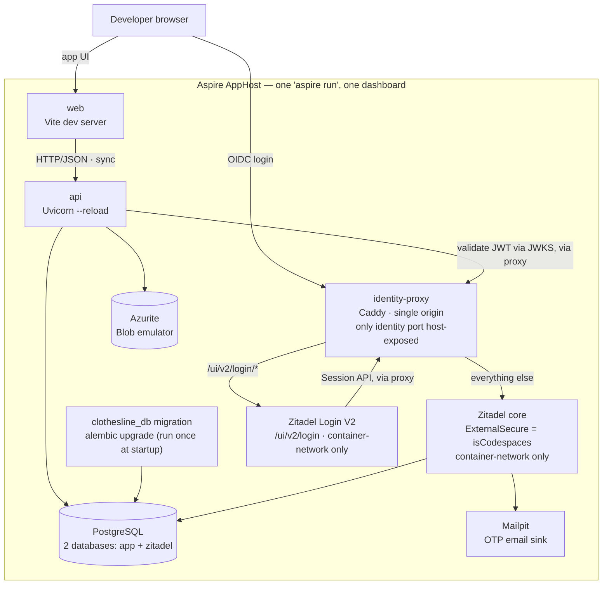
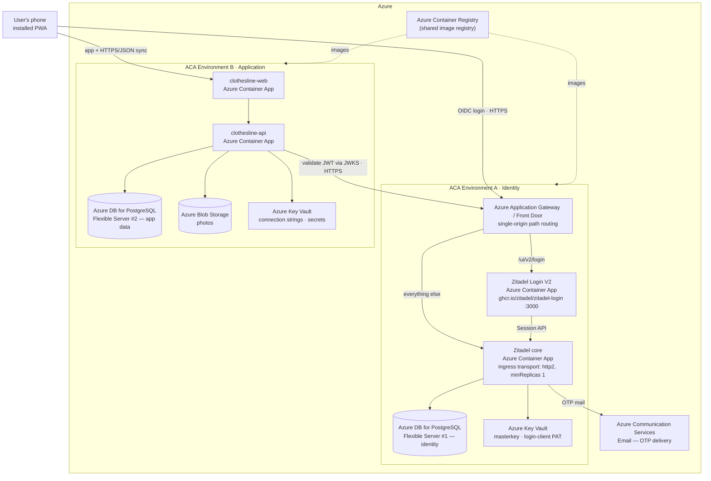
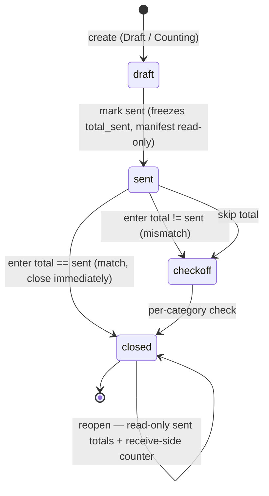

# Technical Implementation Spec — Clothesline (Phase 1: MVP)

> **Companion to:** [`business/07-prd-phase1-mvp.md`](../../business/07-prd-phase1-mvp.md)
> **Phase:** 1 of 3 (MVP)
> **Document date:** 3 July 2026
> **Status:** Draft for build
> **Scope:** This document describes *how* the Phase 1 MVP is built. It maps every PRD feature to a concrete technical design. It does **not** re-argue product decisions — see the PRD for the *what* and *why*.

---

## 1. Summary

Clothesline MVP is an **offline-first Progressive Web App** backed by a **Python FastAPI** service. The pieces run as separate containers, orchestrated in development and provisioned for the cloud by **Aspire (aspire.dev)**, and deployed as **Docker containers to Azure Container Apps (ACA)**.

The defining technical constraint from the PRD is **offline-first at the counter**: create-load, itemize, mark-sent, and enter-received-count must all work with no network. This drives an architecture where the **client is the primary system of record during a session** (local IndexedDB store), and the backend is a **sync target + durable store + photo storage**, not a hard dependency for the core flow.

Identity is **not** built in-house: it is delegated to a self-hosted **Zitadel** OIDC identity server, so the security-critical login flow lives in a vetted system rather than our code.

| Concern | Choice |
|---|---|
| Orchestration / infra | Aspire (aspire.dev) AppHost |
| Deploy target | Azure Container Apps (Docker containers), **two ACA environments** (identity vs. application) |
| Backend | Python 3.12, FastAPI, `uv` (deps + packaging) |
| Backend data | PostgreSQL (SQLAlchemy 2.x + Alembic) |
| Persistence code | Shared **`clothesline_db`** package (ORM models + migrations), imported by the API |
| Photo storage | Azure Blob Storage (Azurite locally) |
| Frontend | React + Vite, TypeScript, PWA (service worker + IndexedDB) |
| Identity / auth | Self-hosted **Zitadel** (OIDC), passwordless email OTP via **Login V2**; API validates JWTs against Zitadel's JWKS |
| Backend tests | pytest |
| Frontend unit tests | Vitest |
| E2E tests | Playwright |
| Local dev | Dev Container + Aspire AppHost |

---

## 2. Architecture

The system is described from two viewpoints: how it runs **locally** under a single `aspire run`, and how it is **deployed to Azure**, where components are separated across two ACA environments and each maps to a specific Azure resource.

### 2.1 Local architecture (`aspire run`)

Locally, the Aspire AppHost boots the whole graph as containers/processes with one command and a single dashboard. One Postgres server hosts two databases (app + zitadel) for simplicity, and outbound email (Zitadel's OTP codes) is captured by **Mailpit** so nothing is actually sent.

Zitadel core and its **Login V2** UI do sit behind a small local reverse proxy (`identity-proxy`, Caddy) — this mirrors the production single-origin requirement (§5.6(a)) rather than being dev-only scaffolding: Login V2's redirects are same-origin-relative and its backend calls back to Zitadel core need a `Host` header that matches Zitadel's configured domain, neither of which holds if the two are reachable on two bare ports with nothing unifying them. `identity-proxy` is the only one of the two host-exposed on a fixed port; Zitadel core and Login V2 are reachable only via the container network. See [`fixes/2026-07-05-codespaces-oidc-signin.md`](./fixes/2026-07-05-codespaces-oidc-signin.md) for the full diagnostic story.

Under **GitHub Codespaces**, `apphost.cs` also auto-detects the Codespaces forwarded-URL pattern (from GitHub's own injected env vars — no setup required) and derives the OIDC issuer, Zitadel's `ExternalDomain`/`ExternalSecure`/`ExternalPort`, redirect URIs, and CORS origin from it; outside Codespaces these all fall back to plain `localhost`.



### 2.2 Cloud-deployed architecture (Azure)

In Azure the topology is split across **two ACA environments** for separation of concerns: an **Identity** environment (Zitadel and its data) and an **Application** environment (our web/API and their data). Each box below names the concrete Azure resource it lives in. The only cross-environment traffic is standard OIDC over public HTTPS (browser → login, API → JWKS), so the split costs nothing on the happy path.



Notes on the cloud topology:
- **Two Postgres Flexible Servers** (identity vs. app) with independent credentials, backups, and network rules. Photos live in **Azure Blob Storage**; the app DB stores only keys/metadata (§8).
- **Login V2 requires its own Container App plus a path-routing layer** — see §5.6(a) for the why and the sources.
- **Database migrations are not a resource here** — they run as a CI/CD pipeline step (§11.2), not a standing ACA job.
- **Collapse-to-one-environment fallback:** if the two-environment cost isn't justified, Zitadel + Login V2 can move into the application environment as their own Container Apps; the app↔identity link is just the issuer URL, so it's a config change. **The two Postgres servers stay split regardless** (§11.6).

### 2.3 Aspire's role (aspire.dev)

The **Aspire AppHost** is the single source of truth for the topology. It:
- Declares every app container (web, api), the identity containers (Zitadel core, Login V2), the run-once `clothesline_db` migration, and the backing resources (two Postgres databases/servers, Blob/Azurite, Mailpit locally).
- Wires **connection strings, the OIDC issuer/JWKS URL, and service discovery** into each container via environment variables — no hand-maintained config duplication.
- Runs the whole graph locally with one command (`aspire run`), giving a dashboard with logs, traces, and metrics across services.
- Feeds `azd` (Azure Developer CLI) to **provision + deploy** to Azure Container Apps. The two-environment split maps to **two deploy targets** (§11.1).

Aspire is polyglot here: the AppHost is .NET, but the orchestrated resources are the **Python FastAPI** service, the **Vite/React** app, and the prebuilt **Zitadel** images. See `CLAUDE.md` for how this sits at the repo root.

---

## 3. Repository & folder structure

> **Target layout** — `aspire/` and `src/` do not exist yet; they will be created as the MVP is built.

```
/                              repo root
├── CLAUDE.md                  agent/dev guide (Aspire, dev container, structure)
├── .devcontainer/             dev container definition
├── aspire/
│   └── Clothesline.AppHost/   Aspire AppHost project (topology + azd target)
├── specs/
│   └── 01-mvp/                this spec + implementation plan
└── src/
    ├── backend/
    │   ├── clothesline_db/     shared data package: ORM models + Alembic migrations
    │   ├── clothesline_api/    FastAPI app (imports clothesline_db)
    │   └── clothesline_tests/  pytest unit/integration tests
    └── frontend/
        ├── clothesline-web/    Vite + React PWA (frontend module)
        └── clothesline-e2e/    Playwright e2e tests
```

Notes:
- **Shared data package** (`clothesline_db`) owns all SQLAlchemy models and the Alembic migration project. It is a `uv` workspace member imported by `clothesline_api`, so the schema has a single owner and can evolve on its own release cadence (migrations run as a pipeline step, §11.2). This is a deliberate trade: models are centralized rather than co-located in each domain module, chosen for maintainability and to allow a future second deployable to share the schema.
- **Backend module** (`clothesline_api`) is a modular monolith — one deployable, internally split by domain package (§5.1) — that depends on `clothesline_db`. `uv` manages dependencies/packaging via `pyproject.toml`.
- **Backend unit test project** (`clothesline_tests`) holds pytest suites; unit tests run against the domain/service layer, integration tests against a throwaway Postgres built from the migration project.
- **Frontend module** (`clothesline-web`) is the Vite/React PWA; **Vitest** unit tests live inside it, colocated with components.
- **Playwright e2e** (`clothesline-e2e`) is its own project so it can drive the built PWA (including offline flows) independently of the unit test runner.

---

## 4. Data model

The same logical model exists on the client (RxDB, backed by IndexedDB) and the server (Postgres). The client is authoritative during an offline session; the server is authoritative once synced. **Each entity below is also an RxDB collection** of the same snake_case plural name (`loads`, `load_item_categories`, `load_items`, `photos`, `photo_links`) and replicates via `/sync/{collection}` (§5.2, §7); the frontend's RxDB `jsonSchema` for each is **derived from these tables** and lives in `clothesline-web` (not duplicated here).

**Wire/sync convention (applies to every synced entity):**
- **Datetime encoding — ISO 8601 UTC strings, never epoch numbers.** Every datetime that crosses the wire — in a JSON body **or** as a query parameter — is an **ISO 8601 UTC string** with a trailing `Z`, e.g. `"2026-07-04T14:30:05.123Z"` (calendar `YYYY-MM-DDTHH:MM:SS[.sss]Z`). Epoch-millisecond integers are **not** used on the wire — they're unreadable and hard to debug. How datetimes are **stored** in Postgres (`timestamptz`) is an implementation detail and independent of this. (Plain dates, e.g. `Load.send_date`, use `YYYY-MM-DD`.)
- `updated_at` is **authored by the server** on every write and serialized as the ISO 8601 string above; it drives the replication checkpoint. Ordering is done server-side on the real `timestamptz` column (`ORDER BY updated_at, id`) — the wire string is parsed back to a timestamp — with `id` as the tiebreaker.
- Soft delete is expressed on the wire as **`_deleted`** (boolean tombstone) mapped from the row's `deleted_at`; deleted rows still replicate.
- `id` (client-generated uuid) is the primary key and the checkpoint tiebreaker.

`User` is the exception — it is **not** an RxDB collection and does not replicate; it's a server-only mirror read via `GET /auth/me`.

### 4.1 Entities

**User** — a **minimal local mirror** of the Zitadel identity, upserted from token claims on first authenticated request. **`email` is the only PII stored in the application database**; everything else about the person lives in Zitadel.
| field | type | notes |
|---|---|---|
| id | uuid | pk (local) |
| sub | text | unique; the Zitadel subject (`sub`) claim — the stable link to the identity server |
| email | text | from token claims; the only PII in the app DB |
| created_at | timestamptz | |

**Load** — the core record (PRD §4.2, §4.6, §4.7)
| field | type | notes |
|---|---|---|
| id | uuid | pk, **client-generated** (uuid v4) so offline creates are stable across sync |
| user_id | uuid | fk → User.id |
| name | text | the load's title; **defaults to today's date**, user-editable (PRD §3.1). On Duplicate it resets to the new load's current date |
| shop_name | text? | **optional** (recommended); free text |
| shop_location | text? | **optional** (recommended); free text |
| send_date | date | |
| status | enum | `draft` \| `sent` \| `closed` (the `draft` state is surfaced in the UI as "Draft / Counting") |
| total_sent | int | denormalized sum of category `count_sent`, frozen at "send" |
| total_received | int? | entered at counter; **null when the user skipped the total** (§5.4) |
| reconciled | bool | true once category check-off completed (optional) |
| created_at / updated_at | timestamptz | `updated_at` drives sync conflict resolution |
| deleted_at | timestamptz? | soft delete for sync |

> The load's thumbnail is no longer a dedicated column — it's the `is_primary` photo linked to the load (see `PhotoLink` below).

**LoadItemCategory** — one row per clothing category present on a load (PRD §4.3). This is the tap-counter row (Shirts, Trousers, …); *renamed from the earlier `LoadItem`*.
| field | type | notes |
|---|---|---|
| id | uuid | pk, client-generated |
| load_id | uuid | fk → Load.id |
| category | text | free text — either a **default template** category or a **user-added custom** one (§4.3) |
| count_sent | int | the count at send; driven by tap or by photos (see §4.4) |
| count_received | int? | received count for this category; **may be filled anytime** (drill-down detail), not only on a mismatch |
| count_mode | enum | `auto` \| `manual` (default `auto`) — how `count_sent` is driven; see §4.4 |
| created_at / updated_at | timestamptz | |
| deleted_at | timestamptz? | soft delete for sync |

**LoadItem** — an individual, specific item within a category (PRD §4.3 groundwork). Auto-created when a photo is captured; primarily just a name.
| field | type | notes |
|---|---|---|
| id | uuid | pk, client-generated |
| load_item_category_id | uuid | fk → LoadItemCategory.id |
| name | text | defaults to the category name; user-renamable |
| created_at / updated_at | timestamptz | |
| deleted_at | timestamptz? | soft delete for sync |

**Photo** — a standalone image record; attachment to an entity is expressed via `PhotoLink` (PRD §4.5)
| field | type | notes |
|---|---|---|
| id | uuid | pk, client-generated |
| blob_key | text | key in Blob Storage; null until upload completes. A non-null `blob_key` is the signal that bytes exist |
| content_type | text | e.g. image/webp |
| created_at / updated_at | timestamptz | |
| deleted_at | timestamptz? | soft delete for sync |

> `local_only` is a **client-only** staging flag (bytes captured but not yet uploaded) — it lives in RxDB but is **not** part of the synced document; the server never sees it.

**PhotoLink** — junction linking a `Photo` to any entity it's attached to. Polymorphic and **many-to-many capable** by design (a photo can attach to several entities; an entity can hold several photos), so per-item photo galleries and richer attachments grow without a schema change.
| field | type | notes |
|---|---|---|
| id | uuid | pk, client-generated |
| photo_id | uuid | fk → Photo.id |
| entity_type | enum | `load` \| `load_item_category` \| `load_item` |
| entity_id | uuid | the attached entity's id (polymorphic — validity enforced in app/sync, not a DB FK) |
| is_primary | bool | designates the entity's primary/thumbnail photo (e.g. the load's bundle photo) |
| created_at / updated_at | timestamptz | |
| deleted_at | timestamptz? | soft delete for sync |

- **Indexes:** unique `(photo_id, entity_type, entity_id)` (no duplicate identical links); lookup `(entity_type, entity_id)` for "this entity's photos."
- **MVP constraint (app-enforced, not schema):** **one photo per entity** for now — the junction stays M:N-capable so this can grow later without migration.
- **Relationships:** `Load 1─* LoadItemCategory 1─* LoadItem`; `Photo *─< PhotoLink >─* (Load | LoadItemCategory | LoadItem)`.

### 4.2 Load state machine


- The `draft` state is surfaced in the UI as **"Draft / Counting"** — categories and counts are fully editable, photos addable.
- `total_sent` is frozen when the load transitions `draft → sent` (PRD §4.6: manifest becomes the source of truth). A `sent`/`closed` load's **sent tally is read-only** thereafter; only the receive side (`count_received`) is writable (§5.4).
- Optional home reconcile (PRD §4.8) can set `reconciled = true` on an already-`closed` load without changing status.
- **Open question O2 in PRD** (now §7.2 — draft/counting lifecycle) is resolved for state modelling: an explicit `draft` state exists; abandoned-draft cleanup (auto-save vs. discard vs. archive) is left unresolved for Phase 1.

### 4.3 Category template & custom categories

A new load opens **pre-seeded** with a default template of common categories (PRD §3.1, §4.3), bundled with the client so it works fully offline:

```
Shirts, Trousers, Shorts, Underwear, Socks, Towels, Bedsheets, Jackets, Dresses, Other
```

- On load creation the client **creates `LoadItemCategory` rows** for the template set (`count_sent = 0`, `count_mode = auto`). The user can **remove** any (soft-delete the row) or **add** their own.
- **Custom categories** are added via a **free-text field** (PRD §3.1(4)); they are just `LoadItemCategory` rows with a user-typed `category` string. Server-side validation accepts arbitrary category strings (the template is a convenience default, not a closed allow-list).
- **Custom categories are one-load-only** (PRD open question §7.1): they live on the load they were added to and are **not** saved to a global list. The **reuse path is Duplicate** — duplicating a load carries its categories (template + custom) forward. A saved/personal category list is deferred to a later phase.

### 4.4 Count modes (auto / manual)

A category's `count_sent` can be driven two ways, tracked **per category** by `count_mode` (default `auto`):

- **Auto mode** — `count_sent` is driven by photos: capturing a photo for that category **creates a `LoadItem` and increments `count_sent` by 1**; deleting that photo/item **decrements `count_sent` by 1** (floored at 0). This lets a user itemize purely by photographing pieces.
- **Manual takeover** — the **first** time the user taps the +/- counter or types a number for that category, `count_mode` flips to `manual` and `count_sent` becomes the user's value. **This is permanent for that category** (one-way, sticky): from then on, capturing or deleting photos still creates/removes `LoadItem`s but **never changes `count_sent`**.

So auto and manual are mutually exclusive per category, and manual always wins once engaged. `LoadItem`s are created in both modes (they carry the photos); they only *drive the count* while the category is still in `auto`.

---

## 5. Backend design (`src/backend/clothesline_api`)

### 5.1 Internal structure (modular monolith + shared data package)

```
src/backend/
├── clothesline_db/            shared data package (uv workspace member)
│   ├── models/                all SQLAlchemy models: User, Load, LoadItemCategory, LoadItem, Photo, PhotoLink
│   ├── migrations/            Alembic env + versioned scripts
│   └── session.py             engine/session factory
└── clothesline_api/           FastAPI app (imports clothesline_db)
    ├── main.py                app factory, router mounting, middleware
    ├── config.py              settings from env (Aspire-injected)
    ├── auth/                  OIDC/JWKS token validation + minimal user upsert
    ├── sync/                  generic /sync/{collection} pull+push handlers
    ├── domain/                per-collection validators/invariants (push-time rules)
    ├── media/                 pre-signed Blob upload/read URLs
    └── common/                errors, dependencies, user scoping
```

The app is **local-first**: the client (RxDB) is the system of record during a session and the API is a **replication target + photo-bytes broker + auth mirror**, not a REST CRUD surface. Accordingly:
- **`sync/`** implements one **generic pull/push handler** parameterized by `{collection}` (all synced tables share the `id`/`updated_at`/`deleted_at` shape), dispatching to
- **`domain/`** for per-collection **push-time validation** — user ownership plus business invariants (e.g. freezing `total_sent` at send, rejecting edits to a sent manifest). This is where "loads logic" now lives — enforced when a document arrives, not as REST actions.
- **`auth/`** validates the bearer JWT against Zitadel and upserts the minimal user row (§5.5); it never issues tokens.
Packages import ORM models from `clothesline_db`; services are unit-testable without HTTP.

### 5.2 API surface (`/api/v1`)

The backend is **local-first**, so the surface is small: an **RxDB replication contract** (`/sync/{collection}`), a **media** pair for photo bytes, and **`/auth/me`**. There is **no REST CRUD** for loads/items — creating, itemizing, sending, receiving, reconciling and duplicating are **local RxDB writes** whose effects replicate through `/sync` (§5.3, §5.4). All requests carry `Authorization: Bearer <Zitadel access token>`; the server derives the user and **scopes every row** to them (§5.5). Field casing is **snake_case** end-to-end; document shapes are defined once in §4.1 and referenced here. Replication semantics (checkpoints, tombstones, conflicts) are in §7.

**Sync — RxDB replication** (`collection ∈ {loads, load_item_categories, load_items, photos, photo_links}`)

`GET /sync/{collection}` — **pull**
| in (query) | type | notes |
|---|---|---|
| `id` | string | checkpoint id; omit on first sync |
| `updated_at` | string | checkpoint ts as **ISO 8601 UTC** (e.g. `2026-07-04T14:30:05.123Z`); omit on first sync |
| `batch_size` | number | max docs to return |

```jsonc
// 200 — docs written strictly after the checkpoint (incl. _deleted tombstones), user-scoped,
// ordered by (updated_at ASC, id ASC). Doc shapes per §4.1. All datetimes are ISO 8601 UTC.
{ "documents": [ /* <collection> docs */ ], "checkpoint": { "id": "…", "updated_at": "2026-07-04T14:30:05.123Z" } }
```

`POST /sync/{collection}` — **push** (idempotent upsert by `id`)
```jsonc
// body: change rows
[ { "new_document_state": { /* … */ }, "assumed_master_state": { /* … */ } | null } ]
// 200 — CONFLICTS ONLY: current server doc for each row whose stored state != assumed_master_state
[ /* current master docs */ ]
```
Per row the server: loads the current doc; if it differs from `assumed_master_state` → **conflict** (return current master, don't apply); else applies the write, **sets `updated_at` = server now**, maps `_deleted → deleted_at`, and runs the **per-collection validator** (ownership + invariants). Invariant violations are returned **as conflicts** (authoritative doc back) so an illegal local write is reverted on the next merge.

> **"Differs" means the replicated content differs** — `id`, the collection's own columns, and `_deleted`. It **excludes `created_at`/`updated_at`**, which are server-authored (§7.3). RxDB never re-pulls between writes: after a successful push it records *the document it sent* as the assumed master state, so `assumed_master_state` always carries the **client's** timestamps. Comparing whole documents would therefore make the **second write to every document** a false conflict, and the default conflict handler (master wins) would silently revert the local change.

> The live **pull-stream (SSE)** is **deferred to Phase 3**; MVP uses pull-on-reconnect + interval polling (§7).

**Media** (photo bytes never travel through `/sync`)
| method | path | purpose |
|---|---|---|
| POST | `/media/upload-url` | body `{photo_id, content_type}` → `{blob_key, upload_url, expires_at}` (`expires_at` is ISO 8601 UTC). Client PUTs bytes to `upload_url`, then sets `blob_key` on the local `photos` doc (which syncs). |
| GET | `/media/{photo_id}` | `{url, expires_at}` (ISO 8601 UTC) — short-lived read SAS; user-scoped. |

**Identity**
| method | path | purpose |
|---|---|---|
| GET | `/auth/me` | current user from the validated token; upserts the minimal `User {id, sub, email}` row on first call. |

**Errors:** `{ "error": { "code", "message" } }`; `401` (refresh + retry), `403` (cross-user), `404` (unknown collection/photo), `422` (malformed document).

### 5.3 Duplicate semantics (PRD §4.4) — a local operation

Duplicate is **not an endpoint** — the client creates a **new `draft` load locally** (new `id`), pre-seeds `LoadItemCategory` rows for the **source's category set** (template + custom), and lets replication carry it to the server. Everything else resets:
- `name` set to the **new load's current date** (not copied); `shop_name`, `shop_location`, `send_date` cleared
- all `count_sent` / `count_received` = 0, `count_mode` back to `auto`
- **no photos, no `LoadItem`s, no links copied**

This carry-over of custom categories is the **only** reuse path for them (they are otherwise one-load-only, §4.3). Because it's pure local document creation, duplicate works fully offline like every other action.

### 5.4 Send & reconcile logic (PRD §4.6–4.7) — client-side, server-validated

Send, receive, and reconcile are **local writes**; the server only **validates them at push time** (§5.1). The rules:

- **Send** — client sets `status = sent` and **freezes `total_sent`** = Σ `count_sent`. On push, the load's validator rejects (as a conflict) any later change to a `sent`/`closed` load's `count_sent`/`total_sent`, keeping the **sent manifest read-only**.
- **Receive — the total is skippable** (PRD §3.1(10)), decided **on the client** (it already has both numbers):
  - enter total, `total_received == total_sent` → set `status = closed` (**match**);
  - enter total, `total_received != total_sent` → open the per-category check (**mismatch**);
  - **skip** (`total_received` stays null) → go straight to the same per-category check.
- **Reconcile** — the per-category check writes only `count_received` (sent tally stays read-only), then sets `status = closed`. A reopened `sent`/`closed` load exposes an **add/minus receive-side counter per category** for double-checking pieces (PRD §3.1(11)); it edits `count_received` only.
- **Received-more-than-sent (PRD §7.4)** — `count_received > count_sent` is allowed (positive delta), labelled surplus not shortfall. No blocking validation — the tool records reality.

Because these are local writes, the whole send→receive→reconcile flow runs offline; the server sees the resulting documents on the next sync and enforces the read-only-manifest invariant.

### 5.5 Identity & authentication (Zitadel)

Identity is delegated entirely to a **self-hosted Zitadel** OIDC server. Our code never stores credentials or issues tokens; it only validates them and keeps the minimal user mirror (§4.1).

- **Passwordless, no signup (PRD §4.1).** The user enters only their email. Zitadel (via **Login V2**) creates the account **just-in-time** if it doesn't exist and sends a **one-time email code / magic link** as the *primary* factor; on verification Zitadel issues OIDC tokens. No password is ever set, and there is no separate signup step — exactly the counter-friendly, zero-setup flow the PRD requires.
- **Login flow.** The SPA uses **OIDC Authorization Code + PKCE**, redirecting to Zitadel **Login V2** for the email-code exchange, then returning with id/access/refresh tokens. Building on Login V2 (rather than a hand-rolled screen) keeps the security-critical login UI in Zitadel's vetted, maintained component.
- **API validation.** The API validates the bearer **access token against Zitadel's JWKS** (issuer + audience checks) on every request. No introspection round-trip on the hot path.
- **Local user mirror.** On the first authenticated request, the API upserts `User {id, sub, email}` from the token claims; `email` is refreshed on subsequent logins so it can't drift. This is the only PII we persist.
- **Offline.** Tokens are persisted client-side (IndexedDB) so an installed PWA stays authenticated through offline sessions (PRD §4.1: zero re-auth friction); access tokens are short-lived and refreshed on reconnect. Tradeoff noted in §9.
- **Local dev.** Zitadel core + Login V2 run as containers under Aspire, behind a local single-origin reverse proxy (`identity-proxy`, §2.1); OTP emails are captured by **Mailpit** (§10.3), so passwordless sign-in is fully exercisable offline of any real mail provider.

### 5.6 Zitadel self-hosting requirements on Azure Container Apps

Self-hosting Zitadel on ACA has two non-obvious requirements. They are documented here so they aren't rediscovered painfully at deploy time.

**(a) Login V2 needs its own Container App (+ single-origin routing).**
Since Zitadel v4, the login UI is **Login V2**, a standalone **Next.js application shipped as its own image** (`ghcr.io/zitadel/zitadel-login`) that listens on **port 3000** under the path **`/ui/v2/login`**. It is **not part of the default Zitadel core container** — it talks to the core over the API as a machine user (`login-client`, role `IAM_LOGIN_CLIENT`) using a PAT the core generates, and is enabled with `ZITADEL_DEFAULTINSTANCE_FEATURES_LOGINV2_REQUIRED=true`. Therefore self-hosting requires **provisioning a second Container App** for Login V2 alongside the core.

Zitadel expects the core and the login app to be served under a **single origin with path-based routing** (`/ui/v2/login` → Login V2, everything else → Zitadel core) so the OIDC flow and session cookies stay same-origin. Because **ACA gives each Container App its own FQDN and does not path-route across apps**, the identity environment adds a **path-routing layer — Azure Application Gateway or Azure Front Door** — that presents one identity domain and splits traffic between the two backends.
Sources: [ZITADEL — Login App](https://zitadel.com/docs/guides/integrate/login-ui/login-app) · [ZITADEL — Connect self-hosted Login UI (login-client)](https://zitadel.com/docs/self-hosting/manage/login-client) · [ACA — transport protocols](https://learn.microsoft.com/azure/container-apps/connect-apps#transport-protocols) · [ACA — ingress settings](https://learn.microsoft.com/azure/container-apps/ingress-how-to#ingress-settings)

This single-origin requirement isn't ACA-specific — local dev now mirrors it too (§2.1's `identity-proxy`), after discovering the hard way that Login V2's relative redirects and its backend calls back to Zitadel core both break without it. See [`fixes/2026-07-05-codespaces-oidc-signin.md`](./fixes/2026-07-05-codespaces-oidc-signin.md) for the two extra header-rewriting subtleties (`X-Forwarded-Host`, `x-zitadel-public-host`/`x-zitadel-instance-host`) that App Gateway/Front Door will also need to get right at deploy time.

**(b) TLS termination + HTTP/2 (h2c) for gRPC.**
ACA terminates TLS at ingress, so Zitadel runs in **external-TLS mode**: `ExternalSecure=true`, `TLS_ENABLED=false`, `ExternalPort=443`, `ExternalDomain=<identity custom domain>`. Zitadel serves its management/admin APIs and console over **gRPC (HTTP/2)** and expects the proxy to forward **h2c (cleartext HTTP/2)**, so the ACA ingress **`transport` must be set to `http2`** (the default `auto` is not sufficient for gRPC end-to-end). Additional requirements:
- **Bootstrap:** Zitadel needs an `init`/`setup` step (schema + first instance/admin) via `start-from-init`, and a **32-char masterkey** supplied as a secret (Key Vault).
- **Database TLS:** Azure Postgres Flexible Server enforces TLS, so the connection uses `sslmode=require`.
- **`minReplicas: 1`** — an IdP shouldn't scale to zero (cold starts hurt login latency and it runs background projections).
- **Custom domain** for a stable issuer URL, which also avoids the generated-FQDN chicken-and-egg (Zitadel bakes `ExternalDomain` into token issuers/cookies).
Sources: [ACA — transport protocols](https://learn.microsoft.com/azure/container-apps/connect-apps#transport-protocols) · [ACA — ingress overview (TLS, HTTP/2, gRPC)](https://learn.microsoft.com/azure/container-apps/ingress-overview#protocol-types) · [ZITADEL — HTTP/2](https://zitadel.com/docs/self-hosting/manage/http2) · [ZITADEL — TLS modes](https://zitadel.com/docs/self-hosting/manage/tls_modes) · [ZITADEL — Reverse proxy configuration](https://zitadel.com/docs/self-hosting/manage/reverseproxy/reverse_proxy)

---

## 6. Frontend design (`src/frontend/clothesline-web`)

### 6.1 Stack

- **Vite + React + TypeScript**.
- **PWA**: `vite-plugin-pwa` (Workbox) for the service worker + web app manifest → installable, offline app shell.
- **Local store + sync**: **RxDB** (IndexedDB storage) is the offline system of record. Each entity is an RxDB **collection** (§4.1); the UI reads/writes RxDB reactively and **RxDB replication** (`replicateRxCollection`, one per collection) syncs to `/sync/{collection}` in the background (§7). No hand-rolled outbox/query layer.
- **Auth**: an OIDC/PKCE client library that redirects to Zitadel Login V2 and manages token storage/refresh (§5.5); the bearer token is attached to the replication pull/push requests.
- **Routing**: React Router.
- **Styling**: mobile-first; large tap targets for the counter (see §6.3).

### 6.2 Screens

These screens are based on the mobile + desktop wireframes in [`wireframe.png`](./wireframe.png). On-screen a load captures **shop name only** — the model's `shop_location` exists but is **not surfaced** in the Phase-1 UI. Desktop/responsive behaviour is in §6.5.

| Screen | PRD ref | Notes |
|---|---|---|
| Sign in | §4.1 | email-only start → **OIDC redirect to Zitadel Login V2**; the callback handler completes sign-in and stores tokens. |
| Home / load list | §4.2 | one card per load: **load name · shop name · status · total item count**, plus a **Duplicate** icon and a **Delete** icon (Delete = confirm → local soft-delete/tombstone, §7; the only cleanup for abandoned drafts, §14 / PRD §7.2). `+` (top-right) creates a new load. The load's bundle photo (PRD §4.5) serves as the card avatar when present. Desktop: multi-column card grid (§6.5). |
| Load — Draft | §4.2–4.3 | one screen = create + itemize. Editable **name** (pencil; defaults to today's date), **shop name**, `ITEMS +` to add a custom category; each row = `– [count] +` counter + **camera** (capture → auto-creates a `LoadItem`, §4.4) + **delete** (remove category); running **total**; **Send (➤)** and a **Save** icon (top-right). |
| Load — Sent | §4.6 | read-only **manifest** (per-category counts, non-editable) with a per-row **photo icon → Gallery**. Header shows shop name and an **editable `send_date`** (defaults to today) just below it, with a **Save** icon. The **✓ (top-right) starts Receive** → "Count your clothes". |
| Receive — "Count your clothes" | §4.7 | prompt + one large **number input** for total received; shows **expected count** (= `total_sent`); **Skip**. Match → close; mismatch or skip → the Closed screen's per-category check. |
| Load — Closed | §4.7/§4.8 | per category: **Sent** count rendered as a **hyperlink → Gallery**, vs **Received** (`– [count] +` counter that edits `count_received` only — sent tally stays read-only); **totals** for sent and received; **Save** icon. Reopenable anytime for the receive-side double-check. |
| Gallery | §4.5 | standard responsive photo grid (tap-to-enlarge) of the load's photos; reached from the row **photo icons** (Draft/Sent) and the hyperlinked **Sent numbers** (Closed). |
| Photo capture | §4.5 | standard camera/file capture with preview + confirm; on confirm writes the `Photo`/`PhotoLink`/`LoadItem` docs and stages bytes for upload (§8). |

- The **Save** icon appears on every screen with editable fields (Draft, Sent, Closed) as a commit/done-editing affordance; writes are already durable locally via RxDB (§7).

### 6.3 Counter UX (the make-or-break number)

PRD success metric is **< 60s to itemize**. Design implications:
- Category tiles are large, thumb-reachable, and increment on a **single tap** with immediate haptic/visual feedback; long-press or a small "−" affordance decrements.
- No modal, no navigation between taps — the whole itemize step is one screen.
- Running total is always visible.

### 6.4 Offline behavior

- Service worker precaches the app shell + category template → app opens with no network.
- All actions (create, itemize, send, receive, reconcile, duplicate) are **RxDB writes**; the UI updates reactively from RxDB and RxDB replication carries the changes when connectivity returns — the app never awaits the network.
- Photos captured offline: the `Photo`, its `PhotoLink`, and the auto-created `LoadItem` are written to RxDB immediately; the image **bytes** are stashed locally with the client-only `local_only` flag and drained to Blob by the **upload queue** on reconnect (then `blob_key` is set, which syncs) — §8.2.
- Viewing photos offline: photos captured on this device are always viewable (bytes kept as a local cache); photos from another device/evicted are viewable offline only if previously opened while online (**lazy cache-on-view**) — §8.3.
- A subtle sync indicator reflects RxDB replication state (active/pending/error); it never blocks the core flow.
- **Auth is online-only by nature** (sign-in requires reaching Zitadel), but once tokens are stored the core counter flow runs fully offline; tokens refresh on reconnect.

### 6.5 Responsive / desktop layout

Clothesline is a **web app**, so it must be usable on large screens as well as phones. (This refinement is captured here in the spec; it is **not** in the PRD.) Layouts derive from [`wireframe.png`](./wireframe.png).

- **Mobile:** single-column, thumb-reachable; the counter step is one screen (§6.3).
- **Desktop:** load screens render **centered at a fixed max-width** rather than full-bleed; the **home list becomes a multi-column card grid**.
- **Reflowed elements (not just centered):** some screens rearrange on desktop — e.g. the running **total moves to a centered header**, and the **Closed** screen lays **Sent** and **Received** out as **side-by-side columns** (total sent above, total received below), per the wireframe.

---

## 7. Offline sync strategy (RxDB replication)

**Model:** local-first with **RxDB replication** against the generic `/sync/{collection}` contract (§5.2). RxDB owns the hard client-side machinery (local store, change queue, retries, checkpoints, conflict handling); we implement the server pull/push handlers. One `replicateRxCollection` runs per collection.

1. **Client-generated UUIDs** for every synced collection eliminate create-time id collisions — an offline create (including auto-created items and photo links) is a first-class record, not a temp placeholder.
2. **Checkpoint** = `{ id, updated_at }`. Pull returns docs written strictly after the checkpoint, ordered by `(updated_at ASC, id ASC)` — `id` is the tiebreaker when timestamps collide.
3. **Server-authored `updated_at`** — the server sets `updated_at` on **every** write (DB `now()`/trigger) and serializes it as an **ISO 8601 UTC string** on the wire (§4); the client's value is never trusted for ordering. Ordering runs on the real `timestamptz` column, so checkpoint iteration is correct regardless of string formatting. The corollary is that a pushed doc does **not** round-trip byte-for-byte, so `created_at`/`updated_at` are excluded from push-time conflict detection (§5.2).
4. **Soft-delete / tombstones** — deletes set `deleted_at`, surfaced on the wire as `_deleted = true` (RxDB `deletedField`), so deletions replicate instead of vanishing. Nothing is hard-deleted.
5. **Push & conflicts** — push sends `{ new_document_state, assumed_master_state }` rows; the server returns **conflicts only** (the current master doc) when its stored state differs from `assumed_master_state`. RxDB resolves conflicts on the client; for a **single-user** MVP (PRD §5: multi-user out of scope) the default **server-wins / last-write** handler is sufficient — real conflicts are limited to the same user on two devices.
6. **Invariants at push-time** — business rules (freeze `total_sent` at send, read-only sent manifest, user ownership) are enforced by the per-collection validator; a rejected write is returned **as a conflict**, reverting the illegal local change on the next merge.
7. **Photos** — bytes go out-of-band to Blob via pre-signed URLs (§8); only the `photos`/`photo_links` **documents** replicate through `/sync`, never image bytes.
8. **Liveness** — MVP uses **pull-on-reconnect + interval polling**; the RxDB live **pull-stream (SSE)** is **deferred to Phase 3** and can be added without changing the pull/push contract.
9. **Two schemas stay in step** — the client RxDB `jsonSchema` (with its own versioned migration strategies) and the Postgres/Alembic schema both derive from §4.1 and must be kept in agreement.

---

## 8. Photo storage & offline photo sync

A photo is **two things carried on two different channels**: its **metadata** (small — the `Photo`/`PhotoLink`/`LoadItem` documents plus a `blob_key` pointer) and its **bytes** (the image file, potentially several MB). Metadata rides RxDB replication like all other data; **bytes never travel through the DB or `/sync`** — they live in **Azure Blob Storage** and move **directly between the device and Blob** via short-lived pre-signed URLs the API mints. This split keeps multi-MB binaries off the sync channel and off the API container.

Because RxDB only ever syncs the *documents*, the byte side needs its **own offline↔online plumbing** — **this is the one piece of sync logic we own** rather than get from RxDB. It is two small client-side workers (an **upload queue** and **lazy cache-on-view** reads), both keyed off local state + connectivity.

### 8.1 Metadata vs. bytes — who carries what

| | Carried by | Offline behavior |
|---|---|---|
| Photo metadata (`photos`/`photo_links`/`load_items` docs, incl. `blob_key`) | **RxDB replication** (automatic) | queued + replayed by RxDB |
| Image **bytes** | **our upload/read workers** + Azure Blob | stashed/cached locally, moved when online |

Two flags bridge them:
- **`blob_key`** — a normal **synced** field, `null` until the bytes are in Blob. Once set, every device knows "the bytes exist, filed under this key."
- **`local_only`** — a **client-only** flag (never synced) meaning "the bytes are on *this* device and not yet uploaded."

### 8.2 Upload path (pushing bytes up)

1. **Capture (online *or* offline, same path):** create the `Photo` doc (`blob_key = null`) + `PhotoLink` (+ auto-created `LoadItem`, §4.4) in RxDB; **stash the image bytes locally** in a dedicated IndexedDB byte store keyed by `photo_id`; set `local_only = true`. Bytes are WebP-compressed first (mobile data).
2. **Upload queue (runs whenever online):** a background worker scans for photos with `local_only = true` and, for each, `POST /media/upload-url` → `PUT` bytes **directly to Blob** → set `blob_key` on the `photos` doc → clear `local_only`. Retries with backoff. Bytes never pass through `/sync` or the API.
3. Setting `blob_key` is a normal RxDB write, so **RxDB syncs it** — the server and other devices now learn the bytes exist.
4. **Bytes are kept as a local cache** after upload (not deleted) — they become this device's offline copy (§8.3).

### 8.3 Read path & offline viewing (pulling bytes down)

**An RxDB pull brings only the document, not the image.** So whether a photo is viewable offline depends on whether its bytes are on *this* device:

- **Captured on this device → always offline-viewable.** Its bytes were stashed on capture and kept as cache (§8.2, step 4); no download needed. *(This is the dominant case — you photograph a piece at the counter and review it seconds later, offline, on the same phone.)*
- **Bytes not local** (captured on another of the user's devices, or evicted from cache) → **lazy cache-on-view**: when online, opening the photo calls **`GET /media/{photo_id}`** → read SAS URL → fetches bytes from Blob → **caches them locally**, so it's viewable offline thereafter. A photo **never opened while online** shows a **"connect to view"** placeholder when offline.
- **Pending state:** a synced `photos` doc can arrive with `blob_key = null` (the capturer hasn't drained its upload queue yet). Viewers show a **pending/placeholder** until `blob_key` fills in.

Under storage pressure the local byte cache is trimmed **least-recently-used first** — the oldest-viewed photos are dropped before recently-viewed ones — and an evicted photo simply falls back to lazy re-fetch. **Only uploaded bytes are ever evicted:** a photo still marked `local_only = true` (captured offline, not yet in Blob) is the *only* copy, so it is **never** evicted until the upload queue has drained it. **Deferred (not Phase 1):** *eager prefetch* — a download queue that proactively pulls every new photo's bytes after each sync for full offline mirroring; it's the same pattern turned up, but costs bandwidth/storage that photo-heavy users rarely need. MVP uses **lazy cache-on-view**.

### 8.4 Access & security

The Blob container is **private** — nothing is publicly reachable. Every upload and read goes through a **short-lived, permission-scoped SAS URL** minted by the API (`/media/*`), which first verifies the photo belongs to a load the authenticated user owns. The storage account key is never exposed to the client.

### 8.5 Local dev

Aspire runs **Azurite** (Blob emulator), so the whole capture → upload → cache → view flow works locally with no cloud account.

---

## 9. Security & privacy

- **Identity is offloaded to Zitadel.** The security-critical login flow (credential handling, code generation/expiry, session management) lives in Zitadel + Login V2, not our code. Our API only **validates JWTs against Zitadel's JWKS** and scopes every query to the authenticated user.
- **Minimal PII.** The application DB stores **only `email`** as PII (plus the opaque `sub`); all other identity data stays in Zitadel's own database (Postgres Flexible Server #1).
- All ingress over HTTPS (ACA-managed certs); Zitadel runs in external-TLS mode with `http2` ingress (§5.6b).
- **Secrets** — Zitadel masterkey, the `login-client` PAT, JWKS/issuer config, and DB/Blob connection strings — come from **Azure Key Vault**, injected by Aspire/azd; never committed. Locally they come from Aspire/dev-container config.
- **Token-at-rest tradeoff:** to honor "zero re-auth friction" offline, Zitadel tokens are persisted client-side. Access tokens are short-lived and refreshed; the refresh token is the sensitive item. Accepted for a single-user consumer MVP; flagged for revisit if the threat model changes.
- Photos are private (SAS-gated), not public URLs.

---

## 10. Testing strategy

### 10.1 Backend unit/integration (`clothesline_tests`, pytest)
- **Unit**: per-collection **push-time validators** (send-freezes-manifest / read-only sent manifest, user ownership, surplus allowed) and helpers, tested without HTTP.
- **Integration**: FastAPI `TestClient` against a **throwaway Postgres built from the `clothesline_db` migration project** (exercising the real Alembic path), covering the **`/sync/{collection}` contract**: pull ordering by `(updated_at, id)` + checkpoint iteration, push **idempotency** (replay → no drift), **conflict** responses (stale `assumed_master_state` → current master returned), server-authored `updated_at`, tombstone (`_deleted`) replication, and the user upsert via `/auth/me`. Auth is stubbed with a **lightweight OIDC mock** (e.g. `mock-oauth2-server`) issuing test JWTs the API validates against the mock's JWKS — no real Zitadel needed for fast tests.
- Run via `uv run pytest`.

### 10.2 Frontend unit (Vitest, inside `clothesline-web`)
- Component tests for the tap-counter increment/decrement + running total, load-list rendering, and the mismatch/skip → check branch.
- **Local-domain logic on RxDB** (against an in-memory/fake RxDB storage): send freezes `total_sent`, receive match/mismatch/skip routing, duplicate creates a date-named draft with the source's categories only, and **count-mode auto→manual** transitions (photo-add increment / delete decrement / manual stickiness — §4.4).

### 10.3 E2E (`clothesline-e2e`, Playwright)
- Full flows against the running Aspire graph, which includes the **real Zitadel core + Login V2** containers:
  - Passwordless sign-in (email → OTP read from the **Mailpit** sink → authenticated).
  - Create → itemize → send → receive **match** (fast close).
  - Create → send → receive **mismatch** → category check-off → close.
  - Duplicate a load → verify only categories carry over, counts/photos/shop reset.
  - **Offline path**: Playwright signs in online, then toggles offline context, performs create+itemize+send+receive fully offline, then goes online and asserts the load syncs to the API.
  - Photo attach (bundle + per-category) via file input against Azurite → auto-creates a `LoadItem`, appears in the **gallery**; in `auto` mode a category photo bumps the count, delete decrements it (§4.4).
- Playwright is browser-driven; use the pre-installed Chromium (`/opt/pw-browsers/chromium`) — do not run `playwright install`.

### 10.4 CI gate
Lint + typecheck (ruff/mypy backend, eslint/tsc frontend) → backend pytest → frontend Vitest → build containers → Playwright e2e against the Aspire graph.

---

## 11. Deployment (Azure Container Apps via Aspire)

### 11.1 Flow & environments
- **Local**: `aspire run` boots the entire graph (§2.1) — web, api, migration, Zitadel core + Login V2, Postgres, Azurite, Mailpit — with one dashboard.
- **Cloud**: the topology is provisioned as **two ACA environments** (Identity, Application — §2.2), which maps to **two `azd`/deploy targets**. `azd` reads the Aspire model, provisions each environment + its backing resources, builds Dockerfiles, pushes to **Azure Container Registry**, and deploys the revisions. Prebuilt Zitadel images are pulled directly.
- Config (connection strings, OIDC issuer/JWKS URL, secrets) flows from Aspire resource wiring → ACA env vars / Key Vault references. No manual per-environment config drift.

### 11.2 Database migrations (CI/CD, not a standing resource)
- App-DB migrations run as a **CI/CD pipeline step** during release: `alembic upgrade head` from the `clothesline_db` project, ordered **before** the new `clothesline-api` revision goes live. Migrations are a release concern, so they are **not** a permanent ACA job.
- **Network caveat:** the pipeline runner must reach Postgres Flexible Server #2. That's fine with a public endpoint + firewall rules (or an in-VNet runner). **If** the DB is later locked to private/VNet-only with externally-hosted runners, the fallback is an **on-demand `az containerapp job` run** executed inside the environment purely as a deploy step — still not a standing app.
- Zitadel's own `init`/`setup` is separate (its IdP bootstrap via `start-from-init`, §5.6b), not our schema migration.

### 11.3 Zitadel on ACA checklist
Applies the requirements from §5.6: Login V2 as its own Container App + Application Gateway/Front Door path routing; `transport: http2` ingress; external-TLS mode (`ExternalSecure`/`TLS_ENABLED`/`ExternalPort`/`ExternalDomain`); masterkey + `login-client` PAT in Key Vault; `sslmode=require`; `minReplicas: 1`; custom domain for a stable issuer.

### 11.4 Backing store choice
- MVP default: **Azure Database for PostgreSQL – Flexible Server** (managed, small SKU) — **two instances**, identity vs. app. Blob Storage is a standard account with one private container for photos.

### 11.5 Containers & images
- `clothesline-api`: multi-stage Dockerfile using `uv` to install deps into a slim Python 3.12 image; runs Uvicorn behind Gunicorn; depends on `clothesline_db`.
- `clothesline-web`: multi-stage Dockerfile — `node` build stage runs `vite build`, static output served by Nginx; SPA + service-worker friendly (correct cache headers, fallback to `index.html`).
- **Zitadel core** and **Login V2** use the official prebuilt images (`ghcr.io/zitadel/zitadel`, `ghcr.io/zitadel/zitadel-login`) — we operate them, we don't build them.

### 11.6 Collapse-to-one-environment fallback
If two environments prove more cost than the MVP justifies, Zitadel core + Login V2 (+ their routing) move into the **application** environment as their own Container Apps. Because the app↔identity coupling is just the OIDC issuer URL, this is a **pipeline/config change, not a redesign**. The **two Postgres Flexible Servers stay separate** either way — collapsing environments does not merge the databases.

---

## 12. Local development

- Open the repo in the **Dev Container** (`.devcontainer/`) — provides Python 3.12 + `uv`, Node.js, the .NET SDK + Aspire workload, and Docker access.
- One command (`aspire run`) starts the full graph — including Zitadel core + Login V2 behind the local `identity-proxy` (§2.1), and Mailpit — so passwordless sign-in works end-to-end with no cloud dependencies; the PWA hot-reloads via Vite, the API via Uvicorn `--reload`.
- **Running in a GitHub Codespace:** `apphost.cs` auto-detects it and rewrites the OIDC issuer/redirect URIs to the Codespaces forwarded-URL pattern (§2.1) — no manual config needed. The one manual step: set `identity-proxy`'s forwarded port to **Public** visibility in the Ports panel (it serves unauthenticated first-time sign-in requests, so a background browser fetch to a Private port gets blocked at GitHub's edge). See [`fixes/2026-07-05-codespaces-oidc-signin.md`](./fixes/2026-07-05-codespaces-oidc-signin.md) if sign-in ever breaks again.
- See `CLAUDE.md` at the repo root for the authoritative dev/orchestration notes.

---

## 13. Mapping: PRD feature → implementation

| PRD § | Feature | Where implemented |
|---|---|---|
| 4.1 | Passwordless email auth | **Zitadel** (Login V2, email-OTP, JIT user); API validates JWTs via JWKS; Mailpit locally (§5.5–5.6) |
| 4.2 | Create a load | local `loads` doc (`name` defaults to date, optional shop fields) + pre-seeded categories; syncs via `/sync/loads` (§4.1, §5.3, §6.2) |
| 4.3 | Itemize + custom categories | pre-seeded template + custom free-text `load_item_categories`; auto/manual `count_mode` (§4.3, §4.4); tap-counter screen (§6.3) |
| 4.4 | Duplicate load | local-only new date-named draft carrying the category set (§5.3) |
| 4.5 | Photos (optional) | `photos` + `photo_links` docs + auto-created `load_items` + gallery; bytes via `/media` to Blob/Azurite (§4.1, §5.2, §8) |
| 4.6 | Send | local `status=sent`, freezes `total_sent`; read-only-manifest enforced at push-time (§5.4) |
| 4.7 | Receive & reconcile | local receive (enter **or skip**) + per-category `count_received`; match/mismatch/skip; receive-side counter (§5.4) |
| 4.8 | Home reconcile (optional) | receive-side counter on closed load; `reconciled` flag (§5.4) |
| 4.9 | Offline-first | PWA service worker + **RxDB** + `/sync/{collection}` replication (§6.4, §7) |
| 4.10 | Shop record-keeping | optional `shop_name`/`shop_location` on `loads`; capture only |

---

## 14. Deferred / open (tracked from PRD §7)

| PRD Q (§7) | Decision in this spec |
|---|---|
| §7.1 categories / custom reuse | Pre-seeded template + **custom free-text allowed** (§4.3). Custom categories are **one-load-only**; reuse is via Duplicate. A saved/personal category list is **deferred** to a later phase |
| §7.2 draft/counting lifecycle | **Resolved:** abandoned drafts simply **persist** — no automatic system cleanup. The **user can manually delete** any load (soft-delete → tombstone that syncs, §6.2/§7). Automatic purge/archival of stale drafts is **backlog**, not Phase 1 |
| §7.3 data retention | Not implemented in Phase 1; no auto-purge. Flag storage growth for photos — revisit before GA |
| §7.4 received > sent | Handled as **surplus** (positive delta), no blocking (§5.4) |
| §7.5 multiple open loads same shop | Allowed; loads are independent records, disambiguated by name/date + thumbnail in the list |
| §7.6 reconcile reminder | Out of scope Phase 1 (PRD backlog); no notification infra built |

**Per-item model is forward-looking groundwork.** The `LoadItem` entity and the `PhotoLink` junction (§4.1) are modelled now so the schema can carry per-item detail and multi-entity/multi-photo attachments across later phases. In the **Phase-1 UI**, per-item surface is intentionally minimal: items are **auto-created on photo capture** (name = category) and viewed only through the **gallery** (§6.2) — there is no per-item editing/rename UI yet, and photos are limited to **one per entity** (§4.1). The data model accommodates the growth; the UI does not build it.
