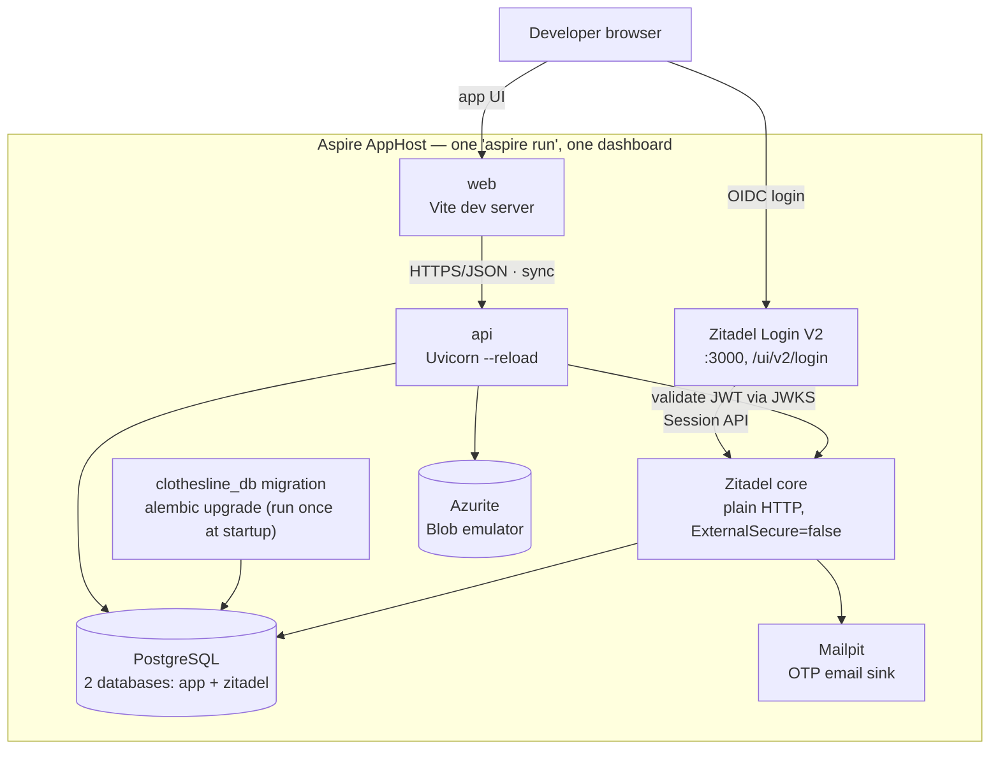
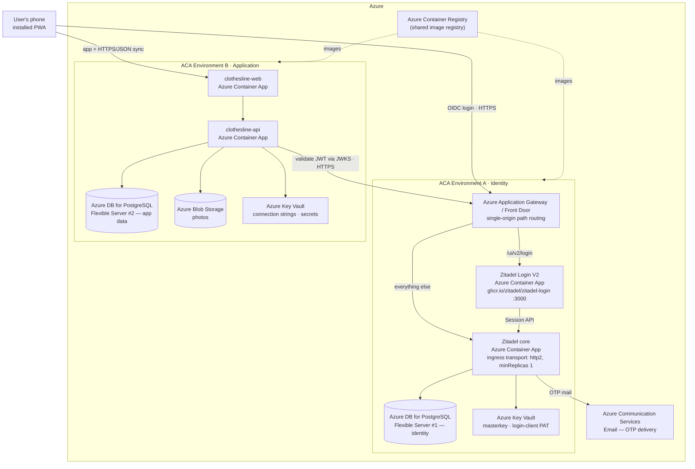
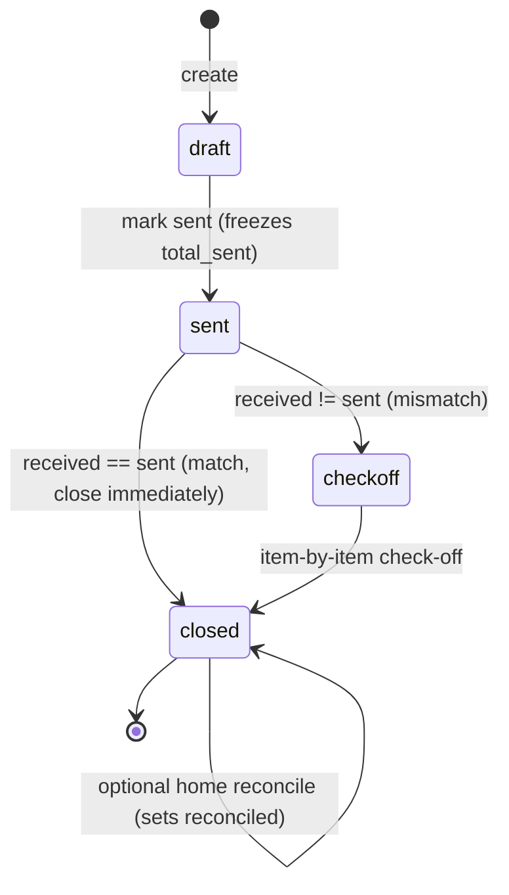

# Technical Implementation Spec — Clothesline (Phase 1: MVP)

> **Companion to:** [`business/07-prd-phase1-mvp.md`](../../business/07-prd-phase1-mvp.md)
> **Phase:** 1 of 3 (MVP)
> **Document date:** 3 July 2026
> **Status:** Draft for build
> **Scope:** This document describes *how* the Phase 1 MVP is built. It maps every PRD feature to a concrete technical design. It does **not** re-argue product decisions — see the PRD for the *what* and *why*.

---

## 1. Summary

Clothesline MVP is an **offline-first Progressive Web App** backed by a **Python FastAPI** service. The pieces run as separate containers, orchestrated in development and provisioned for the cloud by **Aspire (aspire.dev)**, and deployed as **Docker containers to Azure Container Apps (ACA)**.

The defining technical constraint from the PRD is **offline-first at the counter**: create-load, itemize, mark-sent, and enter-received-count must all work with no network. This drives an architecture where the **client is the primary system of record during a session** (local IndexedDB store), and the backend is a **sync target + durable store + photo storage**, not a hard dependency for the core flow.

Identity is **not** built in-house: it is delegated to a self-hosted **Zitadel** OIDC identity server, so the security-critical login flow lives in a vetted system rather than our code.

| Concern | Choice |
|---|---|
| Orchestration / infra | Aspire (aspire.dev) AppHost |
| Deploy target | Azure Container Apps (Docker containers), **two ACA environments** (identity vs. application) |
| Backend | Python 3.12, FastAPI, `uv` (deps + packaging) |
| Backend data | PostgreSQL (SQLAlchemy 2.x + Alembic) |
| Persistence code | Shared **`clothesline_db`** package (ORM models + migrations), imported by the API |
| Photo storage | Azure Blob Storage (Azurite locally) |
| Frontend | React + Vite, TypeScript, PWA (service worker + IndexedDB) |
| Identity / auth | Self-hosted **Zitadel** (OIDC), passwordless email OTP via **Login V2**; API validates JWTs against Zitadel's JWKS |
| Backend tests | pytest |
| Frontend unit tests | Vitest |
| E2E tests | Playwright |
| Local dev | Dev Container + Aspire AppHost |

---

## 2. Architecture

The system is described from two viewpoints: how it runs **locally** under a single `aspire run`, and how it is **deployed to Azure**, where components are separated across two ACA environments and each maps to a specific Azure resource.

### 2.1 Local architecture (`aspire run`)

Locally, the Aspire AppHost boots the whole graph as containers/processes with one command and a single dashboard. There is **no TLS termination or reverse-proxy hop** in dev — Zitadel runs in plain-HTTP mode (`ExternalSecure=false`), and one Postgres server hosts two databases (app + zitadel) for simplicity. Outbound email (Zitadel's OTP codes) is captured by **Mailpit** so nothing is actually sent.



### 2.2 Cloud-deployed architecture (Azure)

In Azure the topology is split across **two ACA environments** for separation of concerns: an **Identity** environment (Zitadel and its data) and an **Application** environment (our web/API and their data). Each box below names the concrete Azure resource it lives in. The only cross-environment traffic is standard OIDC over public HTTPS (browser → login, API → JWKS), so the split costs nothing on the happy path.



Notes on the cloud topology:
- **Two Postgres Flexible Servers** (identity vs. app) with independent credentials, backups, and network rules. Photos live in **Azure Blob Storage**; the app DB stores only keys/metadata (§8).
- **Login V2 requires its own Container App plus a path-routing layer** — see §5.6(a) for the why and the sources.
- **Database migrations are not a resource here** — they run as a CI/CD pipeline step (§11.2), not a standing ACA job.
- **Collapse-to-one-environment fallback:** if the two-environment cost isn't justified, Zitadel + Login V2 can move into the application environment as their own Container Apps; the app↔identity link is just the issuer URL, so it's a config change. **The two Postgres servers stay split regardless** (§11.6).

### 2.3 Aspire's role (aspire.dev)

The **Aspire AppHost** is the single source of truth for the topology. It:
- Declares every app container (web, api), the identity containers (Zitadel core, Login V2), the run-once `clothesline_db` migration, and the backing resources (two Postgres databases/servers, Blob/Azurite, Mailpit locally).
- Wires **connection strings, the OIDC issuer/JWKS URL, and service discovery** into each container via environment variables — no hand-maintained config duplication.
- Runs the whole graph locally with one command (`aspire run`), giving a dashboard with logs, traces, and metrics across services.
- Feeds `azd` (Azure Developer CLI) to **provision + deploy** to Azure Container Apps. The two-environment split maps to **two deploy targets** (§11.1).

Aspire is polyglot here: the AppHost is .NET, but the orchestrated resources are the **Python FastAPI** service, the **Vite/React** app, and the prebuilt **Zitadel** images. See `CLAUDE.md` for how this sits at the repo root.

---

## 3. Repository & folder structure

```
/                              repo root
├── CLAUDE.md                  agent/dev guide (Aspire, dev container, structure)
├── .devcontainer/             dev container definition
├── aspire/
│   └── Clothesline.AppHost/   Aspire AppHost project (topology + azd target)
├── specs/
│   └── 01-mvp/                this spec + implementation plan
└── src/
    ├── backend/
    │   ├── clothesline_db/     shared data package: ORM models + Alembic migrations
    │   ├── clothesline_api/    FastAPI app (imports clothesline_db)
    │   └── clothesline_tests/  pytest unit/integration tests
    └── frontend/
        ├── clothesline-web/    Vite + React PWA (frontend module)
        └── clothesline-e2e/    Playwright e2e tests
```

Notes:
- **Shared data package** (`clothesline_db`) owns all SQLAlchemy models and the Alembic migration project. It is a `uv` workspace member imported by `clothesline_api`, so the schema has a single owner and can evolve on its own release cadence (migrations run as a pipeline step, §11.2). This is a deliberate trade: models are centralized rather than co-located in each domain module, chosen for maintainability and to allow a future second deployable to share the schema.
- **Backend module** (`clothesline_api`) is a modular monolith — one deployable, internally split by domain package (§5.1) — that depends on `clothesline_db`. `uv` manages dependencies/packaging via `pyproject.toml`.
- **Backend unit test project** (`clothesline_tests`) holds pytest suites; unit tests run against the domain/service layer, integration tests against a throwaway Postgres built from the migration project.
- **Frontend module** (`clothesline-web`) is the Vite/React PWA; **Vitest** unit tests live inside it, colocated with components.
- **Playwright e2e** (`clothesline-e2e`) is its own project so it can drive the built PWA (including offline flows) independently of the unit test runner.

---

## 4. Data model

The same logical model exists on the client (IndexedDB) and server (Postgres). The client is authoritative during an offline session; the server is authoritative once synced.

### 4.1 Entities

**User** — a **minimal local mirror** of the Zitadel identity, upserted from token claims on first authenticated request. **`email` is the only PII stored in the application database**; everything else about the person lives in Zitadel.
| field | type | notes |
|---|---|---|
| id | uuid | pk (local) |
| sub | text | unique; the Zitadel subject (`sub`) claim — the stable link to the identity server |
| email | text | from token claims; the only PII in the app DB |
| created_at | timestamptz | |

**Load** — the core record (PRD §3.2, §3.6, §3.7)
| field | type | notes |
|---|---|---|
| id | uuid | pk, **client-generated** (uuid v4) so offline creates are stable across sync |
| user_id | uuid | fk → User.id |
| shop_name | text | |
| shop_location | text | free text in MVP |
| send_date | date | |
| status | enum | `draft` \| `sent` \| `closed` |
| total_sent | int | denormalized sum of item counts, frozen at "send" |
| total_received | int? | entered at counter |
| bundle_photo_id | uuid? | fk → Photo, the load thumbnail |
| reconciled | bool | true once category check-off completed (optional) |
| created_at / updated_at | timestamptz | `updated_at` drives sync conflict resolution |
| deleted_at | timestamptz? | soft delete for sync |

**LoadItem** — one row per category present on a load (PRD §3.3)
| field | type | notes |
|---|---|---|
| id | uuid | pk, client-generated |
| load_id | uuid | fk |
| category | text | from the category catalog (§4.3) |
| count_sent | int | the tap-counter value at send |
| count_received | int? | filled only during a mismatch check-off |
| photo_id | uuid? | optional per-category photo |

**Photo** (PRD §3.5)
| field | type | notes |
|---|---|---|
| id | uuid | pk, client-generated |
| load_id | uuid | fk |
| kind | enum | `bundle` \| `category` |
| blob_key | text | key in Blob Storage; null until upload completes |
| local_only | bool | client-side flag: captured offline, not yet uploaded |
| content_type | text | e.g. image/webp |

### 4.2 Load state machine


- `total_sent` is frozen when the load transitions `draft → sent` (PRD §3.6: manifest becomes the source of truth).
- Optional home reconcile (PRD §3.8) can set `reconciled = true` on an already-`closed` load without changing status.
- **Open question O2 in PRD** (is `draft` needed?) is resolved here in favor of an explicit `draft` state — it makes offline create/edit and "duplicate" natural, and costs nothing.

### 4.3 Category catalog

MVP ships a **fixed default category list** (PRD open question O1), bundled with the client so it works fully offline:

```
Shirts, Trousers, Shorts, Underwear, Socks, Towels, Bedsheets, Jackets, Dresses, Other
```

- Stored as a static config on the client; the server keeps the same list for validation.
- **Custom categories are out of scope for Phase 1** (deferring O1's second half). Revisit if user testing shows the fixed list is a blocker.

---

## 5. Backend design (`src/backend/clothesline_api`)

### 5.1 Internal structure (modular monolith + shared data package)

```
src/backend/
├── clothesline_db/            shared data package (uv workspace member)
│   ├── models/                all SQLAlchemy models: User, Load, LoadItem, Photo
│   ├── migrations/            Alembic env + versioned scripts
│   └── session.py             engine/session factory
└── clothesline_api/           FastAPI app (imports clothesline_db)
    ├── main.py                app factory, router mounting, middleware
    ├── config.py              settings from env (Aspire-injected)
    ├── auth/                  OIDC/JWKS token validation + minimal user upsert
    ├── loads/                 loads + items + reconcile (core domain)
    ├── media/                 photo upload URLs + blob integration
    ├── sync/                  batch pull/push sync endpoint
    └── common/                errors, pagination, dependencies
```

Each domain package holds `router.py` (HTTP), `service.py` (business logic), and `schemas.py` (Pydantic), and **imports its ORM models from `clothesline_db`**. Services are unit-testable without HTTP. The `auth/` package no longer *issues* tokens — it validates the bearer JWT against Zitadel and upserts the minimal user row (§5.5).

### 5.2 API surface (`/api/v1`)

All endpoints require a valid **Zitadel-issued access token** (bearer JWT), validated against Zitadel's JWKS. There are **no token-issuing endpoints** in our API — authentication happens at Zitadel (§5.5).

**Identity**
| method | path | purpose |
|---|---|---|
| GET | `/auth/me` | current user from the validated token; upserts the minimal `User {id, sub, email}` row on first call. |

**Loads (PRD §3.2–3.8)**
| method | path | purpose |
|---|---|---|
| GET | `/loads` | list current user's loads (home screen). |
| POST | `/loads` | create a load (accepts client-generated id, categories, counts). |
| GET | `/loads/{id}` | full load with items + photos. |
| PATCH | `/loads/{id}` | edit header / item counts while `draft`. |
| POST | `/loads/{id}/send` | freeze manifest, `draft → sent`. |
| POST | `/loads/{id}/receive` | body `{total_received}` → returns `match` or `mismatch`; on match sets `closed`. |
| POST | `/loads/{id}/reconcile` | submit per-category `count_received` check-off; closes load (mismatch path) or records optional home reconcile. |
| POST | `/loads/{id}/duplicate` | server-side duplicate (carries categories only; see §5.3). |
| DELETE | `/loads/{id}` | soft delete. |

**Media (PRD §3.5)**
| method | path | purpose |
|---|---|---|
| POST | `/loads/{id}/photos` | register a photo, returns a **pre-signed Blob upload URL**; client uploads bytes directly to Blob. |
| GET | `/loads/{id}/photos/{pid}` | returns a short-lived read SAS URL. |

**Sync (offline, §7)**
| method | path | purpose |
|---|---|---|
| POST | `/sync` | batch: client pushes local mutations since `cursor` and pulls server changes since `cursor`. Returns new cursor. |

### 5.3 Duplicate semantics (PRD §3.4)

Duplicating produces a **new `draft` load** that copies only the **set of categories** present on the source (i.e. `LoadItem.category` values). Everything else resets:
- new `id`, new `created_at`
- `shop_name`, `shop_location`, `send_date` cleared
- all `count_sent` / `count_received` = 0
- **no photos copied**, `bundle_photo_id` null

Because a duplicate is just a normal `draft` load, duplication can be performed **entirely client-side offline** (create a new local load pre-seeded with the source's categories); the `/duplicate` endpoint exists mainly for the online path and cross-device parity.

### 5.4 Reconcile logic (PRD §3.7)

`POST /receive` with `total_received`:
- `total_received == total_sent` → status `closed`, response `{result: "match"}`.
- `total_received != total_sent` → status stays `sent`, response `{result: "mismatch", delta}`; client immediately opens the category check-off UI.

Check-off submitted via `/reconcile` with per-category `count_received`; server stores the values and sets status `closed`. **Received-more-than-sent (PRD open question O4)** is handled by allowing `count_received > count_sent` per category and a positive `delta`; the UI labels it as a surplus rather than a shortfall. No blocking validation either way — the tool records reality, it doesn't police it.

### 5.5 Identity & authentication (Zitadel)

Identity is delegated entirely to a **self-hosted Zitadel** OIDC server. Our code never stores credentials or issues tokens; it only validates them and keeps the minimal user mirror (§4.1).

- **Passwordless, no signup (PRD §3.1).** The user enters only their email. Zitadel (via **Login V2**) creates the account **just-in-time** if it doesn't exist and sends a **one-time email code / magic link** as the *primary* factor; on verification Zitadel issues OIDC tokens. No password is ever set, and there is no separate signup step — exactly the counter-friendly, zero-setup flow the PRD requires.
- **Login flow.** The SPA uses **OIDC Authorization Code + PKCE**, redirecting to Zitadel **Login V2** for the email-code exchange, then returning with id/access/refresh tokens. Building on Login V2 (rather than a hand-rolled screen) keeps the security-critical login UI in Zitadel's vetted, maintained component.
- **API validation.** The API validates the bearer **access token against Zitadel's JWKS** (issuer + audience checks) on every request. No introspection round-trip on the hot path.
- **Local user mirror.** On the first authenticated request, the API upserts `User {id, sub, email}` from the token claims; `email` is refreshed on subsequent logins so it can't drift. This is the only PII we persist.
- **Offline.** Tokens are persisted client-side (IndexedDB) so an installed PWA stays authenticated through offline sessions (PRD §3.1: zero re-auth friction); access tokens are short-lived and refreshed on reconnect. Tradeoff noted in §9.
- **Local dev.** Zitadel core + Login V2 run as containers under Aspire (plain HTTP); OTP emails are captured by **Mailpit** (§10.3), so passwordless sign-in is fully exercisable offline of any real mail provider.

### 5.6 Zitadel self-hosting requirements on Azure Container Apps

Self-hosting Zitadel on ACA has two non-obvious requirements. They are documented here so they aren't rediscovered painfully at deploy time.

**(a) Login V2 needs its own Container App (+ single-origin routing).**
Since Zitadel v4, the login UI is **Login V2**, a standalone **Next.js application shipped as its own image** (`ghcr.io/zitadel/zitadel-login`) that listens on **port 3000** under the path **`/ui/v2/login`**. It is **not part of the default Zitadel core container** — it talks to the core over the API as a machine user (`login-client`, role `IAM_LOGIN_CLIENT`) using a PAT the core generates, and is enabled with `ZITADEL_DEFAULTINSTANCE_FEATURES_LOGINV2_REQUIRED=true`. Therefore self-hosting requires **provisioning a second Container App** for Login V2 alongside the core.

Zitadel expects the core and the login app to be served under a **single origin with path-based routing** (`/ui/v2/login` → Login V2, everything else → Zitadel core) so the OIDC flow and session cookies stay same-origin. Because **ACA gives each Container App its own FQDN and does not path-route across apps**, the identity environment adds a **path-routing layer — Azure Application Gateway or Azure Front Door** — that presents one identity domain and splits traffic between the two backends.
Sources: [ZITADEL — Login App](https://zitadel.com/docs/guides/integrate/login-ui/login-app) · [ZITADEL — Connect self-hosted Login UI (login-client)](https://zitadel.com/docs/self-hosting/manage/login-client) · [ACA — transport protocols](https://learn.microsoft.com/azure/container-apps/connect-apps#transport-protocols) · [ACA — ingress settings](https://learn.microsoft.com/azure/container-apps/ingress-how-to#ingress-settings)

**(b) TLS termination + HTTP/2 (h2c) for gRPC.**
ACA terminates TLS at ingress, so Zitadel runs in **external-TLS mode**: `ExternalSecure=true`, `TLS_ENABLED=false`, `ExternalPort=443`, `ExternalDomain=<identity custom domain>`. Zitadel serves its management/admin APIs and console over **gRPC (HTTP/2)** and expects the proxy to forward **h2c (cleartext HTTP/2)**, so the ACA ingress **`transport` must be set to `http2`** (the default `auto` is not sufficient for gRPC end-to-end). Additional requirements:
- **Bootstrap:** Zitadel needs an `init`/`setup` step (schema + first instance/admin) via `start-from-init`, and a **32-char masterkey** supplied as a secret (Key Vault).
- **Database TLS:** Azure Postgres Flexible Server enforces TLS, so the connection uses `sslmode=require`.
- **`minReplicas: 1`** — an IdP shouldn't scale to zero (cold starts hurt login latency and it runs background projections).
- **Custom domain** for a stable issuer URL, which also avoids the generated-FQDN chicken-and-egg (Zitadel bakes `ExternalDomain` into token issuers/cookies).
Sources: [ACA — transport protocols](https://learn.microsoft.com/azure/container-apps/connect-apps#transport-protocols) · [ACA — ingress overview (TLS, HTTP/2, gRPC)](https://learn.microsoft.com/azure/container-apps/ingress-overview#protocol-types) · [ZITADEL — HTTP/2](https://zitadel.com/docs/self-hosting/manage/http2) · [ZITADEL — TLS modes](https://zitadel.com/docs/self-hosting/manage/tls_modes) · [ZITADEL — Reverse proxy configuration](https://zitadel.com/docs/self-hosting/manage/reverseproxy/reverse_proxy)

---

## 6. Frontend design (`src/frontend/clothesline-web`)

### 6.1 Stack

- **Vite + React + TypeScript**.
- **PWA**: `vite-plugin-pwa` (Workbox) for the service worker + web app manifest → installable, offline app shell.
- **Local store**: IndexedDB via a thin wrapper (e.g. `idb`/Dexie) — the offline system of record.
- **Server state / sync**: a query layer (e.g. TanStack Query) that reads/writes IndexedDB first and reconciles with `/sync` in the background.
- **Auth**: an OIDC/PKCE client library that redirects to Zitadel Login V2 and manages token storage/refresh (§5.5).
- **Routing**: React Router.
- **Styling**: mobile-first; large tap targets for the counter (see §6.3).

### 6.2 Screens

| Screen | PRD ref | Notes |
|---|---|---|
| Sign in | §3.1 | email-only start → **OIDC redirect to Zitadel Login V2** for the email-code exchange; OIDC callback handler completes sign-in and stores tokens. |
| Home / load list | §3.2 | list of loads with bundle-photo thumbnail + status chip; "New load" and per-load "⋮ → Duplicate". |
| Create / edit load | §3.2–3.3 | shop, location, date + the tap-counter grid. |
| Tap counter | §3.3 | category grid; each tile increments on tap; running total pinned. |
| Load detail | §3.6 | manifest summary; "Mark sent". |
| Receive | §3.7 | single number input → match (celebrate + close) or mismatch → check-off. |
| Category check-off | §3.7/§3.8 | per-category received counts; used for mismatch (required) and home reconcile (optional). |
| Photo capture | §3.5 | camera/file input for bundle + per-category photos. |

### 6.3 Counter UX (the make-or-break number)

PRD success metric is **< 60s to itemize**. Design implications:
- Category tiles are large, thumb-reachable, and increment on a **single tap** with immediate haptic/visual feedback; long-press or a small "−" affordance decrements.
- No modal, no navigation between taps — the whole itemize step is one screen.
- Running total is always visible.

### 6.4 Offline behavior

- Service worker precaches the app shell + category catalog → app opens with no network.
- All mutations (create, itemize, send, receive, reconcile, duplicate) write to IndexedDB synchronously and enqueue a sync op.
- Photos captured offline are stored as blobs in IndexedDB with `local_only = true`, uploaded on reconnect.
- A subtle sync indicator shows pending/failed sync; it never blocks the core flow.
- **Auth is online-only by nature** (sign-in requires reaching Zitadel), but once tokens are stored the core counter flow runs fully offline; tokens refresh on reconnect.

---

## 7. Offline sync strategy

**Model:** offline-first with a queue and last-writer-wins per record, made safe by client-generated ids.

1. **Client-generated UUIDs** for Load / LoadItem / Photo eliminate create-time id collisions — an offline create is a first-class record, not a temp placeholder.
2. **Mutation queue**: each local change appends an op `{entity, id, op, payload, updated_at}` to an outbox in IndexedDB.
3. **Push**: `POST /sync` sends the outbox; server applies ops idempotently (upsert by id).
4. **Pull**: same call returns server changes since the client's `cursor` (a monotonic version/timestamp). Client merges.
5. **Conflict resolution**: **last-writer-wins by `updated_at`** at the record level. This is acceptable for MVP because Phase 1 is **single-user** (PRD out-of-scope: multi-user), so real conflicts are limited to the same user on two devices — rare, and LWW is a reasonable loss function. Sent/closed status transitions are monotonic and never regressed by an older update.
6. **Photos**: uploaded out-of-band to Blob via pre-signed URLs; the `/sync` payload only carries photo metadata + `blob_key`, never bytes.

---

## 8. Photo storage

- Bytes live in **Azure Blob Storage**; the DB stores only `blob_key` + metadata.
- Upload path: client asks API for a **pre-signed (SAS) upload URL** → PUTs bytes directly to Blob → confirms to API. Keeps large payloads off the API container.
- Read path: API returns short-lived read SAS URLs (or proxies) so blobs aren't public.
- Images are compressed client-side (target WebP) before upload to respect mobile data.
- **Local dev** uses **Azurite** (Blob emulator) wired by Aspire, so no cloud account is needed to develop the photo flow.

---

## 9. Security & privacy

- **Identity is offloaded to Zitadel.** The security-critical login flow (credential handling, code generation/expiry, session management) lives in Zitadel + Login V2, not our code. Our API only **validates JWTs against Zitadel's JWKS** and scopes every query to the authenticated user.
- **Minimal PII.** The application DB stores **only `email`** as PII (plus the opaque `sub`); all other identity data stays in Zitadel's own database (Postgres Flexible Server #1).
- All ingress over HTTPS (ACA-managed certs); Zitadel runs in external-TLS mode with `http2` ingress (§5.6b).
- **Secrets** — Zitadel masterkey, the `login-client` PAT, JWKS/issuer config, and DB/Blob connection strings — come from **Azure Key Vault**, injected by Aspire/azd; never committed. Locally they come from Aspire/dev-container config.
- **Token-at-rest tradeoff:** to honor "zero re-auth friction" offline, Zitadel tokens are persisted client-side. Access tokens are short-lived and refreshed; the refresh token is the sensitive item. Accepted for a single-user consumer MVP; flagged for revisit if the threat model changes.
- Photos are private (SAS-gated), not public URLs.

---

## 10. Testing strategy

### 10.1 Backend unit/integration (`clothesline_tests`, pytest)
- **Unit**: domain services (reconcile match/mismatch/surplus, duplicate semantics, send-freezes-manifest, sync merge/LWW) tested without HTTP.
- **Integration**: FastAPI `TestClient` against a **throwaway Postgres built from the `clothesline_db` migration project** (exercising the real Alembic path), covering the loads lifecycle, `/sync` idempotency, and the user upsert. Auth is stubbed with a **lightweight OIDC mock** (e.g. `mock-oauth2-server`) that issues test JWTs the API validates against the mock's JWKS — no real Zitadel needed for fast tests.
- Run via `uv run pytest`.

### 10.2 Frontend unit (Vitest, inside `clothesline-web`)
- Component tests for the tap-counter increment/decrement + running total, load-list rendering, and the mismatch → check-off branch.
- IndexedDB wrapper and outbox/sync-merge logic tested against a fake IndexedDB.

### 10.3 E2E (`clothesline-e2e`, Playwright)
- Full flows against the running Aspire graph, which includes the **real Zitadel core + Login V2** containers:
  - Passwordless sign-in (email → OTP read from the **Mailpit** sink → authenticated).
  - Create → itemize → send → receive **match** (fast close).
  - Create → send → receive **mismatch** → category check-off → close.
  - Duplicate a load → verify only categories carry over, counts/photos/shop reset.
  - **Offline path**: Playwright signs in online, then toggles offline context, performs create+itemize+send+receive fully offline, then goes online and asserts the load syncs to the API.
  - Photo attach (bundle + per-category) via file input against Azurite.
- Playwright is browser-driven; use the pre-installed Chromium (`/opt/pw-browsers/chromium`) — do not run `playwright install`.

### 10.4 CI gate
Lint + typecheck (ruff/mypy backend, eslint/tsc frontend) → backend pytest → frontend Vitest → build containers → Playwright e2e against the Aspire graph.

---

## 11. Deployment (Azure Container Apps via Aspire)

### 11.1 Flow & environments
- **Local**: `aspire run` boots the entire graph (§2.1) — web, api, migration, Zitadel core + Login V2, Postgres, Azurite, Mailpit — with one dashboard.
- **Cloud**: the topology is provisioned as **two ACA environments** (Identity, Application — §2.2), which maps to **two `azd`/deploy targets**. `azd` reads the Aspire model, provisions each environment + its backing resources, builds Dockerfiles, pushes to **Azure Container Registry**, and deploys the revisions. Prebuilt Zitadel images are pulled directly.
- Config (connection strings, OIDC issuer/JWKS URL, secrets) flows from Aspire resource wiring → ACA env vars / Key Vault references. No manual per-environment config drift.

### 11.2 Database migrations (CI/CD, not a standing resource)
- App-DB migrations run as a **CI/CD pipeline step** during release: `alembic upgrade head` from the `clothesline_db` project, ordered **before** the new `clothesline-api` revision goes live. Migrations are a release concern, so they are **not** a permanent ACA job.
- **Network caveat:** the pipeline runner must reach Postgres Flexible Server #2. That's fine with a public endpoint + firewall rules (or an in-VNet runner). **If** the DB is later locked to private/VNet-only with externally-hosted runners, the fallback is an **on-demand `az containerapp job` run** executed inside the environment purely as a deploy step — still not a standing app.
- Zitadel's own `init`/`setup` is separate (its IdP bootstrap via `start-from-init`, §5.6b), not our schema migration.

### 11.3 Zitadel on ACA checklist
Applies the requirements from §5.6: Login V2 as its own Container App + Application Gateway/Front Door path routing; `transport: http2` ingress; external-TLS mode (`ExternalSecure`/`TLS_ENABLED`/`ExternalPort`/`ExternalDomain`); masterkey + `login-client` PAT in Key Vault; `sslmode=require`; `minReplicas: 1`; custom domain for a stable issuer.

### 11.4 Backing store choice
- MVP default: **Azure Database for PostgreSQL – Flexible Server** (managed, small SKU) — **two instances**, identity vs. app. Blob Storage is a standard account with one private container for photos.

### 11.5 Containers & images
- `clothesline-api`: multi-stage Dockerfile using `uv` to install deps into a slim Python 3.12 image; runs Uvicorn behind Gunicorn; depends on `clothesline_db`.
- `clothesline-web`: multi-stage Dockerfile — `node` build stage runs `vite build`, static output served by Nginx; SPA + service-worker friendly (correct cache headers, fallback to `index.html`).
- **Zitadel core** and **Login V2** use the official prebuilt images (`ghcr.io/zitadel/zitadel`, `ghcr.io/zitadel/zitadel-login`) — we operate them, we don't build them.

### 11.6 Collapse-to-one-environment fallback
If two environments prove more cost than the MVP justifies, Zitadel core + Login V2 (+ their routing) move into the **application** environment as their own Container Apps. Because the app↔identity coupling is just the OIDC issuer URL, this is a **pipeline/config change, not a redesign**. The **two Postgres Flexible Servers stay separate** either way — collapsing environments does not merge the databases.

---

## 12. Local development

- Open the repo in the **Dev Container** (`.devcontainer/`) — provides Python 3.12 + `uv`, Node.js, the .NET SDK + Aspire workload, and Docker access.
- One command (`aspire run`) starts the full graph — including Zitadel core + Login V2 and Mailpit — so passwordless sign-in works end-to-end with no cloud dependencies; the PWA hot-reloads via Vite, the API via Uvicorn `--reload`.
- See `CLAUDE.md` at the repo root for the authoritative dev/orchestration notes.

---

## 13. Mapping: PRD feature → implementation

| PRD § | Feature | Where implemented |
|---|---|---|
| 3.1 | Passwordless email auth | **Zitadel** (Login V2, email-OTP, JIT user); API validates JWTs via JWKS; Mailpit locally (§5.5–5.6) |
| 3.2 | Create a load | `loads/`; `POST /loads`; create/edit screen |
| 3.3 | Itemize tap-counter | `LoadItem`; tap-counter screen (§6.3) |
| 3.4 | Duplicate load | `/duplicate` + client-side duplicate (§5.3) |
| 3.5 | Photos (optional) | `media/`; Blob + Azurite; pre-signed upload (§8) |
| 3.6 | Send | `/loads/{id}/send` freezes `total_sent` (§4.2) |
| 3.7 | Receive & reconcile | `/receive` + `/reconcile`; match/mismatch (§5.4) |
| 3.8 | Home reconcile (optional) | `/reconcile` on closed load; `reconciled` flag |
| 3.9 | Offline-first | PWA service worker + IndexedDB + `/sync` (§6.4, §7) |
| 3.10 | Shop record-keeping | `shop_name`/`shop_location` on `Load`; capture only |

---

## 14. Deferred / open (tracked from PRD §6)

| PRD Q | Decision in this spec |
|---|---|
| O1 default categories | Fixed list of 10 (§4.3); **no custom categories** in Phase 1 |
| O2 draft state | **Yes** — explicit `draft` state (§4.2) |
| O3 data retention | Not implemented in Phase 1; no auto-purge. Flag storage growth for photos — revisit before GA |
| O4 received > sent | Handled as **surplus** (positive delta), no blocking (§5.4) |
| O5 multiple open loads same shop | Allowed; loads are independent records, disambiguated by date + thumbnail in the list |
| O6 reconcile reminder | Out of scope Phase 1 (PRD backlog); no notification infra built |
