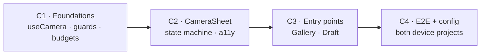

# Implementation Plan — Clothesline (Phase 1.05: Camera)

> **Companion to:** [`technical-implementation-spec.md`](./technical-implementation-spec.md) · **Prototype:** [`camera-prototype.html`](./camera-prototype.html)
> **Phase:** 1.05 — an increment on the shipped MVP
> **Document date:** 14 July 2026
> **Status:** Draft for build
> **Audience:** the person building it. This turns the spec's *design* into an *ordered build* — milestones, dependencies, acceptance criteria. It does not restate the design; cross-references point back to spec sections (e.g. "spec §3.3").

---

## 1. Approach

**Logic before UI.** The risky surface here is `getUserMedia` — permissions, device switching, stream teardown — and it is also the one part that can be tested *without* a camera or a browser. So **C1 builds every non-visual piece behind a hook** and pins its failure modes down against a mocked `navigator.mediaDevices` before a single pixel exists. The sheet, the entry points, and the e2e suite follow in order.

Sequencing principles:
- **The `Blob` boundary is the whole containment story.** Everything downstream of capture (`capture.ts` → `compress.ts` → `putBytes` → upload queue → Blob) already takes a `Blob` and is reused untouched. If a milestone finds itself editing `uploadQueue.ts`, the API, or the schema, something has gone wrong — **there are no backend changes in this phase** (spec §1.2).
- **Build the hook Phase 2 needs, not the one C2 needs.** `useCamera` must expose the `<video>` element and a `grabFrame()` — not merely a shutter callback — because Scan Mode drives the same canvas grab from a detection loop (spec §9). This costs nothing now and cannot be retrofitted cheaply.
- **Each milestone ends at a review gate:** a commit, a green check, and a stop.

Sizes are **T-shirt** (S/M/L), not calendar estimates.

---

## 2. Milestones at a glance

| # | Milestone | Delivers | Depends on | Size |
|---|---|---|---|---|
| C1 | Foundations (no UI) | `useCamera`, `guards`, the pending-bytes budget, the orientation fix — all unit-tested | — | **M** |
| C2 | `CameraSheet` | The modal: state machine, controls, a11y, icons, styles | C1 | **L** |
| C3 | Entry points | Gallery and Draft mount the sheet; Draft gets one-tap capture | C2 | **S** |
| C4 | E2E + config | `camera.spec.ts` green on **both** device projects | C3 | **M** |

**C0 — before anything:** frontend dependencies are **not installed** in this worktree. `npm install` in both `clothesline-web` and `clothesline-e2e` first. Do **not** run `playwright install` — Chromium is pre-provisioned at `/opt/pw-browsers/chromium` (CLAUDE.md).

---

## 3. Milestones in detail

### C1 — Foundations (no UI) · size **M**

Every non-visual piece, each testable without a browser camera.

- [ ] **`photos/useCamera.ts`** (NEW) — the entire `getUserMedia` surface, isolated behind a hook so it can be driven by a mocked `navigator.mediaDevices`:
  - acquire with `{ facingMode: 'environment', width: { ideal: 1920 }, height: { ideal: 1080 } }` — `ideal`, never `exact` (spec §4);
  - `enumerateDevices()` **after** the first grant only — labels are empty before one (spec §3.3);
  - switching by **form factor, not device count**: `facingMode` flip on touch, `deviceId` on desktop, with the desktop choice remembered in `localStorage` and a stale id falling back to the default (spec §3.3);
  - **`grabFrame()`** — draw `<video>` to canvas at intrinsic `videoWidth`/`videoHeight` → `toBlob()`. No `ImageCapture` (spec §4);
  - **teardown**: stop tracks on confirm, cancel, unmount, device switch, and `visibilitychange → hidden` (spec §6);
  - **expose the `<video>` element and `grabFrame()`** — not just a shutter callback (spec §9).
- [ ] **`photos/guards.ts`** (NEW) — checks that run **before any decode** (spec §5.1–5.2): `image/*` type, ≤ 25 MB per file, ≤ 200 files per batch, and the **pending-bytes** refusal.
- [ ] **`photos/byteStore.ts`** (EDIT) — add `pendingBytes()` (sum of entries with `uploaded === false`; the flag is already stored per entry) and **`PENDING_BUDGET_BYTES = 100MB`**. It **must stay below** the existing 150MB `CACHE_BUDGET_BYTES`: `trimCache()` sums *every* entry but evicts only *uploaded* ones, so a pending pile near 150MB makes it evict the entire offline cache and still finish over budget (spec §5.2).
- [ ] **`photos/compress.ts`** (EDIT) — one line: `createImageBitmap(file, { imageOrientation: 'from-image' })` (spec §4.1).

Tests (Vitest — there is currently **no** unit coverage of the capture path at all):
- [ ] `useCamera.test.ts` — tracks stopped on unmount / cancel / before a device switch; `NotAllowedError` / `NotFoundError` / `NotReadableError` / absent `mediaDevices` each map to the right `Unavailable` reason; enumeration only after a grant; stale `deviceId` falls back.
- [ ] `guards.test.ts` — an oversized file and a non-image file are rejected **without being decoded** (assert `createImageBitmap` is *never called* — the guard existing *before* the thing that OOMs is the entire point); a batch over 200 is refused; `pendingBytes()` at/over `PENDING_BUDGET_BYTES` refuses, and accepts again once the queue drains; **`PENDING_BUDGET_BYTES < CACHE_BUDGET_BYTES`** (invert them and the eviction pathology returns silently).
- [ ] `compress.test.ts` — `createImageBitmap` is called with `{ imageOrientation: 'from-image' }`.

**Acceptance:** Vitest, `npm run typecheck`, and `npm run lint` are green. No UI exists yet, and none is needed to prove the camera's failure modes behave.

---

### C2 — `CameraSheet` · size **L**

The modal — a full-bleed overlay on mobile, a centered max-width dialog on desktop, reusing the existing `.photo-lightbox` overlay pattern.

- [ ] **`photos/CameraSheet.tsx`** (NEW) — the spec §3.1 state machine:
  `Requesting → Live → Review → SavingFrame`, `Live/Unavailable → SavingFiles`, `Unavailable → Requesting` (Try again).
  - **`SavingFrame` and `SavingFiles` are separate states.** A failed frame save returns to `Review` with the frame retained (*Use photo* becomes a retry); a failed file save returns to `Live`/`Unavailable`, keeps its successes, and reports `2 of 5 photos couldn't be added` (spec §3.1, §5.3).
  - **`Unavailable` is a first-class state, not an error** — it still offers *Choose existing photo*, names the reason, and offers *Try again* where retrying can help. The button that opens the sheet is never pre-emptively disabled (spec §3.1).
  - Controls per spec §3.2. **Two** file inputs: the picker (`accept="image/*"`, **no `capture`**, `multiple` in category scope only) and the OS-camera escape hatch (`capture="environment"`), the latter rendered **only on touch** — on desktop `capture` is a no-op and the control would be a second file picker wearing a camera label.
  - Batch progress `Adding 143 of 200…` with a **Cancel that keeps what already landed** (spec §5.3).
  - **A11y:** `role="dialog" aria-modal="true"`, focus trapped and returned to the opening button, Escape closes *and stops the stream*, progress `aria-live="polite"`, failures `role="alert"` (spec §3.1).
- [ ] **`components/Icon.tsx`** (EDIT) — **not in the spec's file list, but required.** It carries `camera`/`image`/`images`/`trash3` but **no flip-camera icon and no warning icon**. Add the Bootstrap Icons `d` path data (the file inlines paths deliberately — no icon font, no CDN).
- [ ] **`theme.css`** (EDIT) — `.camera-sheet` / `.camera-stage` / `.camera-controls`, alongside the existing `.photo-lightbox` rules.

**Acceptance:** every state renders and matches [`camera-prototype.html`](./camera-prototype.html); the camera light goes **off** when the sheet closes (the most visible way to get this wrong — it reads as spyware); keyboard-only operation works end to end.

---

### C3 — Entry points · size **S**

- [ ] **`routes/Gallery.tsx`** (EDIT) — delete the hidden `<input>`; the AppBar camera button mounts `<CameraSheet>`, scoped by the `?category=` it already computes (which is also what decides bundle-vs-category and therefore `multiple`, spec §5).
- [ ] **`routes/Draft.tsx`** (EDIT) — the row camera button opens the sheet **in place** rather than navigating to the Gallery. Today it costs two taps and a screen transition to take one photo, on the screen that is supposed to itemize in under 60 seconds — and the PRD describes it as one tap (spec §3.4). No existing test asserts the old navigation.

Both mount the **same** component with the same props (`loadId`, optional `categoryId`).

**Acceptance:** existing Vitest green; capture works by hand from both Draft and Gallery; the Draft path never leaves the screen.

---

### C4 — E2E + config · size **M**

- [ ] **`playwright.config.ts`** (EDIT):
  - add the launch arg **`--use-fake-device-for-media-stream`** (a synthetic camera, so `getUserMedia` resolves headlessly);
  - **widen `desktop-chromium`'s `testMatch`**, currently pinned to `responsive.spec.ts` — otherwise `camera.spec.ts` runs *only* on mobile and is **silently never exercised on desktop**, for the one feature whose entire premise is that both behave alike;
  - **keep `permissions: []` global** and grant camera **per-test**. A blanket `['camera']` grant makes the denied-permission test unwritable (spec §8).
- [ ] **`tests/camera.spec.ts`** (NEW) — shutter → review → *Use photo* (tile appears, count +1); *Retake* (nothing written); picker with 3 files in category scope (3 tiles, count +3); an oversized file and a non-image file **skipped and reported** while the good files in the same selection still land; the **Draft row** opens the sheet in place; **permission denied** still offers the picker and picking still works.
- [ ] **The mobile project must prove it is really mobile.** The whole desktop/touch split rests on `matchMedia('(pointer: coarse)')`. If Pixel 7 emulation doesn't satisfy it, the mobile run would exercise the **desktop** controls and still pass — green tests asserting the wrong UI. So assert the branch directly: mobile has the facing-flip and *Use device camera*; desktop has the device `<select>` and **no** *Use device camera*.
- [ ] **`tests/photos.spec.ts`** (EDIT) — its single `attachPhoto()` helper must open the sheet before `setInputFiles`. Keep the `photo-input` testid on the picker input inside the sheet so the change stays confined to that one helper.

**Acceptance:** the full suite is green on **both** `mobile-chromium` and `desktop-chromium`, including the four pre-existing photo tests. If any of those four fails for a reason other than the extra open-the-sheet step, this phase has broken something it promised not to touch (spec §1.2).

---

## 4. Risks & mitigations

| Risk | Likelihood | Mitigation |
|---|---|---|
| **iOS Safari is untestable in CI** (Chromium only), yet `playsInline` and the backgrounding stream-revocation rules are iOS-specific (spec §6) — a broken sheet on iPhone would ship green | **High** | One manual pass on a real iPhone before merge. This is the single largest hole in the test story and cannot be closed by CI. |
| A leaked `MediaStream` leaves the **camera light on** after close — reads to a user as spyware | Med | Teardown is a C1 unit test (unmount/cancel/switch/hidden), not a C2 afterthought |
| `pointer: coarse` may not hold under Pixel 7 emulation → mobile tests silently exercise the desktop UI | Med | Asserted directly in C4 rather than assumed |
| Someone later raises `PENDING_BUDGET_BYTES` past `CACHE_BUDGET_BYTES`, silently restoring the evict-the-whole-cache pathology | Low | A C1 test asserts the ordering |
| A picked file OOMs the tab before the resize that was meant to shrink it | Med | Guards run **before** `createImageBitmap`, asserted by a test that the decoder is never called (C1) |
| Scope leaks into the backend or the data model | Low | The `Blob` boundary (§1); a diff touching `src/backend/`, `src/db/`, or `aspire/` is the tell |

---

## 5. Verification

1. `npm install` in `clothesline-web` and `clothesline-e2e` (deps are not installed in this worktree). **Never** `playwright install` — Chromium is at `/opt/pw-browsers/chromium`.
2. `npm run test` (Vitest), `npm run typecheck`, `npm run lint` in `clothesline-web`.
3. `aspire run` (boots Postgres, Azurite, Zitadel, API, web), then Playwright on **both** projects.
4. **Drive it by hand.** A fake media device proves the wiring, not the experience: open the sheet on a laptop and on a phone, take a photo, retake, pick from the library, deny the permission, and close the sheet — then check the **camera light is off**. Codespaces' forwarded HTTPS origin satisfies `getUserMedia`; a bare-IP LAN origin does not (spec §6).

---

## 6. Definition of Done

1. The in-app camera works on **desktop and mobile**, with *choose existing photo* reachable **inside** it and the OS camera app available as a per-shot option on mobile only (spec §1.2).
2. **Preview + confirm** exists — the step MVP spec §6.2 called for and Phase 1 never built.
3. Capture from the **Draft row** takes one tap and never leaves the screen (spec §3.4).
4. Oversized and non-image files are refused before decode; a batch is refused when the un-uploaded pile is at budget (spec §5.1–5.2).
5. Unit + e2e green on **both** device projects; the four pre-existing photo tests still pass, including offline capture → upload on reconnect.
6. One manual pass on a **real iPhone** (the CI hole above).
7. **No diff** under `src/backend/`, `src/frontend/clothesline-web/src/db/`, or `aspire/`.
