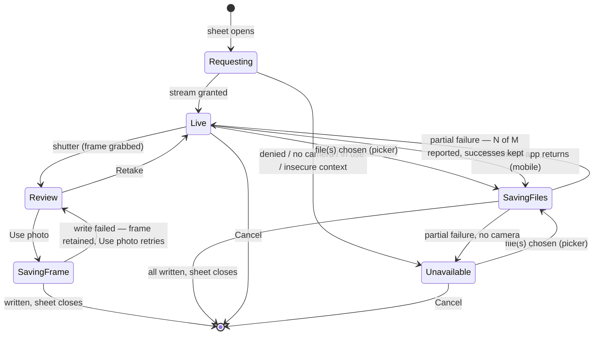

# Technical Implementation Spec — Clothesline (Phase 1.05: Camera)

> **Prototype:** [`camera-prototype.html`](./camera-prototype.html) — every state below, drawn. Open it straight from disk (no build, no network). Deep-link a single screen with `?state=review`, `?state=scan&device=desktop`, …
> **Supersedes:** [`specs/01-mvp/technical-implementation-spec.md`](../01-mvp/technical-implementation-spec.md) §6.2, the *Photo capture* row — and **only** that (see §10)
> **Companion to:** [`business/07-prd-phase1-mvp.md`](../../business/07-prd-phase1-mvp.md) §4.5 (Photos)
> **Phase:** 1.05 — an increment on the shipped MVP, not a new phase of the product
> **Document date:** 14 July 2026
> **Status:** Draft for build
> **Scope:** *How* photo capture works. It does not change the photo **data model**, the **upload/read path** (§8 of the MVP spec), or anything server-side — those stay exactly as built.

---

## 1. Summary

The MVP ships photo capture as a **hidden file input** that is clicked programmatically:

```tsx
// Gallery.tsx (current)
<input type="file" accept="image/*" capture="environment" ... />
```

`capture="environment"` is a *hint*. A phone honours it by launching its OS camera app; **every desktop browser ignores it** and silently degrades the same button into a file picker. So the app has one code path with two unannounced behaviours, and on a laptop the camera button is not a camera button at all — it cannot reach the webcam. There is also no preview/confirm step anywhere, which the MVP spec §6.2 explicitly called for and which was never built.

This spec replaces that hidden input with a **real in-app camera** — a `CameraSheet` built on `getUserMedia` — that behaves the same on desktop and mobile, and that offers **choosing an existing photo** as an option *inside* the camera rather than as a mutually-exclusive alternative to it.

### 1.1 Terminology — three different things

These are easy to conflate, and the rest of the document depends on keeping them apart.

| Term | What is actually on screen | Do we see live frames? |
|---|---|---|
| **In-app camera** *(what this spec builds)* | **Our own UI.** The browser (`getUserMedia`) hands our page the raw video feed from the camera hardware; we render it into a `<video>` in our own React component and draw our own shutter, controls, and overlays around it. The user never leaves Clothesline. | **Yes — every frame.** |
| **OS camera app** *(what the MVP does today)* | **Apple's or Google's Camera app.** A separate full-screen application we do not control. The user leaves Clothesline, shoots, and returns with a finished JPEG. | No — only the finished file. |
| **File picker** | The OS file/photo browser. | No — only the chosen file. |

> **"In-app camera" means our own camera preview inside our app — *not* the camera app installed on the phone.**

### 1.2 The stance

**The in-app camera is the default on every platform.** The OS camera app remains available **as an option, where the platform can honour one** — which in practice means mobile only. On desktop there is *no* OS-camera option to offer: browsers ignore the `capture` attribute, and no web API can launch a laptop's camera app and get a photo back. This asymmetry is a platform fact, not an omission (§3.2).

| | Desktop | Mobile |
|---|---|---|
| **In-app camera** — live preview, shutter, confirm — **the default** | webcam via `getUserMedia` — **new** | rear camera via `getUserMedia` — **new** |
| **Choose an existing photo** — file picker, multi-select | ✅ | ✅ — **new on mobile** |
| **Use the OS camera app** — an option, never the default | **not possible** (no such platform capability) | ✅ — today's behaviour, kept as an escape hatch |

**What this spec does *not* change:** the `Photo`/`PhotoLink`/`LoadItem` documents, `local_only`/`blob_key`, the WebP compression target, the IndexedDB byte store, the upload queue, the read path, the `/media/*` endpoints, the ORM, or the database. Everything downstream of capture takes a `Blob` and is reused untouched. **There are no backend changes in this spec.**

---

## 2. Why an in-app camera (and what it costs)

Handing off to the OS camera app produces a better *photograph* — HDR, night mode, the full sensor. A `getUserMedia` frame grab does not. We are trading some of that away, deliberately:

- **The MVP already throws the difference away.** `compress.ts` caps the longest edge at **`MAX_DIMENSION = 1600`** and re-encodes to WebP at quality `0.8`. A 1080p camera stream (longest edge 1920) is *already above* the resolution we retain, so for the stored artefact the sensor advantage largely evaporates in the resize.
- **The artefact is documentation, not photography.** PRD §4.5: a photo exists so Maria can prove which shirt she handed over. Legible beats beautiful.
- **The handoff costs a screen.** Every OS-camera photo is a full round-trip out of the PWA and back, and it returns *no* confirm step — the photo is simply in the gallery, right or wrong.
- **It is desktop-incapable.** The handoff is not a worse camera on a laptop; it is *no camera at all* (§1.2). Only `getUserMedia` reaches a webcam.
- **The decisive one: Phase 2 cannot be built on the handoff.** Scan Mode needs live frames and an overlay drawn on the viewfinder, and an OS camera app gives us neither (§9). Choosing the handoff as our primary camera would mean building the real one anyway, later, under deadline.

So: **in-app is the default on both platforms**, and on mobile the OS camera app stays reachable as an explicit, per-shot **"Use device camera"** option for when the shot genuinely matters. That keeps the good-photo path one tap away without making it the path everyone walks — and without conceding the viewfinder we will need.

---

## 3. The capture surface

### 3.1 `CameraSheet` — a full-screen modal

Opened from the Gallery AppBar's camera button (today's only capture entry point, [`Gallery.tsx:96-106`](../../src/frontend/clothesline-web/src/routes/Gallery.tsx#L96-L106)). It is a full-bleed overlay on mobile and a centered, max-width dialog on desktop, reusing the `photo-lightbox` overlay pattern already in `theme.css`.

It is a **state machine**, and every terminal state is either a photo or an exit — never a dead end:



**The two save paths fail differently, so they are two states.** A failed **frame** save has something to fall back to — the grabbed frame is still in hand, so we return to `Review` with the frame intact and *Use photo* becomes a retry; nothing is lost. A failed **file** save has no such thing: per §5 it does not roll back, so it returns to whichever state the picker was opened from (`Live`, or `Unavailable` on a camera-less machine), reporting `2 of 5 photos couldn't be added` while the successes keep their photos. Collapsing these into one `Saving` state would have sent a failed picker save into `Review` with no frame to review.

**`Unavailable` is a first-class state, not an error.** A laptop with no webcam, a denied permission, a camera held by another tab, an insecure context — all land here, and all of them still show **"Choose existing photo"** as the primary action, plus the specific reason and a **Try again** button where retrying can help (permission denied, device busy). The button that opens the sheet is *never* disabled on the grounds that a camera might be missing; we find out by asking.

**Modal behaviour.** `role="dialog" aria-modal="true"`, as the existing lightbox already does. Focus moves to the sheet on open and is **trapped** inside it; **Escape** closes (and stops the stream, §6); focus returns to the camera button that opened it. The `SavingFiles` progress (`Adding 3 of 5…`) is announced via `aria-live="polite"`, and the failure report via `role="alert"`.

### 3.2 Controls

| Control | Where | Behaviour |
|---|---|---|
| **Shutter** | `Live` | Grabs a frame → `Review`. Disabled until the video reports a non-zero `videoWidth`. |
| **Choose existing photo** | `Live` + `Unavailable` | Opens a file picker (`<input type="file" accept="image/*">`, **no `capture` attribute** — that is what makes it the library/file picker rather than the camera on mobile). `multiple` per §5. |
| **Switch camera** | `Live`, when ≥2 video inputs | See §3.3. |
| **Use device camera** | `Live` + `Unavailable`, **mobile only** | The existing hidden `capture="environment"` input — the OS camera app. See below. |
| **Cancel** | all | Stops the stream, closes. |
| **Retake / Use photo** | `Review` | Discard the frame and return to `Live`; or commit it (§4). |

**"Use device camera" is rendered only where an OS camera app can actually be reached** — gated on `matchMedia('(pointer: coarse)')`, i.e. touch devices. It is **not** rendered on desktop, and this is deliberate: `capture` is a no-op there, so the control would silently open a *second file picker* while wearing a camera label. A button that lies about what it does is worse than an absent one, and the honest desktop control set is exactly two — in-app camera, and choose-existing-photo.

**The choice does not stick.** Opening the sheet always lands on the live in-app preview; reaching for the OS camera is a per-shot decision, never a remembered default. Two reasons: it keeps one predictable entry state, and it keeps users habituated to the in-app viewfinder — which is the surface Phase 2's Scan Mode is built on (§9). A user who had silently defaulted into the OS camera app for months would meet that viewfinder cold. *(The remembered `deviceId` in §3.3 is a different thing: it picks **which** camera the in-app preview opens, not **whether** the in-app preview is used.)*

### 3.3 Switching cameras — one control, two renderings

`navigator.mediaDevices.enumerateDevices()` filtered to `kind === 'videoinput'`. Device **labels are empty until a camera permission has been granted**, so enumeration runs *after* the first successful `getUserMedia`, never before.

The two renderings are chosen by **form factor, not by device count**:

| | Control | Switches by |
|---|---|---|
| **Touch** (`pointer: coarse`) | An icon **flip** button: rear ⇄ front. | `facingMode` (`'environment'` ⇄ `'user'`) |
| **Desktop** | A `<select>` of the enumerated devices, by `label`. | `deviceId` |

**Counting devices would be wrong.** A modern phone enumerates *far* more than two video inputs — an iPhone reports front, back-wide, back-ultra-wide, and often a telephoto. A count-based rule ("exactly 2 → phone") therefore sends phones down the desktop branch and puts a `<select>` of cryptic hardware labels on a touch screen, which is the exact UI this control exists to avoid. Asking the platform for **`facingMode`** instead lets the OS pick the right physical lens behind "back", which is what the user actually means.

The control is hidden when there is nothing to switch to: fewer than 2 video inputs, or (on touch) only one `facingMode` available.

Desktop's `deviceId` choice is remembered in `localStorage`, so a user with three webcams does not re-pick every time; a stored id that no longer resolves falls back to the default. **Touch does not persist a facing preference** — the sheet always opens rear-facing, because a load photo is a photo *of the clothes*, and a front-camera default would be a bizarre thing to inherit from a session weeks ago.

### 3.4 Entry points — and one the modal lets us fix

PRD §4.5 describes per-category capture as one gesture: *"next to each category is a camera button — she can tap it to photograph that item type."* The shipped app does not do that. [`Draft.tsx:156`](../../src/frontend/clothesline-web/src/routes/Draft.tsx#L156) **navigates to the Gallery**, where the user must find and tap a *second* camera button before any camera opens. Two taps and a screen transition to take one photo, on the screen where itemizing is supposed to take under 60 seconds (MVP spec §6.3).

That detour was close to forced in the MVP, because capture *was* a route — the hidden input lived in the Gallery. **`CameraSheet` is a component, not a screen**, so the detour is now gratuitous:

| Entry point | Today | With `CameraSheet` |
|---|---|---|
| **Draft row camera** ([`Draft.tsx:156`](../../src/frontend/clothesline-web/src/routes/Draft.tsx#L156)) | → navigate to Gallery → tap camera | **opens the sheet in place**, scoped to that category |
| **Gallery AppBar camera** ([`Gallery.tsx:96-106`](../../src/frontend/clothesline-web/src/routes/Gallery.tsx#L96-L106)) | → tap camera | opens the sheet, scoped by `?category=` |
| Sent / Closed row photo icons | → Gallery (viewing) | unchanged — these are *view* affordances, not capture |

Both capture entry points mount the **same** `<CameraSheet>` with the same props (`loadId`, optional `categoryId`); only the scope differs, and the scope is exactly what already decides bundle-vs-category and therefore `multiple` (§5). The Gallery button stays — a user who is already looking at the gallery should be able to add from there — but it is no longer the *only* way in, and the Draft screen gets the one-tap capture the PRD actually specified.

*(This is the sole UX change here beyond the camera itself. It is in scope because it is a direct consequence of capture becoming a component: leaving the detour in place would mean shipping the refactor and none of its benefit.)*

---

## 4. Frame grab and the write path

**Grab:** draw the live `<video>` to a canvas at its intrinsic `videoWidth`/`videoHeight`, then `canvas.toBlob()`. We do **not** use `ImageCapture.takePhoto()`: it is Chromium-only (absent in Safari and Firefox), and its one advantage — full sensor resolution — is discarded by the 1600px resize anyway (§2). One code path, all browsers.

The requested stream is `{ video: { facingMode: 'environment', width: { ideal: 1920 }, height: { ideal: 1080 } } }` — `ideal`, not `exact`, so a device that cannot do 1080p still gets a stream instead of an `OverconstrainedError`.

**Write:** the grabbed `Blob` enters the **existing, unmodified** pipeline — [`capture.ts`](../../src/frontend/clothesline-web/src/photos/capture.ts) → `compressToWebP` → `putBytes` → doc write, with the upload queue waking on the photo doc's insert. A camera frame and a picked file are the same thing by the time they reach it: a `Blob`. This is the whole reason the change stays contained.

### 4.1 Orientation — a real bug this fixes

`compress.ts:19` calls `createImageBitmap(file)` with no options, leaving `imageOrientation` at the browser's default — a value the browsers have historically **disagreed** on (`'none'` vs. `'from-image'`). A JPEG carrying an EXIF rotation flag — which is most photos out of a phone's library — can therefore be re-encoded **sideways** into WebP, and since we re-encode, the EXIF tag is *dropped*, so nothing downstream can rescue it. Today the bug is latent, because the OS camera app usually hands back an already-upright image; **the moment we allow picking arbitrary library photos, it becomes reachable.** Passing the option explicitly removes the dependence on the default entirely.

Fix, in `compress.ts`:

```ts
const bitmap = await createImageBitmap(file, { imageOrientation: 'from-image' })
```

Canvas-grabbed camera frames are already upright and are unaffected.

---

## 5. Multiple photos

The data model decides this for us, and it lands differently in the two scopes the Gallery already distinguishes via `?category=`:

| Scope | Model behaviour | Multi-select |
|---|---|---|
| **Category** (`?category=<id>`) | Each photo **auto-creates its own `LoadItem`** and bumps `count_sent` while the category is in `auto` mode ([`domain/photos.ts:55-106`](../../src/frontend/clothesline-web/src/domain/photos.ts#L55-L106)) — one photo *is* one garment. | ✅ **`multiple` enabled.** N files → N photos → N items → count +N. This is not a special case; it is the existing per-photo semantics run N times. |
| **Bundle** (no `?category=`) | **One photo per load**, app-enforced — a second bundle photo *replaces* the first ([`capture.ts:25-26`](../../src/frontend/clothesline-web/src/photos/capture.ts#L25-L26)). | ❌ **`multiple` omitted.** Selecting many would mean "replace, replace, replace" and silently keep only the last. |

The camera shutter always produces **one** photo at a time — after `Use photo` the sheet closes. (Staying in the camera for a rapid burst is a natural follow-on but is **not** in this spec.)

### 5.1 Guarding the input — the bound the camera used to give us for free

Every photo in the MVP came from the OS camera app, so the input was **implicitly bounded**: a normal photo, a few MB, one at a time. Opening a file picker onto the user's disk **removes that bound**, and nothing in the existing pipeline replaces it. [`compress.ts`](../../src/frontend/clothesline-web/src/photos/compress.ts) calls `createImageBitmap(file)`, which decodes the **entire** image into memory *before* the resize that was supposed to make it small — so a 200MB scan or a 60MP raw takes the tab out with it. `accept="image/*"` does not save us; it is a picker filter, not enforcement, and is trivially bypassed.

So, **before any decode**, each file is checked:

| Guard | Rule | Why |
|---|---|---|
| **Type** | `file.type` must start with `image/` | A `.zip` renamed `.jpg` should fail fast, not inside the decoder. |
| **Size** | `file.size` ≤ **25 MB** | Generously above any phone photo (~2–8MB) and any reasonable DSLR JPEG, far below what kills a tab. |
| **Batch** | ≤ **200 files** per selection | See §5.2. |

A file failing a guard is **skipped, not fatal** — it flows into the same partial-failure report as any other bad file (below).

### 5.2 Batch size, and the limit that actually matters

**200 files per selection.** After compression a photo is ~150–300KB, so 200 is roughly **30–60MB** — comfortably inside the 150MB budget in [`byteStore.ts:13`](../../src/frontend/clothesline-web/src/photos/byteStore.ts#L13) and nowhere near a browser storage limit. It is a generous cap, and deliberately so: it exists to stop an absurd gesture, not to ration ordinary use.

**But a per-selection cap is not the real safeguard, and must not be mistaken for one.** Un-uploaded bytes are **never evicted** — correctly, since they are the only copy (MVP §8.3). That rule was safe when photos arrived one camera shot at a time. It is not safe against *repeated* batches: a user offline in a shop can pick 200, then 200 again, and nothing in a per-gesture cap stops the pending pile from growing without limit until IndexedDB writes start failing — **offline, which is precisely when the app is supposed to be dependable.**

So the guard that matters is on the **cumulative weight of photos still waiting to upload**, not on the size of any one gesture:

- Before a batch, sum the bytes of entries with `uploaded === false` ([`byteStore.ts`](../../src/frontend/clothesline-web/src/photos/byteStore.ts) already records this per entry, so it is a `getAll` + filter).
- If that total is at or above the budget, **refuse the batch** and say why: *"You have a lot of photos waiting to upload. Connect to the internet to free up space."* Refusing to accept a photo we cannot safely keep is honest; accepting it and later failing to store it is not.
- The camera shutter (one photo) is subject to the same check. A single photo is small, so in practice this only ever fires after the pending pile is already large.

### 5.3 Processing a batch

**Sequentially, not `Promise.all`** — each file is a decode + canvas resize + WebP encode, and running even a dozen in parallel on a mid-range phone will spike memory. At the 200-file cap this is **60–100 seconds** of work, which cannot be a frozen screen:

- Live progress (`Adding 143 of 200…`), announced via `aria-live` (§3.1).
- A **Cancel** that stops after the in-flight file. **Everything already written is kept** — cancel means "stop adding more", not "undo".
- **Partial failure does not roll back.** Files that succeed keep their photos; the sheet reports `2 of 5 photos couldn't be added`. Losing four good photos because the fifth was a corrupt HEIC would be worse than the honest partial result.

---

## 6. Stream lifecycle

A leaked `MediaStream` leaves the camera light on after the sheet closes — the single most visible way to get this wrong, and it reads to the user as spyware. Rules:

- Every acquired stream's tracks are `stop()`ped on: **confirm, cancel, unmount, and switching device** (the old stream stops before the new one is requested — some devices refuse to open a second camera while the first is live).
- On `visibilitychange → hidden`, stop the stream; re-acquire on return to `Live`. iOS Safari revokes the camera on backgrounding regardless, and holding a dead track produces a permanently black preview.
- The `<video>` element is `autoPlay muted playsInline`. **`playsInline` is load-bearing** — without it iOS Safari takes the video fullscreen and the sheet's own UI vanishes behind it.

`getUserMedia` requires a **secure context**. Production (HTTPS), `localhost`, and Codespaces' forwarded HTTPS URLs all qualify; a bare-IP LAN origin (`http://192.168.x.x:5173`) does **not**, and lands in `Unavailable` with a reason naming HTTPS. Worth knowing before someone tests on a phone over the LAN and concludes the camera is broken.

---

## 7. Files

```
src/frontend/clothesline-web/src/photos/
├── useCamera.ts       NEW  stream acquisition, device enumeration/switching,
│                          frame grab, teardown. All the getUserMedia surface,
│                          isolated behind a hook so it can be unit-tested with
│                          a mocked navigator.mediaDevices.
├── CameraSheet.tsx    NEW  the modal: the §3.1 state machine, controls, the two
│                          file inputs (picker + OS-camera escape hatch).
├── guards.ts          NEW  pre-decode input guards (§5.1): file type, 25MB size
│                          cap, 200-file batch cap — plus the pending-bytes check
│                          that is the guard actually protecting the offline case.
├── capture.ts         —    unchanged (already takes a Blob)
├── compress.ts        EDIT one line: imageOrientation: 'from-image' (§4.1)
├── byteStore.ts       EDIT add pendingBytes(): sum of entries with uploaded=false.
│                          The data is already stored per entry; nothing exposes it.
└── uploadQueue.ts     —    unchanged

src/frontend/clothesline-web/src/routes/Gallery.tsx
    EDIT  drop the hidden <input>; the camera button now opens <CameraSheet>.
          The `?category=` scope it already computes decides bundle vs. category
          (and therefore `multiple`, §5).

src/frontend/clothesline-web/src/routes/Draft.tsx
    EDIT  the row camera button opens <CameraSheet> for that category in place,
          instead of navigating to the Gallery (§3.4).

src/frontend/clothesline-web/src/theme.css
    EDIT  .camera-sheet / .camera-stage / .camera-controls, alongside the
          existing .photo-lightbox rules.
```

No changes under `src/backend/`, `src/frontend/clothesline-web/src/db/`, or `aspire/`.

---

## 8. Testing

**Vitest** (`useCamera.test.ts` — new; there is currently *no* unit coverage of the capture path at all):
- `navigator.mediaDevices` stubbed. Assert: tracks are stopped on unmount, on cancel, and before a device switch; `NotAllowedError` / `NotFoundError` / `NotReadableError` / absent `mediaDevices` each map to the right `Unavailable` reason; enumeration happens only after a grant; a stale stored `deviceId` falls back to the default.
- `compress.test.ts` — new: asserts `createImageBitmap` is called with `{ imageOrientation: 'from-image' }` (§4.1).
- `guards.test.ts` — new (§5.1–5.2): an oversized file and a non-image file are rejected **without being decoded** (assert `createImageBitmap` is never called — the whole point is that the guard runs *before* the thing that OOMs); a batch over 200 is refused; `pendingBytes()` at/over budget refuses the batch, and drops back to accepting once the queue drains.

**Playwright** — Chromium needs the launch arg **`--use-fake-device-for-media-stream`** (a synthetic camera, so `getUserMedia` resolves headlessly with no hardware). New `camera.spec.ts`:

- shutter → review → **Use photo** → tile appears in the gallery, category count +1;
- shutter → **Retake** → back to live, no photo written;
- **Choose existing photo** with 3 files in category scope → 3 tiles, count +3;
- a file over the size guard, and a non-image file, are **skipped and reported** while the good files in the same selection still land (§5.1);
- from the **Draft row** camera button, the sheet opens **in place** — no navigation to the Gallery (§3.4);
- permission **denied** → `Unavailable` state still offers the picker, and picking still works.

**It must actually run on both device types — which takes a config change.** Today `desktop-chromium` has `testMatch: /responsive\.spec\.ts/` ([`playwright.config.ts:44`](../../src/frontend/clothesline-e2e/playwright.config.ts#L44)), so it runs *that spec and nothing else*. A new `camera.spec.ts` would therefore run **only** on `mobile-chromium` and silently never be exercised on desktop — for the one feature whose entire premise is that desktop and mobile now behave alike. Widen that project's `testMatch` to include `camera.spec.ts`.

**And the mobile project must prove it is really mobile.** The desktop/touch split in §3.2–§3.3 hangs on `matchMedia('(pointer: coarse)')`. If Pixel 7 emulation does not satisfy that query, the mobile run would quietly exercise the **desktop** control set and still pass — green tests asserting the wrong UI, which is worse than a red one. So `camera.spec.ts` asserts the branch directly: on `mobile-chromium` the **facing-flip** control and **"Use device camera"** are present; on `desktop-chromium` the **device `<select>`** is present and **"Use device camera" is absent** (§3.2).

**On permissions — the grant must be per-test, not global.** The config currently sets `permissions: []` at [`playwright.config.ts:28`](../../src/frontend/clothesline-e2e/playwright.config.ts#L28). Do **not** change that to `['camera']`: a blanket grant makes the denied-permission test above impossible to write. Grant camera in the tests that need a live stream (`context.grantPermissions(['camera'])`), and let the denied test simply run under the default. The two cases are the point of the state machine, so the harness has to be able to express both.

The existing [`photos.spec.ts`](../../src/frontend/clothesline-e2e/tests/photos.spec.ts) drives `setInputFiles` on `data-testid="photo-input"`, and **will need editing** — its capture helper must now open the sheet before setting files. Keep the `photo-input` testid on the picker input inside the sheet so the change stays to one shared helper. Those specs (including the offline capture → upload-on-reconnect one) are about the **write path**, not the camera; they must go on passing, and if any of them fails for a reason other than the extra open-the-sheet step, this spec has broken something it promised not to touch (§1.2).

---

## 9. Forward compatibility with Phase 2 (Scan Mode)

This is not a Phase 2 design — it is a short list of things Phase 1.05 must **not foreclose**.

[PRD Phase 2 §3.1](../../business/08-prd-phase2-ai.md) specifies "Scan Mode": the camera runs as a **live, real-time video stream** (explicitly "not a single-shot photo trigger"), the user pans across a pile of clothes, and the app classifies garments continuously — bumping the category count and filing a frame-capture photo on each detection.

**Scan Mode is only buildable on an in-app camera, and this spec is what makes it possible.** The two requirements it has are precisely the two things an OS camera app structurally cannot provide:

1. **Continuous access to frames while the user is still shooting.** The OS camera app returns nothing until its own shutter has been pressed and it has been dismissed — by then the moment has passed. There is no API to read the viewfinder of Apple's Camera app.
2. **The ability to draw on top of the live view.** Because the in-app camera's feed lives in a `<video>` element **in our own DOM**, we can absolutely-position an overlay on it and render detection state in real time — a bounding box and a *"Shirt · 92%"* label chip tracking a garment through frame, a *"+1 Shirt"* confirmation as it is auto-counted, the low-confidence *"Is this a Shirt?"* prompt from [PRD §3.4](../../business/08-prd-phase2-ai.md), a running tally strip, a filmstrip of captures. None of that can exist inside someone else's camera app. **Scan Mode is a set of overlays on the viewfinder this spec builds.**

So two constraints on the `useCamera` implementation, cheap now and expensive to retrofit:

- **Expose the `<video>` element and a `grabFrame()` function — not *only* a shutter callback.** Scan Mode's frame grab is the same canvas draw as §4, just driven from a detection loop instead of a button press. A hook whose only output is "here is the photo the user took" would have to be torn up.
- **Do not tune the stream constraint so tightly to the storage path that inference cannot share the feed.** §4 asks for 1080p because the 1600px cap makes anything more pointless *for the stored artefact*; a model wants a small frame (typically 224–640px) many times a second. These don't conflict — the same stream is downscaled for inference and grabbed at full frame for the photo — but the constraint should be a parameter, not a hard-coded assumption that the only consumer is `compress.ts`.

One Phase 2 assumption is **already satisfied**: [PRD §3.5](../../business/08-prd-phase2-ai.md) says Phase 2 "introduces an underlying items relation," but the MVP already built it — `captureCategoryPhoto` creates one `LoadItem` per photo (§5). Phase 2 inherits it rather than introducing it.

Left entirely open, because the camera surface is the same either way: **on-device vs. cloud inference**, which the Phase 2 PRD itself calls "the single biggest architecture decision for this phase." Only where the frames are *sent* differs, not how they are obtained.

---

## 10. Supersessions

What this spec **overrides** in [`specs/01-mvp/technical-implementation-spec.md`](../01-mvp/technical-implementation-spec.md). Per the repo convention (CLAUDE.md), the MVP spec is **not rewritten** — its original text stays and the superseded passage carries a dated callout pointing back here, so the evolution of the decision stays readable from either end.

| Superseded | Overridden by | Nature of the change |
|---|---|---|
| MVP **§6.2**, the *Photo capture* row | **§1.2** (and §3 for the surface) | Capture was a hidden `<input capture="environment">` — the OS camera app on mobile, and on desktop a silent degradation to a file picker with no camera access at all. It is now an in-app `getUserMedia` camera on both platforms, with the OS camera app kept as a mobile-only per-shot option. The row's **preview + confirm** was specced in Phase 1 but never built; §3.1 delivers it. |

**Deliberately *not* superseded**, though a reader might expect them to be:

- **MVP §8 in its entirety**, including §8.2 step 1. The byte path — compress → stash locally → `local_only` → upload queue → Blob — is untouched. Where the bytes came *from* is not something §8 ever asserted: a camera frame and a picked file are both a `Blob` by the time they reach it.
- **MVP §6.2, the *Load — Draft* row.** It says the row's camera button "capture → auto-creates a `LoadItem`". That is still exactly true — §3.4 makes it *more* true by opening the camera in place instead of detouring through the Gallery. The row described the intent; the implementation drifted from it. Nothing to reverse.

Both are cases where the convention could have been applied and shouldn't be: it earns its keep only while it marks **reversed decisions**, not every passage a reader might land on near a change.

---

## 11. Out of scope

- **Burst / stay-in-camera multi-shot** — the shutter yields one photo and closes. Worth revisiting once we see whether users photograph garments in runs.
- **Zoom, torch, tap-to-focus** (`applyConstraints` on the track) — Chromium-mostly, and not obviously worth the surface.
- **Re-taking or cropping an already-saved photo** — delete + re-add remains the path.
- **On-device HEIC decode** — browsers that can't decode a picked HEIC will fail that file; the partial-failure path (§5) reports it. Ordinary phone pickers transcode to JPEG on the way out, so this should be rare.
- **Anything server-side.** Explicitly: no new endpoint, no schema change, no migration.
