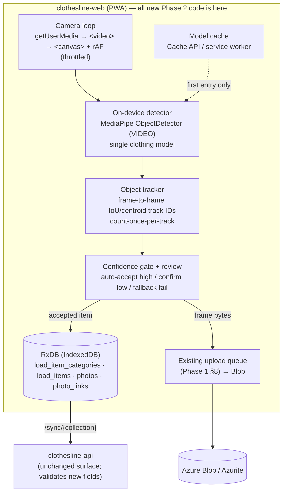
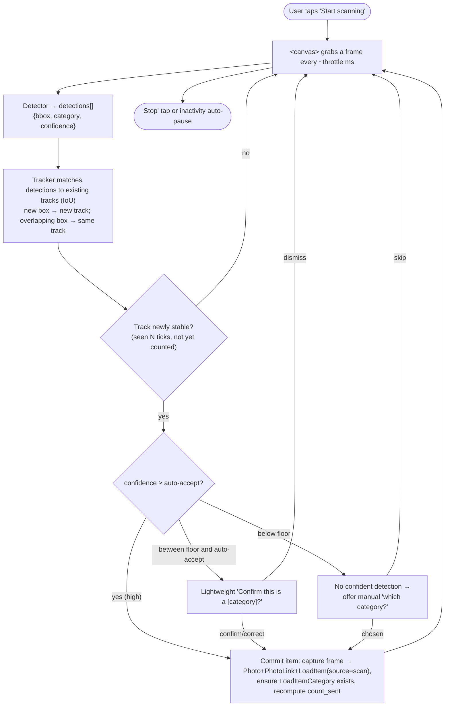

# Technical Implementation Spec — Clothesline (Phase 2: AI-Assisted Itemization)

> **Companion to:** [`business/08-prd-phase2-ai.md`](../../business/08-prd-phase2-ai.md)
> **Builds on:** [`specs/01-mvp/technical-implementation-spec.md`](../01-mvp/technical-implementation-spec.md)
> **Phase:** 2 of 3 (AI Clothing Detection)
> **Document date:** 9 July 2026
> **Status:** Draft for build
> **Scope:** This document describes *how* Phase 2 "Scan Mode" is built **on top of the Phase 1 MVP**. It maps every Phase 2 PRD feature to a concrete technical design and defines the delta against the Phase 1 spec. It does **not** restate Phase 1 — read that spec first for the data model, sync contract, and photo pipeline this phase reuses.

---

## 1. Summary

Phase 2 adds **Scan Mode**: a live camera view that detects and classifies garments as the user pans across a pile, auto-incrementing the per-category count and filing a photo per detected item — no per-item manual capture. It is **almost entirely an additive, client-side capability**. It writes into the *same* RxDB collections Phase 1 already built (`load_item_categories`, `load_items`, `photos`, `photo_links`) and reuses the *same* Azure Blob upload queue for photo bytes. There is **no new backend service, no new endpoint, and no new sync channel** — only a few new fields flowing through the existing generic `/sync/{collection}` contract.

The defining technical constraints from the PRD, and the decisions that resolve them:

| PRD constraint / open question | Decision (this spec) |
|---|---|
| On-device vs. cloud classification (OQ1) | **On-device.** MediaPipe/TF.js in the browser. Only the *first* entry into Scan Mode needs a network to download + cache the model; every scan afterward runs fully offline, preserving the offline-first hard requirement. Zero per-scan cost. |
| Category list stability (OQ2) / training data (OQ5) | **Stock model for an AI-supported subset + manual fallback for the rest.** Scan classifies the garment categories an on-device model handles reliably; laundry categories it can't (towels, bedsheets, underwear, socks) stay on the Phase 1 tap-counter *in the same load* (mixed-mode). A custom fine-tuned model is **deferred**, not a Phase 2 blocker. |
| Double-count in live stream (OQ7) | **Within-session frame-to-frame object tracking** (bounding-box IoU / centroid), not perceptual-hash dedup. Correctly counts six identical socks as six; a lingering garment is counted once. **No cross-session image comparison.** |
| Detection pipeline shape | **A single clothing-trained object detector** (detection + category + bounding box in one pass), not a generic COCO presence-gate feeding a separate classifier. One model asset to cache; its bounding boxes feed the tracker directly. |
| Session boundaries (OQ8) | **Explicit start/stop** with an inactivity auto-pause. |
| Success metrics (PRD §5) | **Capture the data, defer the pipeline.** Persist lightweight detection metadata (predicted category, confidence, overridden flag) on each scanned item so the accuracy/override/flag metrics are *computable later*. No analytics/telemetry subsystem is built this phase. |

**Supersedes Phase 1 §4.4 (count modes).** Phase 1 made "manual takeover" permanent and one-way — once a category was tap-counted, photos stopped affecting its count. Phase 2 **retires that rule** in favor of a composition model where photographed/scanned items and manual adjustments **both** contribute to the count at the same time (§4.2 below). This is the one place Phase 2 changes existing behavior rather than adding to it.

| Concern | Choice |
|---|---|
| Inference runtime | On-device, WebAssembly + WebGL, in the PWA |
| Detection library | **MediaPipe Tasks Vision** `ObjectDetector` (VIDEO running mode) as primary; TF.js as fallback runtime (§6) |
| Model | Single clothing-category object-detection model, served as a static asset, lazily cached (§6) |
| Double-count control | Within-session object tracker (IoU/centroid track IDs), §5.3 |
| New backend | **None** — new fields ride existing `/sync/{collection}`; photo bytes ride existing `/media` → Blob |
| New data | Columns on `load_item_categories` + `load_items`; no new tables |

---

## 2. Relationship to Phase 1 — reused / new / superseded

**Reused unchanged:**
- The RxDB collections and the generic `/sync/{collection}` pull/push contract (Phase 1 §5.2, §7).
- The photo model: `Photo` + `PhotoLink` + auto-created `LoadItem` (Phase 1 §4.1). A scan-captured frame is *exactly* a Phase 1 photo capture — same doc writes, same links.
- The Blob byte pipeline: the §8 upload queue (stash locally → `local_only` → drain to Blob on reconnect) and lazy cache-on-view reads. Scan frames use it verbatim.
- Auth (Zitadel/JWKS), the modular-monolith backend, Aspire orchestration, deploy topology. **Untouched.**

**New (this phase):**
- A client-side **Scan Mode** on the Draft screen: camera loop, on-device detector, object tracker, confidence-review step, manual override, first-run onboarding.
- An **on-device model asset** + its lazy download/cache lifecycle.
- A few **new fields** on two existing collections (§4.1).

**Superseded:**
- Phase 1 §4.4 `count_mode` (auto|manual, sticky) → replaced by the §4.2 composition model. The `count_mode` field is retired (§4.1).

---

## 3. Architecture

Phase 2 adds **no new deployable and no new backing resource.** The cloud and local topologies from Phase 1 §2 are unchanged. The new machinery lives inside the existing `clothesline-web` PWA; the existing `clothesline-api` only gains a few validated fields on existing collections.

### 3.1 Where the new work lives



### 3.2 The scan pipeline (data flow within one session)



The **commit** step is the only place that writes; everything before it is transient per-frame work. A committed scan item is indistinguishable at rest from a manually captured photo item except for its detection metadata (§4.3).

---

## 4. Data model delta

Phase 2 adds fields to **two existing collections** and adds **no new entity**. All new fields are ordinary synced columns riding the existing `/sync/{collection}` contract (Phase 1 §5.2) and the existing wire conventions (ISO-8601 UTC datetimes, `_deleted` tombstones, server-authored `updated_at`). The RxDB `jsonSchema` for each collection bumps a schema version with a migration strategy (Phase 1 §7.9); the Postgres side gets one Alembic migration adding nullable columns.

### 4.1 Changed collections

**LoadItemCategory** — count composition replaces count mode
| field | change | notes |
|---|---|---|
| `count_mode` | **removed** | The Phase 1 auto/manual sticky enum is retired (superseded by §4.2). Migration drops the column; RxDB migration strategy discards it. |
| `manual_adjustment` | **added** — `int`, default `0` | The **manual contribution** to the count (from +/− taps and typed totals). May be negative. See §4.2. |
| `count_sent` | semantics changed | Now the **effective** count `max(0, item_count + manual_adjustment)`, client-maintained during draft, **frozen at send** (unchanged freeze rule, Phase 1 §5.4). |
| `count_received` | unchanged | Receive-side counter as in Phase 1 §5.4. |

**LoadItem** — gains provenance + detection metadata (all nullable; manual items leave them null/default)
| field | change | notes |
|---|---|---|
| `source` | **added** — enum `manual` \| `scan`, default `manual` | How the item was created. `scan` = committed by the detector; `manual` = Phase 1 photo capture or manual add. Drives the §10 metrics. |
| `detected_category` | **added** — `text?` | The model's **predicted** category label at detection time (null for `manual`). Compared against the item's final category to compute override/accuracy. |
| `confidence` | **added** — `float?` | Detection confidence 0–1 (null for `manual`). Lets the low-confidence-flag rate be recomputed against any threshold later. |
| `overridden` | **added** — `bool`, default `false` | Set `true` when the user reassigns a scanned item to a different category than `detected_category` (PRD §3.2). |

`Photo`, `PhotoLink`, `Load`, `User` are **unchanged**.

### 4.2 Count composition (supersedes Phase 1 §4.4)

A category's sent count now has **two independent, simultaneously-live contributors**:

> **`count_sent` = max(0, item_count + manual_adjustment)**
> where `item_count` = number of non-deleted `LoadItem`s in the category (each backs a captured/scanned photo), and `manual_adjustment` is the running manual delta.

Behavior:
- **Scan or capture a photo** → creates a `LoadItem` → `item_count` +1 → `count_sent` **+1** — *always*, even if the category was previously tap-adjusted. (This is the explicit Phase 2 change the product owner requested.)
- **Delete a scanned/captured photo** → removes its `LoadItem` → `item_count` −1 → `count_sent` **−1** (floored at 0).
- **Manual `+` / `−` tap** → `manual_adjustment` ±1 → `count_sent` ±1 (floored at 0).
- **Type an absolute number `N`** → interpreted as *"make the total this"* → `manual_adjustment = N − item_count` (may be negative). Total shows `N`.

Worked example: type **5** (→ `manual_adjustment=5`, no items yet, shows **5**) → scan **2** shirts (→ `item_count=2`, shows **7**) → delete **1** scanned shirt (→ `item_count=1`, shows **6**) → tap **−** once (→ `manual_adjustment=4`, shows **5**).

Notes and edge cases:
- `manual_adjustment` can be **negative** (e.g. items photographed but the user wants a lower headline count); `count_sent` is floored at 0 for display and freeze. A negative adjustment that makes `count_sent < item_count` is allowed — it means the count intentionally undershoots the photographed items (the gallery may then show more photos than the count; surfaced, not blocked).
- **Deleting photos removes items; minus-taps never delete items.** A `−` tap only moves `manual_adjustment`. This keeps the gallery (items) and the headline count independently controllable.
- Freeze at send is unchanged: on `draft → sent` the effective `count_sent` (and its `manual_adjustment`) become read-only, enforced by the existing load validator (Phase 1 §5.4). The receive side is untouched by this phase.

### 4.3 Detection metadata → metrics (capture now, measure later)

The four scan fields make every PRD §5 accuracy metric **computable from stored data** without a telemetry system (§10):
- **Classification accuracy** = `scan` items with `overridden = false` ÷ all `scan` items.
- **Manual override rate** = `scan` items with `overridden = true` ÷ all `scan` items.
- **Low-confidence flag rate** = `scan` items with `confidence` below the review threshold ÷ all `scan` items (recomputable against any threshold because raw `confidence` is stored).
- **Scan-mode adoption / retention / photo-per-item uplift** = derivable from the presence of `source = scan` items per load per user over time.

These are queryable server-side from the synced rows if/when an analytics pipeline is built; nothing is phoned home in Phase 2.

---

## 5. Scan-mode client design (`clothesline-web`)

All of §5 is new frontend code. It slots onto the existing **Load — Draft** screen (Phase 1 §6.2) as an entry point ("Scan" affordance next to `ITEMS +`).

### 5.1 Camera loop

- `getUserMedia({ video: { facingMode: 'environment', width: {ideal:1280}, height:{ideal:720} } })` → `<video>` (React-rendered) → `<canvas>` + `requestAnimationFrame`, per the reference doc.
- **Inference is throttled**, not per-frame — a `throttle` interval (default ~**800 ms**, adaptive per device tier, §5.7) gates how often a grabbed frame is handed to the detector. rAF keeps the preview smooth; only throttled ticks run inference.
- HTTPS-only (Phase 1 already serves the PWA over HTTPS/ACA); localhost exempt in dev.

### 5.2 Detection

- One call per throttled tick to the on-device detector (§6) in **VIDEO** running mode, returning `detections[] = { boundingBox, category, score }`.
- The detector emits only the **AI-supported category subset** (§6.2); anything else is out of scope for scan and handled by manual tap-count in the same load (mixed-mode, §5.6).

### 5.3 Object tracking (double-count control — PRD OQ7)

The tracker is what makes a continuous pan safe. Per throttled tick:
1. **Match** each new detection box to existing open tracks by **IoU / centroid distance** (greedy match above an IoU threshold). A matched detection extends its track; an unmatched detection **opens a new track**.
2. A track is **counted once**, when it becomes **stable** — seen in **≥ N consecutive ticks** (default `N=2–3`) and not yet counted. Stability debounces flicker and motion blur.
3. While a counted track **lingers** in frame (keeps matching), it is **not** recounted.
4. A track that goes **unmatched for M ticks** (default `M=2`) is **closed**. A garment that leaves and genuinely re-enters frame opens a *new* track → counts again (correct: the user re-presenting an item is rare; two *different* identical items are common and must both count).

This is deliberately **not** perceptual-hash dedup: two identical white shirts produce near-identical images but are separate physical items and must each count. Tracking keys on *spatial continuity within the session*, which is the property the PRD actually wants. **No hash of any image is compared across sessions or across items.**

### 5.4 Confidence gate & review (PRD §3.4)

Two thresholds (both tunable; starting values illustrative):
- **Auto-accept** (`≥ 0.6`): commit immediately — keeps the pan fast.
- **Review band** (`0.3 – 0.6`): show a lightweight **"Confirm this is a [category]?"** with the predicted category preselected and one tap to accept or correct. Correcting sets the item's category and `overridden = true`.
- **Below floor** (`< 0.3`): treated as **no confident detection** — the track does not auto-commit; if the user lingers, offer the manual "which category is this?" prompt (§5.5) rather than silently discarding (PRD §3.2).

### 5.5 Manual override & failure fallback (PRD §3.2)

- **Reassign after the fact:** any captured item (in the live strip or the gallery) can be moved to a different category. Moving a `scan` item sets `overridden = true`, updates `load_item_category_id` (the `PhotoLink` follows the item), and both categories' `count_sent` recompute automatically via §4.2.
- **Detection fails outright** (low light, unusual garment, repeated below-floor): the app offers a manual category picker for the current frame instead of discarding the scan — the frame still becomes a photographed item, just manually categorized (`source = manual`).
- **Repeated-failure nudge (PRD OQ6):** after a run of consecutive failed/dismissed detections (default ~5) with no commits, surface a non-blocking suggestion to switch to manual tap-counting for this load. Advisory only; never forces a mode change.

### 5.6 Mixed-mode itemization (PRD §3.3)

Scan Mode and the Phase 1 tap-counter **coexist on the same load**. A user can scan shirts/trousers for photo evidence and tap-count socks/underwear in bulk — because §4.2 makes photographed items and manual adjustments additive per category, the two modes compose without conflict on the same `LoadItemCategory` row. Categories outside the AI-supported subset simply never receive scan commits; they're driven entirely by `manual_adjustment`.

- A scan commit **ensures its target `LoadItemCategory` exists** on the load (creates the row if the user had removed it), then applies §4.2.

### 5.7 Model delivery, memory, and device tiers

- **Lazy load + cache:** the model (~5–15 MB) is **not** precached into the app shell. On **first** entry into Scan Mode it is downloaded and stored via the **Cache API** (registered with the service worker so subsequent entries and offline use hit cache). A one-time "Preparing scanner…" progress state covers the download; after that, Scan Mode works fully offline (PRD offline-first, honored for scan after first use).
- **TF.js/WebGL memory discipline** (from the reference): every per-frame tensor is wrapped in `tf.tidy()` and final tensors `.dispose()`d; `tf.memory().numTensors` is watched in dev. Uncontrolled tensors crash a mobile tab within minutes — this is a hard implementation rule, called out for the build. (MediaPipe manages its own WASM memory but the same discipline applies to any TF.js post-processing.)
- **Device floor & degradation:** design target is **mid-range Android**. On slower devices, degrade gracefully — increase the `throttle` interval and/or lower capture resolution — rather than dropping frames unpredictably. High-end devices may lower `throttle` for snappier counting.

### 5.8 Session lifecycle (PRD OQ8)

- **Explicit start/stop:** the user taps to begin scanning and taps to end. Stopping releases the camera (`MediaStream` tracks stopped) and tears down the detector loop.
- **Inactivity auto-pause:** after a period with no detections/commits (default ~30 s), the loop auto-pauses (camera released) to save battery/heat; a tap resumes. Auto-pause closes all open tracks, so resuming starts fresh — avoiding stale-track miscounts at the session edge.

---

## 6. On-device model & inference

### 6.1 Runtime & pipeline shape

- **Primary:** MediaPipe **Tasks Vision** `ObjectDetector` in `runningMode: 'VIDEO'`, running via WASM with WebGL acceleration, fully offline once cached. One model does **presence + category + bounding box** in a single pass — the box feeds the §5.3 tracker directly. No separate presence-gate + classifier split (a generic COCO gate doesn't recognize garments and buys nothing here).
- **Fallback runtime:** if a chosen model ships only in TF.js format, load it via `@tensorflow/tfjs` with the same tidy/dispose discipline. The pipeline contract (frame → `{bbox, category, score}[]`) is identical; the runtime is swappable.

### 6.2 Category mapping & the AI-supported subset

The detector emits labels mapped onto the Phase 1 category strings. The **AI-supported subset** (categories an on-device clothing detector handles reliably) is expected to be:

```
Shirts, Trousers, Shorts, Jackets, Dresses
```

Categories **out of scope for scan** — driven by manual tap-count in the same load (§5.6):

```
Underwear, Socks, Towels, Bedsheets, Other
```

A small **label-map** table translates raw model labels to these strings, kept beside the model asset so the mapping can change with the model without touching app logic. The exact supported set is finalized against the chosen model's real accuracy during build; the *mechanism* (map supported labels, manual-fallback the rest) is fixed.

### 6.3 Model sourcing (PRD OQ2 / OQ5)

- **Preferred:** an existing pre-trained clothing object-detection model whose labels cover the supported subset acceptably (e.g. a fashion/clothing-trained detector from Roboflow Universe / Hugging Face, exported to `.tflite` or TF.js).
- **Fallback if coverage is inadequate:** a light fine-tune (e.g. MediaPipe Model Maker / a small EfficientDet-Lite) on the target categories. This is a **deferred** option — the phase ships on the best available pre-trained model and expands coverage later. A full custom model spanning laundry-specific items (towels, bedsheets, Philippine uniforms/barong) is Phase 2.x/3 backlog.
- The model is a **static asset** served by the web container (like Phase 1's shell assets) and cached (§5.7), so upgrading it is a redeploy, not an app rewrite.

---

## 7. Backend delta (`clothesline_api` / `clothesline_db`)

Minimal and additive:
- **Schema:** one Alembic migration in `clothesline_db` adds nullable columns — `load_item_categories.manual_adjustment` (int, default 0), and `load_items.source` / `detected_category` / `confidence` / `overridden` — and drops `load_item_categories.count_mode`. Backfill: existing rows get `manual_adjustment = count_sent - item_count` (so their displayed total is preserved), `source = manual`.
- **Sync:** the new fields flow through the **existing generic `/sync/{collection}`** handlers unchanged — they're just fields on `load_item_categories` and `load_items`.
- **Validators:** the existing per-collection validators (Phase 1 §5.1) gain light field validation — `source ∈ {manual, scan}`, `confidence ∈ [0,1]` when present — and the existing read-only-sent-manifest invariant now also covers `manual_adjustment` (can't change on a `sent`/`closed` load). No new business endpoints.
- **Media:** photo bytes for scan frames use the **existing** `/media/upload-url` → Blob path (Phase 1 §8) with **no changes**.

No new containers, endpoints, or backing resources.

---

## 8. Offline behavior

- **First scan entry needs network** (one-time model download, §5.7). After the model is cached, **Scan Mode runs fully offline** — camera, detection, tracking, and item commits are all local; nothing awaits the network.
- Scan-committed items (`LoadItem` + `Photo` + `PhotoLink`) are RxDB writes replicated by the existing pipeline; the frame **bytes** ride the existing offline upload queue (`local_only` → drain to Blob on reconnect, Phase 1 §8.2).
- This keeps the PRD's offline-first promise intact for everything except the single first-run model fetch — an acceptable and clearly-scoped exception (PRD §4 "Out of Scope" already anticipated a possible connection requirement for scan; we confine it to first use only).

---

## 9. Onboarding & persistent help (PRD §3.6)

- **First run:** the first time a user enters Scan Mode, a full-screen instructional overlay explains panning, the detection indicator, automatic counting, and how to correct a misclassification. Shown once, automatically.
- **After that:** a persistent **"?" help icon** in the Scan Mode header re-opens the same content on demand.
- **"Seen" state:** stored as a **client-local flag** (RxDB local document / IndexedDB), not synced in Phase 2 — the overlay reappearing once on a second device is harmless. (A synced user-preferences collection is backlog; noted in §13.)

---

## 10. Success-metrics instrumentation

Per the locked decision: **capture the data, defer the pipeline.**
- The §4.3 fields (`source`, `detected_category`, `confidence`, `overridden`) make every PRD §5 accuracy/adoption metric computable from the synced rows.
- **No** analytics service, event stream, or dashboard is built this phase — consistent with offline-first and minimal-PII (nothing new is phoned home; the metrics are latent in data the user already syncs).
- When measurement is prioritized later, it's a server-side query/rollup over existing rows, not new client instrumentation.

---

## 11. Testing strategy

### 11.1 Frontend unit (Vitest, in `clothesline-web`)
- **Count composition (§4.2)** — the make-or-break logic: scan/capture increments, photo-delete decrements, manual +/− adjusts, typed-N-as-total (`manual_adjustment = N − item_count`), floor-at-0, negative adjustment. Table-driven against the worked example and edge cases.
- **Tracker (§5.3)** — pure-function tests over synthetic detection sequences: lingering box counts once; two overlapping-then-separate boxes count twice; a box that leaves and re-enters counts twice; flicker below stability `N` does not count. No camera needed.
- **Confidence gate (§5.4)** — routing of high/review/below-floor scores; override sets `overridden` and moves the item.
- **Category mapping (§6.2)** — label-map translation and supported/unsupported partitioning.

### 11.2 Backend (pytest, `clothesline_tests`)
- Migration round-trip incl. the `count_mode → manual_adjustment` backfill preserves displayed totals.
- `/sync` carries the new fields; validators reject bad `source`/`confidence` and reject `manual_adjustment` edits on a `sent`/`closed` load (read-only manifest still holds).

### 11.3 E2E (Playwright, `clothesline-e2e`)
- The live camera + on-device model are **not** driven by real hardware in CI. Strategy: **inject a fake `MediaStream`** (Playwright `--use-fake-device-for-media-stream` / a canvas-driven track) and **stub the detector** behind a thin interface so tests feed a scripted `detections[]` timeline. This exercises the tracker → gate → commit → RxDB → gallery → count path deterministically.
- Flows: scan a short sequence → correct category counts + one photo per item in the gallery; low-confidence detection → confirm step; mixed-mode (scan shirts + tap-count socks in one load) → composed totals; offline scan after model cached → items sync on reconnect.
- On-device inference **accuracy** is validated out-of-band (a fixed labeled image set against the chosen model), not in the e2e gate — CI asserts pipeline wiring, not model quality.

### 11.4 CI gate
Unchanged shape (Phase 1 §10.4): lint/typecheck → backend pytest → frontend Vitest → build → Playwright e2e against the Aspire graph, now including the scan-pipeline flows above.

---

## 12. Mapping: PRD feature → implementation

| PRD § | Feature | Where implemented |
|---|---|---|
| 3.1 | Scan Mode (live detection + auto-count + auto-photo) | Camera loop §5.1, detector §6, tracker §5.3, commit → existing `load_items`/`photos`/`photo_links` + §4.2 count |
| 3.2 | Manual correction / fallback | Override §5.5 (`overridden`), manual-category fallback on failure §5.5 |
| 3.3 | Mixed-mode itemization | §5.6 — scan + tap-counter coexist via additive composition §4.2 |
| 3.4 | Confidence threshold & review | §5.4 auto-accept / review band / floor |
| 3.5 | Photo storage per category (items relation) | Reuses Phase 1 `LoadItem`/`PhotoLink`; scan items add detection metadata §4.3 |
| 3.6 | First-run onboarding + persistent help | §9 |
| §5 | Success metrics | Captured via §4.3; measurement deferred §10 |

## 13. Deferred / open (Phase 2)

| Item | Disposition |
|---|---|
| Custom fine-tuned model for full laundry categories (towels, bedsheets, underwear, socks, PH uniforms/barong) | **Deferred** (Phase 2.x/3). Phase 2 ships stock model + manual fallback for out-of-subset categories (§6.2–6.3). |
| Analytics/telemetry pipeline & dashboards | **Deferred.** Data is captured now (§4.3, §10); rollups are a later server-side concern. |
| Multi-item simultaneous detection in one frame | **Out of scope** (PRD §4) — single garment through frame at a time; the tracker assumes one dominant new object per pan. |
| Eager photo prefetch for full offline mirroring | Still **deferred** (inherited from Phase 1 §8.3); scan uses the same lazy cache-on-view. |
| Synced onboarding "seen" flag / user-preferences collection | Backlog — Phase 2 uses a client-local flag (§9). |
| Live pull-stream (SSE) sync | Still **deferred to Phase 3** (Phase 1 §7.8); unaffected by scan. |

## 14. Resolved PRD open questions

| PRD OQ (§6) | Resolution |
|---|---|
| OQ1 on-device vs. API | **On-device** (§1, §6). First-run model download only; scan offline thereafter. |
| OQ2 category-list stability | **AI-supported subset + manual fallback** (§6.2); no forced taxonomy change. |
| OQ3 cost model | Moot — on-device inference has **no per-scan cost**. |
| OQ4 ambiguous/overlapping garments | Single-garment-through-frame framing (PRD §4 out-of-scope); communicated in onboarding (§9); tracker assumes one dominant new object (§5.3). |
| OQ5 training data | Prefer pre-trained; light fine-tune is the **deferred** fallback (§6.3). |
| OQ6 repeated-failure UX | Non-blocking "switch to manual" nudge after a failure run (§5.5). |
| OQ7 duplicate/tracking | **Within-session object tracking**, not perceptual hashing (§5.3). |
| OQ8 session boundaries | **Explicit start/stop + inactivity auto-pause** (§5.8). |
