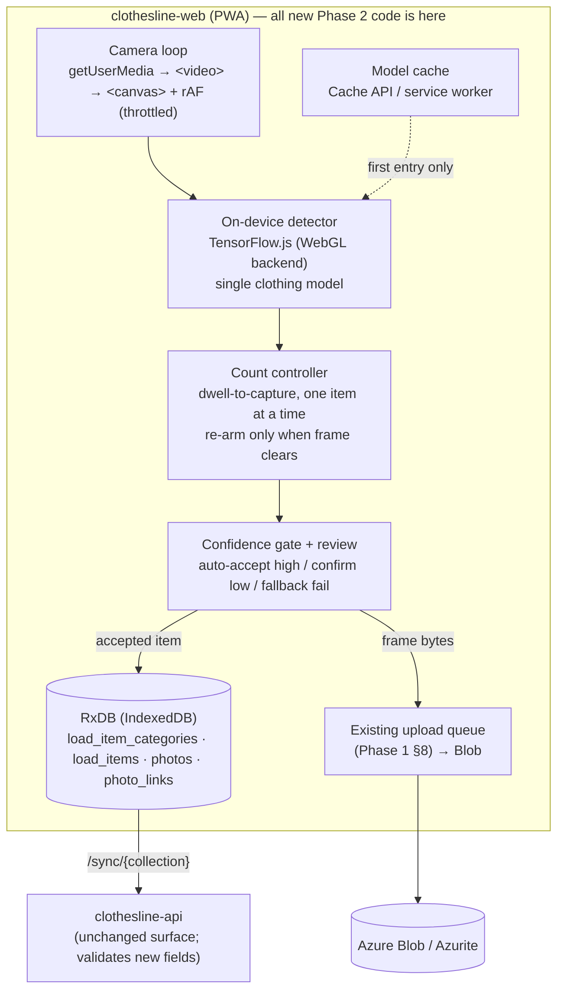
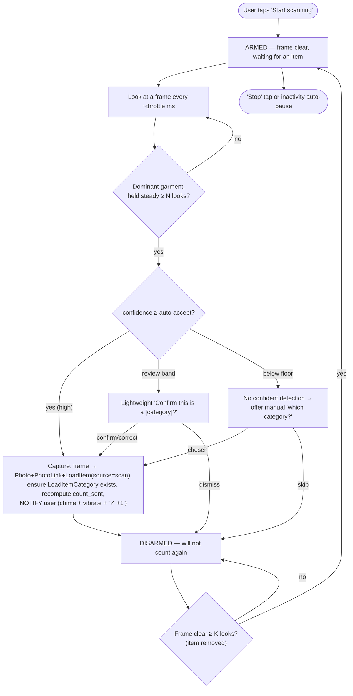

# Technical Implementation Spec — Clothesline (Phase 2: AI-Assisted Itemization)

> **Companion to:** [`business/08-prd-phase2-ai.md`](../../business/08-prd-phase2-ai.md)
> **Builds on:** [`specs/01-mvp/technical-implementation-spec.md`](../01-mvp/technical-implementation-spec.md)
> **Phase:** 2 of 3 (AI Clothing Detection)
> **Document date:** 9 July 2026
> **Status:** Draft for build
> **Scope:** This document describes *how* Phase 2 "Scan Mode" is built **on top of the Phase 1 MVP**. It maps every Phase 2 PRD feature to a concrete technical design and defines the delta against the Phase 1 spec. It does **not** restate Phase 1 — read that spec first for the data model, sync contract, and photo pipeline this phase reuses.

---

## 1. Summary

Phase 2 adds **Scan Mode**: a live, **hands-free** camera view where the user **presents one garment at a time** to the camera — holding the phone, or propping it up in **selfie/front-camera mode** and picking up each item. The app **auto-detects, classifies, captures a photo, and increments the per-category count** on its own, then **notifies her** (chime + vibration + on-screen "✓ Shirt +1"); she sets the item down and picks up the next. **No capture button, no per-item tapping, and no panning across a pile** — the cadence is a supermarket scanner: present → beep/count → remove → present the next (§5.3). It is **almost entirely an additive, client-side capability**. It writes into the *same* RxDB collections Phase 1 already built (`load_item_categories`, `load_items`, `photos`, `photo_links`) and reuses the *same* Azure Blob upload queue for photo bytes. There is **no new backend service, no new endpoint, and no new sync channel** — only a few new fields flowing through the existing generic `/sync/{collection}` contract.

The defining technical constraints from the PRD, and the decisions that resolve them:

| PRD constraint / open question | Decision (this spec) |
|---|---|
| On-device vs. cloud classification (OQ1) | **On-device.** **TensorFlow.js** in the browser. Only the *first* entry into Scan Mode needs a network to download + cache the model; every scan afterward runs fully offline, preserving the offline-first hard requirement. Zero per-scan cost. |
| Category list stability (OQ2) / training data (OQ5) | **A garment detector trained on the Fashionpedia dataset (CC BY 4.0) and exported to TensorFlow.js graph-model format, covering an AI-supported subset + manual fallback for the rest.** Verification showed **no** commercially-licensed, real-time, per-category clothing detector exists off-the-shelf (§6.3), so the model is a **first-class Phase 2 deliverable**, not a deferred fallback. Laundry categories the model doesn't cover (towels, bedsheets, underwear, socks) stay on the Phase 1 tap-counter *in the same load* (mixed-mode). |
| Double-count in live stream (OQ7) | **Present-to-scan, one item at a time.** Each garment is counted once while held steady in view, and the scanner won't count again until the frame **clears** (the item is removed) — a supermarket-scanner cadence (§5.3). Correctly counts six identical socks as six (each presented in turn); no perceptual-hash dedup, no cross-session comparison. |
| Detection pipeline shape | **A single clothing-trained object detector** (detection + category + bounding box in one pass), not a generic COCO presence-gate feeding a separate classifier. One model asset to cache; its bounding boxes feed the count controller (§5.3) directly. |
| Session boundaries (OQ8) | **Explicit start/stop** with an inactivity auto-pause. |
| Success metrics (PRD §5) | **Capture the data, defer the pipeline.** Persist lightweight detection metadata (predicted category, confidence, overridden flag) on each scanned item so the accuracy/override/flag metrics are *computable later*. No analytics/telemetry subsystem is built this phase. |

**Supersedes Phase 1 §4.4 (count modes).** Phase 1 made "manual takeover" permanent and one-way — once a category was tap-counted, photos stopped affecting its count. Phase 2 **retires that rule** in favor of a composition model where photographed/scanned items and manual adjustments **both** contribute to the count at the same time (§4.2 below). This is the one place Phase 2 changes existing behavior rather than adding to it.

| Concern | Choice |
|---|---|
| Interaction model | **Present-to-scan, hands-free, one item at a time** — user presents each garment; app auto-detects, auto-captures, and notifies; no capture button, no panning (§5 intro, §5.3) |
| Inference runtime | **TensorFlow.js** — WebGL (GPU) backend primary, WASM (CPU) fallback; runs a converted graph model in-browser (§6.1) |
| Model | Lightweight **SSD-MobileNet / EfficientDet-Lite-class** garment detector, trained on **Fashionpedia (CC BY 4.0)** and exported to **TensorFlow.js graph-model** format; self-hosted static asset, cached for offline (§6.3, §5.7) |
| Double-count control | Present-to-scan: dwell-to-capture + clear-frame re-arm (§5.3) |
| New backend | **None** — new fields ride existing `/sync/{collection}`; photo bytes ride existing `/media` → Blob |
| New data | Columns on `load_item_categories` + `load_items`; no new tables |

---

## 2. Relationship to Phase 1 — reused / new / superseded

**Reused unchanged:**
- The RxDB collections and the generic `/sync/{collection}` pull/push contract (Phase 1 §5.2, §7).
- The photo model: `Photo` + `PhotoLink` + auto-created `LoadItem` (Phase 1 §4.1). A scan-captured frame is *exactly* a Phase 1 photo capture — same doc writes, same links.
- The Blob byte pipeline: the §8 upload queue (stash locally → `local_only` → drain to Blob on reconnect) and lazy cache-on-view reads. Scan frames use it verbatim.
- Auth (Zitadel/JWKS), the modular-monolith backend, Aspire orchestration, deploy topology. **Untouched.**

**New (this phase):**
- A client-side **Scan Mode** on the Draft screen: camera loop, on-device detector, count controller (§5.3), confidence-review step, manual override, first-run onboarding.
- An **on-device model asset** + its lazy download/cache lifecycle.
- A few **new fields** on two existing collections (§4.1).

**Superseded:**
- Phase 1 §4.4 `count_mode` (auto|manual, sticky) → replaced by the §4.2 composition model. The `count_mode` field is retired (§4.1).

---

## 3. Architecture

Phase 2 adds **no new deployable and no new backing resource.** The cloud and local topologies from Phase 1 §2 are unchanged. The new machinery lives inside the existing `clothesline-web` PWA; the existing `clothesline-api` only gains a few validated fields on existing collections.

### 3.1 Where the new work lives



### 3.2 The scan pipeline (data flow within one session)



The **capture** step is the only place that writes; everything before it is transient per-frame work. A captured scan item is indistinguishable at rest from a manually captured photo item except for its detection metadata (§4.3).

---

## 4. Data model delta

Phase 2 adds fields to **two existing collections** and adds **no new entity**. All new fields are ordinary synced columns riding the existing `/sync/{collection}` contract (Phase 1 §5.2) and the existing wire conventions (ISO-8601 UTC datetimes, `_deleted` tombstones, server-authored `updated_at`). The RxDB `jsonSchema` for each collection bumps a schema version with a migration strategy (Phase 1 §7.9); the Postgres side gets one Alembic migration adding nullable columns.

### 4.1 Changed collections

**LoadItemCategory** — count composition replaces count mode
| field | change | notes |
|---|---|---|
| `count_mode` | **removed** | The Phase 1 auto/manual sticky enum is retired (superseded by §4.2). Migration drops the column; RxDB migration strategy discards it. |
| `manual_adjustment` | **added** — `int`, default `0` | The **manual contribution** to the count (from +/− taps and typed totals). May be negative. See §4.2. |
| `count_sent` | semantics changed | Now the **effective** count `max(0, item_count + manual_adjustment)`, client-maintained during draft, **frozen at send** (unchanged freeze rule, Phase 1 §5.4). |
| `count_received` | unchanged | Receive-side counter as in Phase 1 §5.4. |

**LoadItem** — gains provenance + detection metadata (all nullable; manual items leave them null/default)
| field | change | notes |
|---|---|---|
| `source` | **added** — enum `manual` \| `scan`, default `manual` | How the item was created. `scan` = committed by the detector; `manual` = Phase 1 photo capture or manual add. Drives the §10 metrics. |
| `detected_category` | **added** — `text?` | The model's **predicted** category label at detection time (null for `manual`). Compared against the item's final category to compute override/accuracy. |
| `confidence` | **added** — `float?` | Detection confidence 0–1 (null for `manual`). Lets the low-confidence-flag rate be recomputed against any threshold later. |
| `overridden` | **added** — `bool`, default `false` | Set `true` when the user reassigns a scanned item to a different category than `detected_category` (PRD §3.2). |

`Photo`, `PhotoLink`, `Load`, `User` are **unchanged**.

### 4.2 Count composition (supersedes Phase 1 §4.4)

A category's sent count now has **two independent, simultaneously-live contributors**:

> **`count_sent` = max(0, item_count + manual_adjustment)**
> where `item_count` = number of non-deleted `LoadItem`s in the category (each backs a captured/scanned photo), and `manual_adjustment` is the running manual delta.

Behavior:
- **Scan or capture a photo** → creates a `LoadItem` → `item_count` +1 → `count_sent` **+1** — *always*, even if the category was previously tap-adjusted. (This is the explicit Phase 2 change the product owner requested.)
- **Delete a scanned/captured photo** → removes its `LoadItem` → `item_count` −1 → `count_sent` **−1** (floored at 0).
- **Manual `+` / `−` tap** → `manual_adjustment` ±1 → `count_sent` ±1 (floored at 0).
- **Type an absolute number `N`** → interpreted as *"make the total this"* → `manual_adjustment = N − item_count` (may be negative). Total shows `N`.

Worked example: type **5** (→ `manual_adjustment=5`, no items yet, shows **5**) → scan **2** shirts (→ `item_count=2`, shows **7**) → delete **1** scanned shirt (→ `item_count=1`, shows **6**) → tap **−** once (→ `manual_adjustment=4`, shows **5**).

Notes and edge cases:
- `manual_adjustment` can be **negative** (e.g. items photographed but the user wants a lower headline count); `count_sent` is floored at 0 for display and freeze. A negative adjustment that makes `count_sent < item_count` is allowed — it means the count intentionally undershoots the photographed items (the gallery may then show more photos than the count; surfaced, not blocked).
- **Deleting photos removes items; minus-taps never delete items.** A `−` tap only moves `manual_adjustment`. This keeps the gallery (items) and the headline count independently controllable.
- Freeze at send is unchanged: on `draft → sent` the effective `count_sent` (and its `manual_adjustment`) become read-only, enforced by the existing load validator (Phase 1 §5.4). The receive side is untouched by this phase.
- **Authority (stored vs. derived), to avoid drift across devices/sync.** `count_sent` is the **stored, synced** value and is authoritative; `item_count + manual_adjustment` is how the **local UI recomputes it while actively editing a draft**. The reactive recompute runs **only on the device editing the draft** — other devices display the stored `count_sent` — so a device that has only partially synced a load's `LoadItem`s can't clobber the count. Once **sent**, `count_sent` is frozen and the formula is not re-applied: a scan `LoadItem` that syncs *after* send does **not** change the frozen total (it still appears in the gallery). This keeps the frozen manifest stable regardless of late photo/item sync.

### 4.3 Detection metadata → metrics (capture now, measure later)

The four scan fields make every PRD §5 accuracy metric **computable from stored data** without a telemetry system (§10):
- **Classification accuracy** = `scan` items with `overridden = false` ÷ all `scan` items.
- **Manual override rate** = `scan` items with `overridden = true` ÷ all `scan` items.
- **Low-confidence flag rate** = `scan` items with `confidence` below the review threshold ÷ all `scan` items (recomputable against any threshold because raw `confidence` is stored).
- **Scan-mode adoption / retention / photo-per-item uplift** = derivable from the presence of `source = scan` items per load per user over time.

These are queryable server-side from the synced rows if/when an analytics pipeline is built; nothing is phoned home in Phase 2.

---

## 5. Scan-mode client design (`clothesline-web`)

All of §5 is new frontend code. It slots onto the existing **Load — Draft** screen (Phase 1 §6.2) as an entry point ("Scan" affordance next to `ITEMS +`).

**Interaction model — present-to-scan, one item at a time (hands-free).** The user does **not** pan across a pile and does **not** press a capture button. She starts Scan Mode, then holds the phone or **props it up (front/selfie camera)** and **presents one garment at a time**: pick up an item, show it to the camera → the app detects and classifies it → **auto-captures a photo, counts it, and notifies her** (chime + vibration + on-screen "✓ Shirt +1") → she sets it down and picks up the next. Counting follows a **dwell-then-clear cadence like a supermarket scanner** (§5.3): an item is counted once it's held steady, and the next count can't happen until the frame **clears** (the item is removed). This interaction is the deliberate resolution to the pan-vs-count tension — it makes counting reliable **and** removes the multiple-items-in-one-frame problem by construction (one item is presented at a time).

### 5.1 Camera loop

- **Camera choice — front/back selectable.** `getUserMedia` with a **user-togglable `facingMode`**. The **front (selfie) camera is a first-class option**: propping the phone up and presenting items lets her watch the screen for the ✓ feedback; the rear camera suits holding the phone over a surface. Request `width {ideal:1280}, height {ideal:720}`; feed the stream to a `<video>` and grab frames onto a `<canvas>` for the detector.
- **Inference is throttled**, not per-frame — a `throttle` interval (starting ~**400–800 ms**, tuned per device in the bake-off, §5.8) gates how often a grabbed frame is handed to the detector. Because the item is **held still and presented** (not swept past), a modest rate is enough to register a dwell; the interval is a battery/heat-vs-responsiveness tradeoff, **not** a correctness knob.
- **No overlapping inference:** never start a new inference while the previous one is still running — **skip the tick** instead of queuing, so a slow device degrades to a lower rate rather than piling up work.
- HTTPS-only (Phase 1 already serves the PWA over HTTPS/ACA); localhost exempt in dev.

### 5.2 Detection

- One call per throttled tick to the on-device detector (§6), returning `detections[] = { boundingBox, category, score }` for the current frame.
- **One presented item at a time.** Normally a single garment is in view; if the detector returns several boxes (background clutter, or two items shown at once), take the **dominant** one — largest / most-central / highest-confidence — as the candidate. If two garments are comparably strong, **hold off** and nudge "show one item at a time" rather than guess.
- The detector emits only the **AI-supported category subset** (§6.2); anything else is out of scope for scan and handled by manual tap-count in the same load (mixed-mode, §5.6).

### 5.3 Counting mechanic — dwell-to-capture with clear-frame re-arm (double-count control — PRD OQ7)

Counting is a two-state **arm / disarm** cycle, exactly like a supermarket barcode scanner that needs the item to leave before it scans the next:

1. **Armed** (frame is clear — no confident garment). When a garment is presented, detected as the dominant item (§5.2) past the confidence gate (§5.4), and **held steady for ≥ N consecutive looks** (default `N=2–3`, debouncing motion blur and a hand passing through), it is **captured once**: photo + count + **immediate feedback** (a chime, a vibration via the Vibration API where supported, and an on-screen "✓ Shirt +1"). The scanner then **disarms**.
2. **Disarmed.** No further counting happens — *even though the just-counted item is still in view* — until the frame **clears**: **≥ K consecutive looks** (default `K=2`) with no confident garment (she has taken the item away). Clearing **re-arms** the scanner for the next item.

**Why this is robust where a pan is not:** the item is **held still and presented**, so a couple of looks confirm it, and the **"must clear the frame between items"** rule is what prevents recounting the same held garment. Two identical white shirts presented one after another are two separate arm→capture→clear cycles → **counted as two**, correctly. There is **no cross-object tracking, no perceptual-hash dedup, and no cross-session comparison** — the dedup is purely this arm/disarm cadence within the session.

**Edge cases:**
- **She hesitates / the item lingers:** still disarmed, so no double count; a subtle on-screen cue shows "remove item to scan the next."
- **Next item shown with no clear gap:** if the dominant category **changes confidently and holds for ≥ N looks**, treat it as a new item (re-arm-on-change), so back-to-back *different* garments aren't missed — threshold tuned in the bake-off.
- **Same category back-to-back with no gap** (two shirts, no clear frame between) is the one under-count case; the "remove item" cue trains the small pause that makes it reliable.

### 5.4 Confidence gate & review (PRD §3.4)

Two thresholds (both tunable; starting values illustrative):
- **Auto-accept** (`≥ 0.6`): capture immediately — keeps the flow fast.
- **Review band** (`0.3 – 0.6`): show a lightweight **"Confirm this is a [category]?"** with the predicted category preselected and one tap to accept or correct. Correcting sets the item's category and `overridden = true`.
- **Below floor** (`< 0.3`): treated as **no confident detection** — nothing is auto-captured; if the user keeps the item in view, offer the manual "which category is this?" prompt (§5.5) rather than silently discarding (PRD §3.2).

### 5.5 Manual override & failure fallback (PRD §3.2)

- **Reassign after the fact:** any captured item (in the live strip or the gallery) can be moved to a different category. Moving a `scan` item sets `overridden = true`, updates `load_item_category_id` (the `PhotoLink` follows the item), and both categories' `count_sent` recompute automatically via §4.2.
- **Detection fails outright** (low light, unusual garment, repeated below-floor): the app offers a manual category picker for the current frame instead of discarding the scan — the frame still becomes a photographed item, just manually categorized (`source = manual`).
- **Repeated-failure nudge (PRD OQ6):** after a run of consecutive failed/dismissed detections (default ~5) with no commits, surface a non-blocking suggestion to switch to manual tap-counting for this load. Advisory only; never forces a mode change.

### 5.6 Mixed-mode itemization (PRD §3.3)

Scan Mode and the Phase 1 tap-counter **coexist on the same load**. A user can scan shirts/trousers for photo evidence and tap-count socks/underwear in bulk — because §4.2 makes photographed items and manual adjustments additive per category, the two modes compose without conflict on the same `LoadItemCategory` row. Categories outside the AI-supported subset simply never receive scan commits; they're driven entirely by `manual_adjustment`.

- A scan commit **ensures its target `LoadItemCategory` exists** on the load (creates the row if the user had removed it), then applies §4.2.

### 5.7 Offline delivery — the three components that must be cached

**Scan Mode needs three separate things on-device to run offline, not one.** This is the most common way a browser-ML PWA silently breaks offline: teams cache the app shell and the model but leave the *inference runtime* pointed at a CDN. All three below must be **self-hosted by `clothesline-web` and precached by the service worker**; miss any one and Scan Mode fails with no network.

| # | Component | What it is | Naïve (offline-breaking) source | How we make it offline |
|---|---|---|---|---|
| 1 | **App shell + TF.js library** | The React app, Scan-Mode code, and the **TensorFlow.js** library itself | Bundled into the app | **Already precached** by the PWA service worker (Phase 1 §6.4) — no change. |
| 2 | **The runtime backend** | The engine that *executes* the model. On the **WebGL (GPU) backend** this is the browser's built-in graphics API — **nothing extra to download.** *Only* if we enable the **WASM (CPU) fallback** backend does TensorFlow.js need its `tfjs-backend-wasm` `.wasm` files. | The WASM-backend files default to a **CDN** (jsDelivr) | WebGL backend: nothing to do. WASM fallback: **self-host** the `tfjs-backend-wasm` `.wasm` files and point TF.js at them with `setWasmPaths('/tfjs/wasm/')`, then precache them. |
| 3 | **The model** | The garment detector as a **TensorFlow.js graph model** — `model.json` (architecture + weight manifest) **+ the weight `.bin` shards** — plus a tiny **`labels.json`** (§6.2) | Static asset URLs | Served by `clothesline-web`; **lazily downloaded on first Scan-Mode entry** and stored via the **Cache API** so it persists across sessions and offline. |

- **Why the WebGL backend is the simpler default:** unlike a WASM-based engine, the WebGL backend runs on the phone's existing graphics stack, so there is **no separate multi-MB inference engine to self-host** — component 2 disappears on the happy path. This is a real offline advantage of the TensorFlow.js/WebGL route.
- **The CDN trap still applies to the WASM fallback.** If we ship the WASM (CPU) backend for devices without usable WebGL, its `.wasm` files load from jsDelivr by default — that call hits the network and **breaks offline**. Self-host them and set `setWasmPaths()` to a local path, then precache. (Same class of bug as any CDN-loaded runtime; it just now only affects the optional CPU fallback.)
- **First-run cost & when it downloads:** the only mandatory first-run download is **component 3** — the graph model — typically **~3–8 MB** (a mobile SSD-MobileNet / EfficientDet-Lite-class detector: `model.json` + weight shards). It is **not** precached into the app shell (that would bloat first paint); it downloads on **first entry into Scan Mode** behind a one-time **"Preparing scanner…"** state, then lives in cache. After that, **Scan Mode runs fully offline** (§8). This confines the PRD's "may need a connection for scan" exception to **first use only**.

### 5.8 Memory and device tiers

- **GPU/tensor memory discipline (hard rule):** TensorFlow.js tensors live in GPU memory and are **not** garbage-collected — every per-frame tensor must be wrapped in `tf.tidy()` and final tensors `.dispose()`d, watching `tf.memory().numTensors` in dev. Leaked tensors crash a mobile browser tab within minutes on a live frame loop; this is the single most important implementation rule for Scan Mode.
- **Device floor & degradation:** the audience is **Android-majority**, so the design target is **mid-range Android** and the model/throttle are tuned for it. On slower devices, degrade gracefully — increase the `throttle` interval and/or lower capture resolution — rather than dropping frames unpredictably. High-end devices may lower `throttle` for snappier counting. Final model choice and thresholds are settled by a **bake-off on real low-end/mid-range Android phones** (§6.3, §11.3).
- **Backend selection:** prefer the **WebGL (GPU) backend** for speed; fall back to the **WASM (CPU) backend** where WebGL is unavailable/blocked (§5.7). TensorFlow.js runs on **both Android and iOS** browsers, so the minority of iOS users are covered by the same code path — validate on a representative device of each during the bake-off, but iOS is **not** a special-cased risk here.
- **WebGL context loss is expected, not exceptional.** Backgrounding, memory pressure, or a phone call can drop the GPU context, after which TensorFlow.js errors until the model is reloaded. Scan Mode must **listen for context-loss events and re-initialize** (reload the cached model, §5.7) rather than crash, and re-arm the counter (§5.3); if WebGL keeps failing, fall back to the WASM/CPU backend.
- **A hard capability floor — not infinite degradation.** If a device can't sustain a usable detection rate even after lowering resolution / lengthening the throttle (each look takes multiple seconds, or WebGL is unavailable and CPU is too slow), Scan Mode is **not offered** on that device: a startup capability check disables it and the user stays on the reliable Phase 1 tap-counter. A clean "scan isn't supported on this phone — use manual" beats a slow, inaccurate scanner.

### 5.9 Session lifecycle (PRD OQ8)

- **Explicit start/stop:** the user taps to begin scanning and taps to end. Stopping releases the camera (`MediaStream` tracks stopped) and tears down the detector loop.
- **Inactivity auto-pause:** after a period with no detections/captures (default ~30–60 s — long enough to fold or sort between items), the loop auto-pauses (camera released) to save battery/heat; a tap resumes. Auto-pause resets the counter to **armed** (§5.3), so resuming starts clean.
- **Interruption/backgrounding:** switching apps or taking a call releases the camera and GPU context; on return, the model may need reloading (§5.8) and the counter returns to **armed**.

---

## 6. On-device model & inference

### 6.1 Runtime & pipeline shape

- **TensorFlow.js**, loading a converted **graph model** via `tf.loadGraphModel('/models/garment/model.json')`, run on the **WebGL (GPU) backend** (WASM/CPU fallback, §5.7). One model does **presence + category + bounding box** in a single pass — the box feeds the §5.3 count controller directly. No generic COCO presence-gate + separate classifier (COCO has no garment classes and buys nothing here).
- **Per-frame — counting is our logic.** The detector classifies each frame independently; the runtime does no cross-frame reasoning. The dwell/clear cadence that turns per-frame detections into counts is **our own count controller (§5.3), by design.**
- **We own the pre/post-processing — and it's required, not optional** (the flip side of TensorFlow.js's flexibility, vs. a turnkey task API): the frame is resized/normalized into an input tensor, and the raw model outputs are decoded into `{bbox, category, score}[]` — anchor/box decode plus **non-max suppression** via `tf.image.nonMaxSuppression`. This lives in our JS **because** the model is converted *without* its built-in detection post-processing (those ops don't convert to the browser — see §6.3). Same pattern the `coco-ssd` model uses.
- **Model format & labels.** The runtime loads a TensorFlow.js **graph model** (`model.json` + weight `.bin` shards, §5.7). Class labels are **not** embedded in the model — they ship as a small side **`labels.json`** the app maps to category strings (§6.2). This is looser than a metadata-carrying TFLite file and removes the metadata-compatibility trap that a MediaPipe-style runtime imposes.

### 6.2 Category mapping & the AI-supported subset

The detector is trained (§6.3) to emit the **AI-supported subset**, mapped onto the Phase 1 category strings:

```
Shirts, Trousers, Shorts, Jackets, Dresses
```

sourced from Fashionpedia classes — `shirt, blouse, top, t-shirt, sweatshirt → Shirts`; `pants → Trousers`; `shorts → Shorts`; `jacket, coat → Jackets`; `dress → Dresses`. Fashionpedia's ontology **separates pants vs. shorts** and **jacket/coat vs. dress**, giving the per-category granularity the counter needs (a key reason it beats coarser community detectors that collapse "bottoms" — §6.3).

Categories **out of scope for scan** — driven by manual tap-count in the same load (§5.6):

```
Underwear, Socks, Towels, Bedsheets, Other
```

A **label-map** — the model's side `labels.json` (§6.1) plus a thin app-side alias table — translates raw model labels to these strings, so the mapping changes with the model without touching app logic. The exact supported set and thresholds are finalized against the model's real accuracy in the device bake-off (§5.8, §11.3); the *mechanism* (map supported labels, manual-fallback the rest) is fixed.

### 6.3 Model sourcing & production (PRD OQ2 / OQ5)

Verification against the community catalogs (Roboflow Universe, Hugging Face) established that **no off-the-shelf clothing detector clears all four required gates at once** — a commercially usable license, real-time performance on mid-range mobile, per-category granularity, and a form we can run under TensorFlow.js:

| Community option | Why it fails a gate |
|---|---|
| **Ultralytics YOLOv8/v5** clothing detectors (the most common on Roboflow/HF) | **License:** AGPL-3.0 — unusable in a closed-source product without open-sourcing all of Clothesline or buying an enterprise license. |
| **DETR / YOLOS** fashion detectors (Apache-2.0) | **Perf + granularity:** transformer detectors are heavy for real-time mobile (convertible to TF.js, but the frame rate won't hold on mid-range Android), and their labels collapse "bottoms" (no trousers/shorts split). |
| **DeepFashion2**-trained models (best granularity) | **License:** the dataset is **non-commercial research only** — no commercial models permitted. |

**Decision — build the model, don't grab weights.** Train a lightweight **SSD-MobileNet / EfficientDet-Lite-class** detector (transfer learning) on the **Fashionpedia** dataset and export it to **TensorFlow.js graph-model** format:

- **Fashionpedia is CC BY 4.0 → commercial use is permitted** (with attribution), and its ontology covers *and separates* the supported subset (§6.2).
- **Production pipeline (with a known conversion gotcha):** fine-tune the detector in TensorFlow, then export it **truncated to its raw detection outputs — excluding the built-in post-processing subgraph — before** running `tensorflowjs_converter`. This matters: a *full* SSD/EfficientDet SavedModel **fails to convert**, because the post-processing ops (`NonMaxSuppression`, `Where`, `TopKV2`, `Assert`) aren't supported by the browser converter. So we convert up to the raw outputs and do anchor-decode + NMS in JS (§6.1). Output is a graph model (`model.json` + weight shards) plus a side **`labels.json`**. A light-CNN detector of this class is the size/latency sweet spot for mobile (§5.7) and runs GPU-accelerated on the TF.js WebGL backend.
- Transfer learning needs only a modest labeled slice (≈ 100+ images/class is a common floor); Fashionpedia supplies far more.
- **License hygiene — open-license sources only.** v1's data comes from **public, openly/commercially-licensed** datasets (Fashionpedia and similar); we do **not** scrape copyrighted web images. AI may assist by *auto-labeling* these license-clean images (human-verified), but the sources stay open-license. Ship Fashionpedia's CC BY 4.0 attribution in the app's third-party notices; the trained weights are ours to use commercially.

So Phase 2 treats the garment model as a **first-class deliverable** (dataset → train → convert → validated graph model), **not** a "deferred fine-tune." The model is a **self-hosted static asset** (§5.7), so upgrading it is a redeploy, not an app rewrite. Backbone/input-size choice, the final class set, and thresholds are settled by a **device bake-off** (§5.8, §11.3) on target hardware.

**Risks to validate at build (couldn't be settled from docs alone):**
- **Domain shift is the known top accuracy risk — accepted this phase, remediation deferred.** Fashionpedia is **fashion/e-commerce/editorial imagery** (garments worn by models, studio lighting), while the app sees **crumpled laundry and hand-held single items in home lighting**, so v1 may generalize imperfectly. For Phase 2 this is **accepted, not solved**: v1 trains and validates on **open/open-license data only** (held-out open-license splits for the build bake-off), and the **manual correction + tap-counter fallbacks** (§5.5–5.6) cover misfires. **Building our own in-domain training dataset (real present-to-scan laundry photos) and fine-tuning on it is explicitly deferred to a later phase** (§13) — done only if real-world usage shows it's needed.
- **Real-device throughput** on target **mid-range/low-end Android** — a bake-off across backbone + input-size options; this also sets the capability floor (§5.8).
- **License pass-through:** if any *specific* community checkpoint is ever substituted, its individual model-card license must be confirmed (a base-architecture license does not automatically carry over).

**Deferred to a later phase (§13):** (a) **building our own in-domain training dataset** (real present-to-scan laundry photos) and **fine-tuning** the model on it — the remediation for the domain-shift risk above; (b) extending coverage to laundry-specific items absent from Fashionpedia (towels, bedsheets, underwear, socks) and Philippine garments (uniforms, barong). Until then, out-of-subset categories and any AI misfires are handled manually (§5.5–5.6).

---

## 7. Backend delta (`clothesline_api` / `clothesline_db`)

Minimal and additive:
- **Schema:** one Alembic migration in `clothesline_db` adds nullable columns — `load_item_categories.manual_adjustment` (int, default 0), and `load_items.source` / `detected_category` / `confidence` / `overridden` — and drops `load_item_categories.count_mode`. Backfill: existing rows get `manual_adjustment = count_sent - item_count` (so their displayed total is preserved), `source = manual`.
- **Sync:** the new fields flow through the **existing generic `/sync/{collection}`** handlers unchanged — they're just fields on `load_item_categories` and `load_items`.
- **Validators:** the existing per-collection validators (Phase 1 §5.1) gain light field validation — `source ∈ {manual, scan}`, `confidence ∈ [0,1]` when present — and the existing read-only-sent-manifest invariant now also covers `manual_adjustment` (can't change on a `sent`/`closed` load). No new business endpoints.
- **Media:** photo bytes for scan frames use the **existing** `/media/upload-url` → Blob path (Phase 1 §8) with **no changes**.

No new containers, endpoints, or backing resources.

---

## 8. Offline behavior

- **First scan entry needs network** — a one-time download of **the model** (§5.7 component 3, ~3–8 MB graph model). On the WebGL backend there is no separate engine to fetch (§5.7); once the model is cached alongside the already-precached app shell + TF.js library (component 1), **Scan Mode runs fully offline** — camera, detection, tracking, and item commits are all local; nothing awaits the network.
- **The offline guarantee holds only if the §5.7 components are self-hosted and cached** — in particular, if the **WASM (CPU) fallback backend** is shipped, its `.wasm` files must be served from our own origin (`setWasmPaths`), **not** the jsDelivr default, or scan breaks with no network on devices that fall back to CPU.
- Scan-committed items (`LoadItem` + `Photo` + `PhotoLink`) are RxDB writes replicated by the existing pipeline; the frame **bytes** ride the existing offline upload queue (`local_only` → drain to Blob on reconnect, Phase 1 §8.2).
- This keeps the PRD's offline-first promise intact for everything except the single first-run model fetch — an acceptable and clearly-scoped exception (PRD §4 "Out of Scope" already anticipated a possible connection requirement for scan; we confine it to first use only).
- **Photo volume is bounded by the interaction, but higher than Phase 1.** Present-to-scan produces roughly **one photo per garment the user deliberately presents** — the disarm/clear cycle (§5.3) prevents bursts of near-duplicate frames. Still, a large load means many photos and uploads; frames are WebP-compressed (Phase 1 §8.2) and drained by the existing queue, and the Phase 1 storage-growth watch-item (Phase 1 §14) applies with more weight. No new mechanism this phase; flagged for the GA storage review.

---

## 9. Onboarding & persistent help (PRD §3.6)

- **First run:** the first time a user enters Scan Mode, a full-screen instructional overlay explains **presenting one item at a time**, the detection indicator, the ✓/chime feedback, that counting happens automatically, and how to correct a misclassification. Shown once, automatically.
- **After that:** a persistent **"?" help icon** in the Scan Mode header re-opens the same content on demand.
- **"Seen" state:** stored as a **client-local flag** (RxDB local document / IndexedDB), not synced in Phase 2 — the overlay reappearing once on a second device is harmless. (A synced user-preferences collection is backlog; noted in §13.)

---

## 10. Success-metrics instrumentation

Per the locked decision: **capture the data, defer the pipeline.**
- The §4.3 fields (`source`, `detected_category`, `confidence`, `overridden`) make every PRD §5 accuracy/adoption metric computable from the synced rows.
- **No** analytics service, event stream, or dashboard is built this phase — consistent with offline-first and minimal-PII (nothing new is phoned home; the metrics are latent in data the user already syncs).
- When measurement is prioritized later, it's a server-side query/rollup over existing rows, not new client instrumentation.
- **Caveat — implicit labels.** These metrics use the user's corrections as the truth signal, so they measure the **not-corrected rate**, not ground-truth accuracy: a wrong high-confidence capture the user never fixes still counts as "correct." And items sent to the manual picker on a failed detection are stored as `source = manual`, so they fall outside the scan-only denominators. Good enough for trend-tracking; not a substitute for the offline accuracy benchmark (§11.3).

---

## 11. Testing strategy

### 11.1 Frontend unit (Vitest, in `clothesline-web`)
- **Count composition (§4.2)** — the make-or-break logic: scan/capture increments, photo-delete decrements, manual +/− adjusts, typed-N-as-total (`manual_adjustment = N − item_count`), floor-at-0, negative adjustment. Table-driven against the worked example and edge cases.
- **Counting mechanic (§5.3)** — pure-function tests over synthetic detection sequences: a held item counts **once**; it does **not** re-count while it lingers (disarmed); it counts again only after a clear-frame gap of ≥ `K`; a confident category-change re-arms (back-to-back different garments both count); flicker below stability `N` does not count. No camera needed.
- **Confidence gate (§5.4)** — routing of high/review/below-floor scores; override sets `overridden` and moves the item.
- **Category mapping (§6.2)** — label-map translation and supported/unsupported partitioning.

### 11.2 Backend (pytest, `clothesline_tests`)
- Migration round-trip incl. the `count_mode → manual_adjustment` backfill preserves displayed totals.
- `/sync` carries the new fields; validators reject bad `source`/`confidence` and reject `manual_adjustment` edits on a `sent`/`closed` load (read-only manifest still holds).

### 11.3 E2E (Playwright, `clothesline-e2e`)
- The live camera + on-device model are **not** driven by real hardware in CI. Strategy: **inject a fake `MediaStream`** (Playwright launches Chromium with `--use-fake-device-for-media-stream`; a canvas `captureStream()` track can stand in for real footage) and **stub the detector** behind a thin interface so tests feed a scripted `detections[]` timeline — including the **clear-frame gaps** that re-arm the counter. This exercises the count controller → gate → capture → RxDB → gallery → count path deterministically. (Note: `--use-fake-device-for-media-stream` injects only a synthetic test pattern, and feeding real garment video needs an uncompressed `.y4m` file and is Chromium-only — so real-video model testing is **not** an e2e concern; the detector stub sidesteps it.)
- Flows: scan a short sequence → correct category counts + one photo per item in the gallery; low-confidence detection → confirm step; mixed-mode (scan shirts + tap-count socks in one load) → composed totals; offline scan after model cached → items sync on reconnect.
- On-device inference **accuracy** is validated out-of-band (a fixed labeled image set against the chosen model), not in the e2e gate — CI asserts pipeline wiring, not model quality.

### 11.4 CI gate
Unchanged shape (Phase 1 §10.4): lint/typecheck → backend pytest → frontend Vitest → build → Playwright e2e against the Aspire graph, now including the scan-pipeline flows above.

---

## 12. Mapping: PRD feature → implementation

| PRD § | Feature | Where implemented |
|---|---|---|
| 3.1 | Scan Mode (live detection + auto-count + auto-photo) | Camera loop §5.1, detector §6, count controller §5.3, capture → existing `load_items`/`photos`/`photo_links` + §4.2 count |
| 3.2 | Manual correction / fallback | Override §5.5 (`overridden`), manual-category fallback on failure §5.5 |
| 3.3 | Mixed-mode itemization | §5.6 — scan + tap-counter coexist via additive composition §4.2 |
| 3.4 | Confidence threshold & review | §5.4 auto-accept / review band / floor |
| 3.5 | Photo storage per category (items relation) | Reuses Phase 1 `LoadItem`/`PhotoLink`; scan items add detection metadata §4.3 |
| 3.6 | First-run onboarding + persistent help | §9 |
| §5 | Success metrics | Captured via §4.3; measurement deferred §10 |

## 13. Deferred / open (Phase 2)

| Item | Disposition |
|---|---|
| Build our own in-domain training dataset + fine-tune the model | **Deferred to a later phase.** v1 trains on open-license data (§6.3); collecting real present-to-scan laundry photos and fine-tuning on them is the remediation for domain shift, done later only if real-world accuracy shows it's needed. Consented app usage is the natural data source. |
| Extending the garment model to laundry-specific items (towels, bedsheets, underwear, socks) and PH garments (uniforms, barong) absent from Fashionpedia | **Deferred** (Phase 2.x/3) — needs additional labeled data beyond Fashionpedia. Phase 2 ships the Fashionpedia-trained subset (§6.3); out-of-subset categories are manual (§5.6). |
| Real-time scan performance on **low-end Android** | **Open risk** (§5.8, §6.3). Settled by a device bake-off during build (backbone / input size / throttle); if a device can't sustain the loop it degrades (lower resolution / longer throttle) or falls back to manual itemization. |
| Analytics/telemetry pipeline & dashboards | **Deferred.** Data is captured now (§4.3, §10); rollups are a later server-side concern. |
| Multi-item simultaneous detection in one frame | **Out of scope** (PRD §4) and **moot by design** — present-to-scan (§5.3) has one item in view at a time; if several are detected, the dominant one is used and comparably-strong pairs pause with a "one item at a time" nudge (§5.2). |
| Eager photo prefetch for full offline mirroring | Still **deferred** (inherited from Phase 1 §8.3); scan uses the same lazy cache-on-view. |
| Synced onboarding "seen" flag / user-preferences collection | Backlog — Phase 2 uses a client-local flag (§9). |
| Live pull-stream (SSE) sync | Still **deferred to Phase 3** (Phase 1 §7.8); unaffected by scan. |

## 14. Resolved PRD open questions

| PRD OQ (§6) | Resolution |
|---|---|
| OQ1 on-device vs. API | **On-device** (§1, §6). First-run model download only; scan offline thereafter. |
| OQ2 category-list stability | **AI-supported subset + manual fallback** (§6.2); no forced taxonomy change — Fashionpedia's ontology already separates the subset. |
| OQ3 cost model | Moot — on-device inference has **no per-scan cost**. |
| OQ4 ambiguous/overlapping garments | **Present-to-scan** shows one item at a time (§5.3); if several are detected the dominant one is used, and comparably-strong pairs pause with a "one item at a time" nudge (§5.2). Communicated in onboarding (§9). |
| OQ5 training data | **Resolved for v1:** a light SSD-MobileNet/EfficientDet-Lite-class detector trained on **open-license data (Fashionpedia, CC BY 4.0)** and exported to **TensorFlow.js graph-model** format (§6.3). Off-the-shelf weights fail on license/perf/granularity gates. **Building an in-domain dataset + fine-tuning is deferred** to a later phase (§13); manual correction covers misfires meanwhile. |
| OQ6 repeated-failure UX | Non-blocking "switch to manual" nudge after a failure run (§5.5). |
| OQ7 duplicate/tracking | **Dwell-to-capture with clear-frame re-arm** (§5.3) — supermarket-scanner cadence, one item at a time; no tracking-across-a-pan, no perceptual hashing. |
| OQ8 session boundaries | **Explicit start/stop + inactivity auto-pause** (§5.9). |
